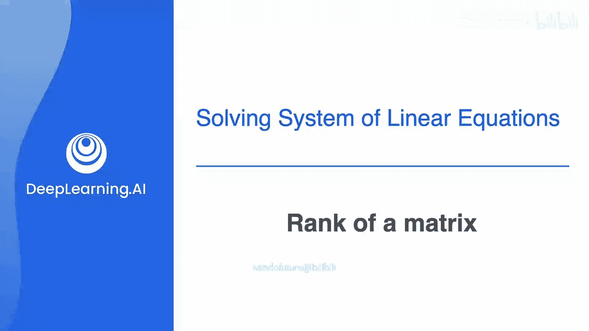
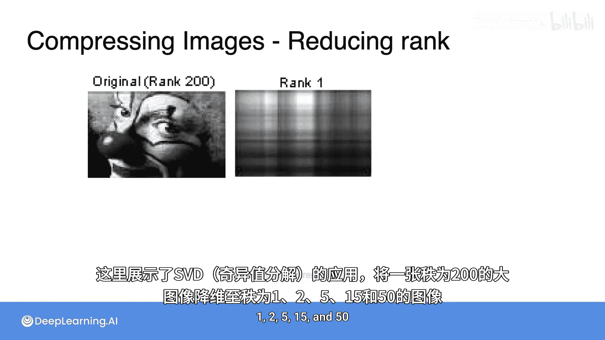
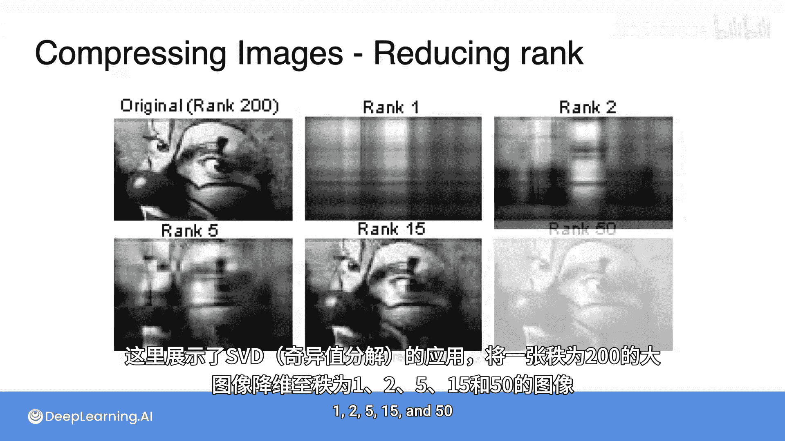
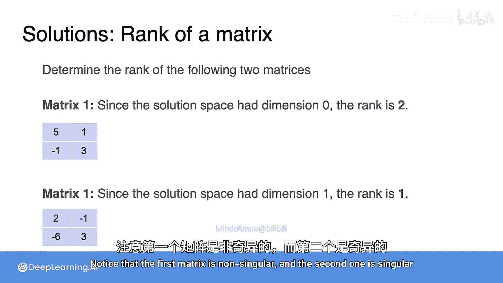

# 020：矩阵的秩

在本节课中，我们将要学习矩阵秩（Rank）的概念。秩是衡量矩阵或其对应的线性方程组所携带信息量的一个重要指标。我们将了解如何定义和计算矩阵的秩，并探索其在机器学习（如图像压缩）中的应用。

## 秩的概念引入

在之前的视频中，我们已经接触过一个概念，但尚未正式介绍，那就是矩阵的秩。它从某种程度上衡量了一个矩阵或其对应的线性方程组所携带的信息量。

让我们跟随讲解，看看如何定义和计算秩。

## 秩在机器学习中的应用：图像压缩

矩阵秩的一个绝佳应用是在机器学习的图像压缩领域。请看这张图片：

它非常清晰，但也占用了大量存储空间，因为每个像素的强度值都需要存储为一个数字。

那么，能否用显著更少的空间来存储这张图片，或者一个稍微模糊一点的版本呢？

答案是肯定的，这就要用到本节课的核心主题——矩阵的秩。

事实证明，像素图像就是矩阵，而矩阵的秩与存储该图像所需的空间量有关。这张特定图片的秩是200，相当高。

一种非常强大的技术叫做**奇异值分解**（Singular Value Decomposition，简称SVD），它可以在尽可能少地改变矩阵的前提下降低其秩。

你可以看到，在下面的视频中，SVD被用来将秩为200的繁重图像压缩为秩分别为1、2.5、15和50的图像。

请注意，秩为15和50的图像与原始图像非常相似，但存储它们所需的空间却少得多。

## 从句子系统理解信息量

回想一下，在方程组中，存在一个关于系统携带多少信息量的概念。让我们看三个句子系统：

*   **系统一**：句子为“狗是黑色的”和“猫是橙色的”。
*   **系统二**：句子为“狗是黑色的”和“狗是黑色的”。
*   **系统三**：句子为“狗”和“狗”。

系统一有两个句子，它携带两条信息。
系统二也有两个句子，但它们相同，所以这个系统只携带一条信息。
系统三有两个句子，但它完全不携带关于动物颜色的信息。它携带零条信息。

回想一下，你的目标是确定颜色。因此，一个句子系统携带的信息量被定义为该系统的**秩**。所以，系统一的秩为2，系统二的秩为1，系统三的秩为0。

接下来，你将看到这个概念如何应用于矩阵及其对应的线性方程组。

## 矩阵秩的定义

现在，让我们回到之前视频中的三个方程组。

正如你已经看到的，第一个系统有两个方程，每个方程都带来了新的信息。这就是为什么你能将解的范围缩小到一个点：第一个方程将解缩小到一条线，第二个方程将其缩小到一个点。因此，该系统有两条信息。系统的秩就是这样定义的，所以它的秩是**2**。

第二个系统有两个方程，但回想一下，第二个方程与第一个完全相同。因此，该系统实际上只携带一条信息，即第一个方程。这就是为什么你只能将解集缩小到一条线，而无法更进一步。因此，该系统的秩定义为**1**。

最后，第三个系统有两个方程，但它们不携带任何信息，因为任何数字A、B都满足这些方程。所以该系统携带零条信息，其秩定义为**0**。

现在来定义矩阵的秩。由于每个方程组都有一个对应的矩阵，那么**矩阵的秩**就定义为对应方程组的秩。

因此，对应第一个系统的矩阵秩为**2**。
对应第二个系统的矩阵秩为**1**。
对应第三个系统的矩阵秩为**0**。

## 矩阵秩与解空间的关系

现在，矩阵的秩与其解空间之间存在一种特殊关系。

回想一下，每个矩阵的解空间是当常数项为零时，方程组解的集合。

*   对于第一个矩阵，解只有 `a = 0` 和 `b = 0`，这是一个点。点的维度是0，所以解空间的维度是**0**。
*   对于第二个矩阵，解集是某条线。线的维度是1，所以解空间的维度是**1**。
*   对于第三个矩阵，任何A和B都成立，因为任何点(A, B)都是该系统的解。因此，解空间是一个平面，其维度为**2**。

那么，在这三种情况下都发生了什么呢？**秩等于矩阵的行数（2）减去解空间的维度**。

对于2x2矩阵，情况总是如此。一般来说，正如你稍后将看到的，**秩**和**解空间的维度**总是相加等于矩阵的**行数**。

还要注意，第一个矩阵是**非奇异**的，而另外两个是**奇异**的。

因此，一个矩阵是非奇异的，**当且仅当**它具有**满秩**，即秩等于行数。

这等同于说，一个方程组是非奇异的，如果它携带的信息量与它拥有的方程数量一样多。这意味着你携带了可能的最大信息量，即每个方程都带来了新的信息，方程之间没有冗余。

## 小测验

现在你已准备好进行一个小测验。请确定你最近见过的两个相同矩阵的秩。

**答案如下：**

由于第一个矩阵的解空间维度为0，其秩为**2**。
第二个矩阵的解空间维度为1，其秩为**1**。

注意，第一个矩阵是非奇异的，第二个是奇异的。

## 总结

在本节课中，我们一起学习了矩阵秩的核心概念。我们了解到，**秩**衡量了矩阵或方程组所携带的独立信息量。它可以通过矩阵行数减去其解空间的维度来计算。满秩（秩等于行数）的矩阵是非奇异的。最后，我们还看到了秩在图像压缩等实际应用中的强大作用，通过**奇异值分解**技术可以有效地降低矩阵秩，从而实现数据压缩。