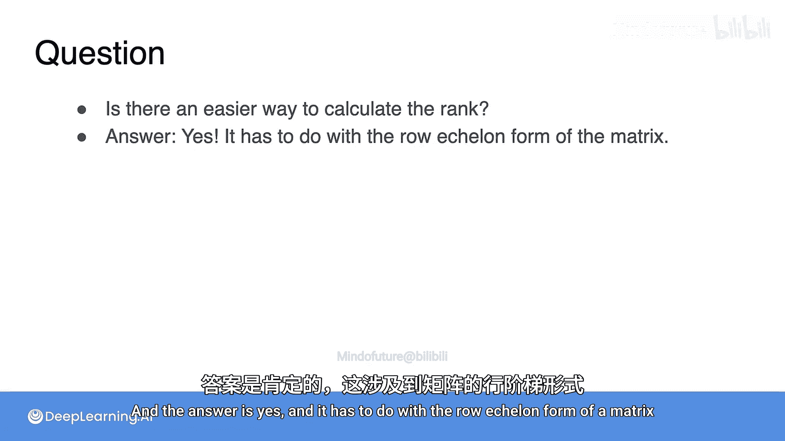

# 021：矩阵秩的一般概念 📊

在本节课中，我们将学习矩阵“秩”的概念。秩是衡量矩阵所包含的独立信息量的一个关键指标。我们将从2x2矩阵扩展到3x3矩阵，理解其定义、几何意义以及计算方法。

上一节我们介绍了2x2矩阵的秩，本节中我们来看看3x3矩阵的秩是如何定义和计算的。其几何意义与2x2矩阵非常相似。

为了定义3x3矩阵的秩，我们需要观察一个由三个方程和三个未知数组成的系统。我们将重点关注哪些方程能为系统带来新的信息。

所谓“没有带来新信息”，指的是一个方程已经是系统中其他方程的线性组合。

以下是几个系统示例，用于说明秩的计算：

*   **系统1**：你可以验证，所有方程都是线性独立的。无法从其中两个方程推导出第三个。因此，该系统有三个方程，且每个都提供了新的信息，即它有三条独立信息。独立方程的数量就是秩，所以这个系统的秩为3。按照惯例，我们说其对应的矩阵秩为3。
*   **系统2**：观察可知，第二个方程是第一个和第三个方程的平均值。因此，你可以认为第一个和第三个方程是新的信息，第二个方程没有带来任何新内容。无论你以何种顺序分析，最终都会得到三个方程中只有两条独立信息，因为该系统的秩为2。因此，其矩阵被定义为秩2。
*   **系统3**：这个系统更简单。第一个方程是新的，但第二个方程是第一个的两倍（依赖于第一个），第三个方程是第一个的三倍（也依赖于第一个）。所以我们有三个方程，但只有一条独立信息。因此，该系统的秩为1，矩阵的秩也为1。
*   **系统4**：这是最简单的情况。没有一个方程能带来关于未知数A、B、C的任何新信息。所以你有三个方程，零条独立信息，矩阵的秩为0。

这里产生了一个问题：计算秩看起来并不容易。

那么，是否有更简单的方法来计算秩呢？答案是肯定的，它与矩阵的**行阶梯形式**有关。

本节课中我们一起学习了3x3矩阵秩的概念。我们了解到，矩阵的秩等于其对应方程组中独立方程的数量，它量化了矩阵所包含的有效信息量。对于更复杂的矩阵，我们可以通过将其转化为行阶梯形式来更简便地确定其秩。