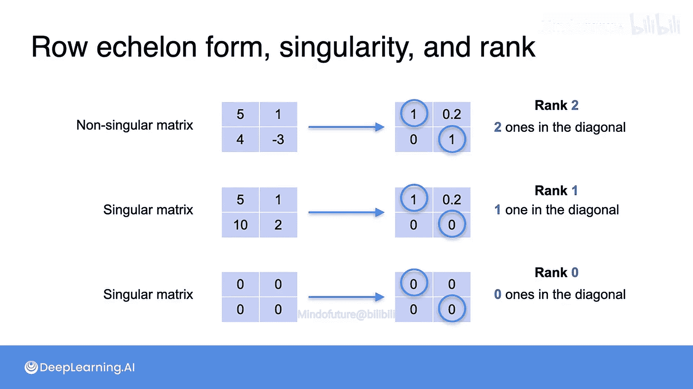

# 022：行阶梯形矩阵


在本节课中，我们将要学习如何通过行操作将矩阵转换为行阶梯形。这是一种能揭示矩阵重要信息的标准形式，例如矩阵的秩和奇异性。

## 概述

在之前的视频中，我们学习了矩阵的一种特殊形式——行阶梯形。它能提供关于矩阵的许多信息，并且可以通过简单的行操作获得。本节中，我们将更详细地探讨这个过程。我们将回顾如何通过行操作（而非方程组）来得到行阶梯形，并理解其与矩阵秩和奇异性之间的重要联系。

## 从矩阵到行阶梯形

上一节我们介绍了行阶梯形的概念，本节中我们来看看如何通过具体的行操作步骤来得到它。以下是计算行阶梯形的通用方法。

### 示例一：非奇异矩阵

我们以矩阵 `A` 为例：
```
A = [[5, 1],
     [4, -3]]
```
目标是将其转换为行阶梯形。

**第一步：** 将每一行除以其最左边的非零系数，使每行首项为1。
```
第一行： [5, 1] -> 除以5 -> [1, 0.2]
第二行： [4, -3] -> 除以4 -> [1, -0.75]
```
得到中间矩阵：
```
[[1, 0.2],
 [1, -0.75]]
```

**第二步：** 为了消去左下角的 `1`，我们保持第一行不变，从第二行中减去第一行。
```
新第二行 = [1, -0.75] - [1, 0.2] = [0, -0.95]
```
得到矩阵：
```
[[1, 0.2],
 [0, -0.95]]
```

**第三步：** 将第二行除以其最左边的非零系数（-0.95），使该行首项为1。
```
第二行： [0, -0.95] -> 除以-0.95 -> [0, 1]
```
最终，我们得到了矩阵 `A` 的行阶梯形：
```
行阶梯形(A) = [[1, 0.2],
              [0, 1]]
```

### 示例二：奇异矩阵

现在，让我们对一个奇异矩阵 `B` 进行同样的操作：
```
B = [[5, 1],
     [10, 2]]
```

**第一步：** 将每一行除以其最左边的非零系数。
```
第一行： [5, 1] -> 除以5 -> [1, 0.2]
第二行： [10, 2] -> 除以10 -> [1, 0.2]
```
得到矩阵：
```
[[1, 0.2],
 [1, 0.2]]
```

**第二步：** 为了消去左下角的 `1`，从第二行中减去第一行。
```
新第二行 = [1, 0.2] - [1, 0.2] = [0, 0]
```
得到矩阵：
```
[[1, 0.2],
 [0, 0]]
```
此时，第二行最左边的非零系数是 `0`，我们无法进行“除以首项系数”的操作。因此，这个矩阵本身就是行阶梯形。

### 示例三：全零矩阵

对于一个全零矩阵 `C`：
```
C = [[0, 0],
     [0, 0]]
```
由于所有行的最左边系数都是零，无法进行“除以首项系数”的操作。因此，其行阶梯形就是它本身。

## 行阶梯形与矩阵性质的联系

通过以上例子，我们可以总结出行阶梯形与矩阵两个核心性质——**秩**和**奇异性**——的深刻联系。

以下是三个矩阵及其行阶梯形的总结：
1.  矩阵 `A` (`[[5,1],[4,-3]]`) 的行阶梯形有 **两个** `1` 在对角线上，其秩为 **2**，且是**非奇异**的。
2.  矩阵 `B` (`[[5,1],[10,2]]`) 的行阶梯形有 **一个** `1` 在对角线上，其秩为 **1**，且是**奇异**的。
3.  矩阵 `C` (`[[0,0],[0,0]]`) 的行阶梯形有 **零个** `1` 在对角线上，其秩为 **0**，且是**奇异**的。

由此，我们可以得出两个关键结论：

**结论一：矩阵的秩**
> 矩阵的秩等于其行阶梯形中主对角线上 `1` 的个数。
> 公式表示为：`rank(A) = number of 1‘s on the diagonal of rref(A)`

**结论二：矩阵的奇异性**
> 一个矩阵是奇异的，当且仅当它的行阶梯形在对角线上存在 `0`（即非满秩）。
> 换句话说，一个**非奇异**（可逆）矩阵的行阶梯形是一个**单位矩阵**（对角线全为1，其余为0）。

## 总结



本节课中我们一起学习了如何通过三步行操作（使首项为1、消元、再次使首项为1）将矩阵化为行阶梯形。更重要的是，我们发现了行阶梯形是揭示矩阵内在属性的强大工具：通过计算其对角线上的 `1` 的个数，我们可以立即得到矩阵的**秩**；通过观察其对角线是否全为 `1`，我们可以判断矩阵是否为**非奇异**（可逆）。这是线性代数中连接计算与理论的一个关键桥梁。