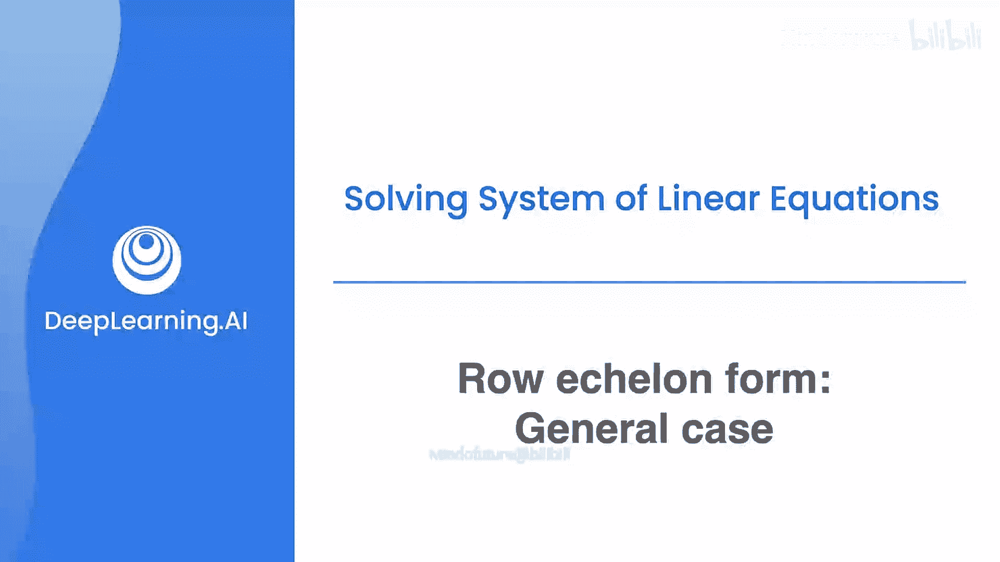
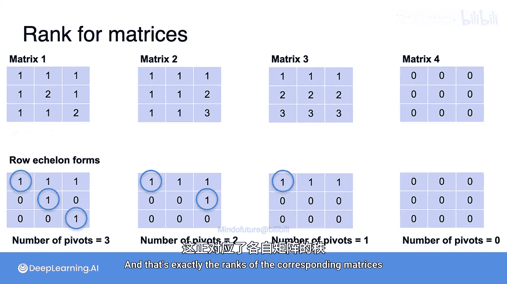

# 023：一般行阶梯形矩阵



在本节课中，我们将学习一般矩阵的行阶梯形（Row Echelon Form，简称REF）。我们将从2x2矩阵扩展到更大的矩阵，理解其定义、性质，并学习如何用它来确定矩阵的秩。

## 从方程组到矩阵

上一节我们介绍了2x2矩阵的行阶梯形。本节中我们来看看对于更大的矩阵，行阶梯形是什么样子。

回顾以下方程组：
```
方程1: A + B + C = ...
方程2: B + C = ...
方程3: C = ...
```
求解过程中，我们通过行操作得到了一个中间形式：第一个方程包含变量A、B、C，第二个方程只包含B和C，第三个方程只包含C。

同样的行操作可以应用于该方程组对应的**增广矩阵**上，最终得到一个矩阵，其**主对角线**上为1，且**主对角线以下**的元素全为0。这就是该矩阵的**行阶梯形**。

## 行阶梯形的一般定义

现在，我们来看看行阶梯形矩阵在一般情况下是什么样子。

以下是两个行阶梯形矩阵的例子：
```
[ 1 * * * * * ]
[ 0 0 1 * * * ]
[ 0 0 0 1 * * ]
[ 0 0 0 0 0 1 ]
[ 0 0 0 0 0 0 ]

[ 1 * * * ]
[ 0 1 * * ]
[ 0 0 1 * ]
```
其中，星号 `*` 代表可以是零也可以是非零的任意数字。

行阶梯形矩阵必须满足以下规则：

以下是构成行阶梯形的关键规则：
1.  **全零行位于底部**：矩阵可以包含元素全为零的行，但如果有，这些行必须位于矩阵的最底部。
2.  **每行有一个主元**：每个非零行都有一个**最左边的非零元素**，这个元素被称为该行的**主元**。
3.  **主元位置逐行右移**：每一行的主元必须严格位于其上方所有行主元的**右侧**。换句话说，从上往下看，主元的位置是逐行向右移动的。

## 行阶梯形与矩阵的秩

正如之前所见，行阶梯形对于判断矩阵的**秩**非常有用。

**矩阵的秩等于其行阶梯形中主元的数量**。

例如，上面第一个示例矩阵有5个主元（每行开头的1），因此其秩为5。第二个示例矩阵有3个主元，因此其秩为3。

## 关于记法的重要说明

在行阶梯形的定义上，不同教材略有差异。请看左侧矩阵：
```
[ 3  *  *  * ]
[ 0 -1  *  * ]
[ 0  0 -4  * ]
```
我们可以做一些“美化”操作：将第一行除以3，第二行除以-1，第三行除以-4，从而得到一个主元全为1的矩阵（右侧）：
```
[ 1  *  *  * ]
[ 0  1  *  * ]
[ 0  0  1  * ]
```
虽然星号处的具体数值变了，但**主元的位置保持不变**（因为除以一个非零数不会将零变为非零，反之亦然）。

*   在大多数教科书中，允许主元是**任意非零数**（如左侧矩阵）。
*   然而，**在本课程中，我们将采用右侧的形式**。这意味着我们会多做一步：将每个主元行除以该行的**主元系数**，使得所有主元都变为1。

这在数学上没有本质区别，矩阵的秩保持不变。这样做是为了与我们**通过除以首项系数来解方程组**的方法保持一致，更加统一。

## 行阶梯形计算示例

理解了定义后，我们通过几个例子来练习如何将矩阵化为行阶梯形。

以下是几个矩阵及其行阶梯形的例子：

**示例1：非奇异矩阵**
已知矩阵：
```
[ 1  1  1 ]
[ 1  2  2 ]
[ 1  2  3 ]
```
通过将第一行分别从第二行和第三行中减去，可以得到其行阶梯形：
```
[ 1  1  1 ]
[ 0  1  1 ]
[ 0  0  1 ]
```
注意，右侧的矩阵是行阶梯形，且主元全为1。

**示例2：奇异矩阵（秩为2）**
现在，尝试求这个之前见过的奇异矩阵的行阶梯形：
```
[ 1  1  1 ]
[ 1  2  2 ]
[ 2  3  3 ]
```
1.  首先，将第一行从第二行和第三行中减去，得到：
    ```
    [ 1  1  1 ]
    [ 0  1  1 ]
    [ 0  1  1 ]
    ```
2.  然后，将第二行乘以2后从第三行中减去，得到：
    ```
    [ 1  1  1 ]
    [ 0  1  1 ]
    [ 0  0  0 ]
    ```
这就是该矩阵的行阶梯形。

**示例3：奇异矩阵（秩为1）**
再求另一个奇异矩阵的行阶梯形：
```
[ 1  1  1 ]
[ 2  2  2 ]
[ 3  3  3 ]
```
1.  将第一行乘以2后从第二行中减去，得到：
    ```
    [ 1  1  1 ]
    [ 0  0  0 ]
    [ 3  3  3 ]
    ```
2.  将第一行乘以3后从第三行中减去，得到：
    ```
    [ 1  1  1 ]
    [ 0  0  0 ]
    [ 0  0  0 ]
    ```

## 通过行阶梯形确定矩阵的秩

就像对2x2矩阵一样，**矩阵的秩等于其行阶梯形中主元1的数量**。

以下是刚才计算出的行阶梯形及其对应的秩：
*   **示例1**的行阶梯形有**3个**主元1，因此原矩阵的秩为3。
*   **示例2**的行阶梯形有**2个**主元1，因此原矩阵的秩为2。
*   **示例3**的行阶梯形有**1个**主元1，因此原矩阵的秩为1。

## 总结



本节课中我们一起学习了**一般矩阵的行阶梯形**。我们了解到行阶梯形是一种通过行变换得到的特殊矩阵形式，其特点是主元下方全为零，且主元位置逐行右移。更重要的是，**矩阵的秩就等于其行阶梯形中主元的数量**。在本课程中，我们约定将主元化为1，这使得形式更加统一，便于求解方程组和理解矩阵的性质。掌握行阶梯形是理解线性方程组解的结构和矩阵秩概念的关键一步。