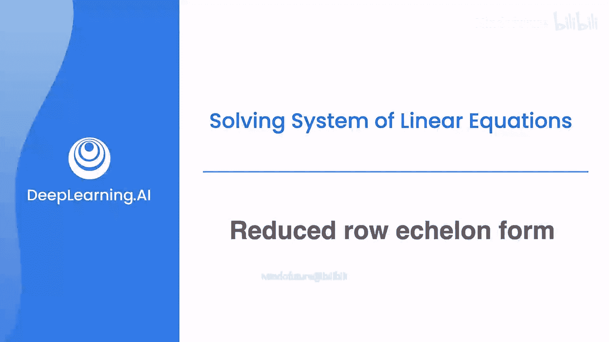
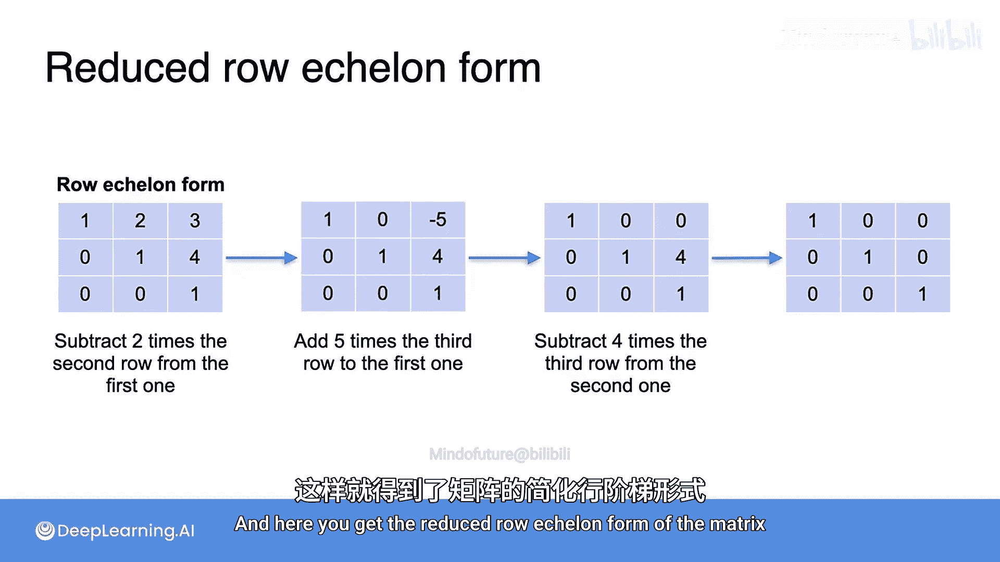

# 024：简化行阶梯形

在本节课中，我们将要学习简化行阶梯形。这是行阶梯形的一个延伸，能更直接地给出线性方程组的解。

上一节我们介绍了行阶梯形，本节中我们来看看如何进一步简化它，得到简化行阶梯形。

## 从行阶梯形到简化行阶梯形

假设我们正在求解以下方程组：
**5a + b = 17**
**4a - 2b = 6**

回顾求解过程，我们首先通过消元法，从第二个方程中消去变量 `a`，以计算出 `b` 的值。然后，我们将 `b` 的值代回第一个方程，得到 `a` 的值。最终解为 `a = 3` 和 `b = 2`。

按照相同的步骤，忽略常数项 17 和 6，我们得到系数矩阵。通过行变换，可以得到一个中间的行阶梯形矩阵，其元素为 `[1, 0.2]` 和 `[0, 1]`。再进行一些变换，就能得到一个对角线为 1、其余位置为 0 的矩阵。

为什么这个矩阵对应上面的方程组？因为我们可以将方程组 `a = 3` 和 `b = 2` 看作：
**1*a + 0*b = 3**
**0*a + 1*b = 2**

由此便得到了矩阵 `[[1, 0], [0, 1]]`。这个中间的矩阵被称为行阶梯形，而最终的这个矩阵被称为**简化行阶梯形**，它直接对应方程组的解。

从行阶梯形矩阵得到简化行阶梯形矩阵的方法很简单：利用对角线上的 1，消去其上方所有的非零元素。例如，我们想消去右上角那个讨厌的 0.2。在这种情况下，可以保持第二行不变，从第一行中减去 0.2 倍的第二行。这样，第一行就变成了 `[1, 0]`，这就是新的第一行，从而得到了简化行阶梯形。

## 简化行阶梯形的定义与性质

以下是简化行阶梯形矩阵的两个例子。

简化行阶梯形矩阵必须满足以下规则：
1.  它必须是行阶梯形。
2.  每个主元必须是 **1**。
3.  主元上方的所有元素必须是 **0**。

它与行阶梯形的主要区别就在于主元上方的元素必须为零。它有一个很好的性质，与行阶梯形相同：矩阵的秩等于主元的数量。因此，左边矩阵的秩是 5，右边矩阵的秩是 3。

## 通用转换方法

以下是通用的将行阶梯形矩阵转换为简化行阶梯形矩阵的方法。

假设你有一个行阶梯形矩阵，这些是主元，它们可能不是 1。在本课程中，我们使用的行阶梯形要求主元为 1，但如果主元不是 1 也没关系，只需将每一行除以其首项系数即可。例如，第一行除以 3，第二行除以 2，第三行除以 -4，就能得到右边这个主元为 1 的矩阵。

现在，要得到简化行阶梯形，只需利用每个主元 1 来清除它上方的所有数字。例如，如果 1 的上方有一个 5，你只需将该 1 所在的行乘以 5，然后从前一行中减去它。

## 一个具体示例

让我们看一个小例子。假设这是矩阵的行阶梯形，我们要将其转换为简化行阶梯形。

首先，去掉第一行中的那个 2。为此，我们可以从第一行中减去 2 倍的第二行，这改变了其他一些数字，但至少将那个位置变成了 0。

现在，去掉那个 -5。取第三行，乘以 5 后加到第一行，这样就消去了 -5。接着，去掉那个 4。取第三行，乘以 4 后从第一行中减去，这样就得到了矩阵的简化行阶梯形。

本节课中我们一起学习了简化行阶梯形。我们了解了它是行阶梯形的进一步简化形式，其特点是主元为 1 且主元上方元素全为 0。我们学习了如何通过行变换从行阶梯形得到简化行阶梯形，并理解了它可以直接对应线性方程组的解，其主元数量同样等于矩阵的秩。