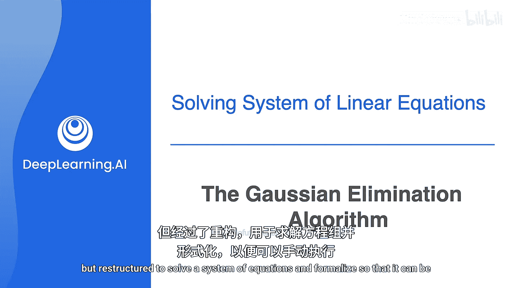
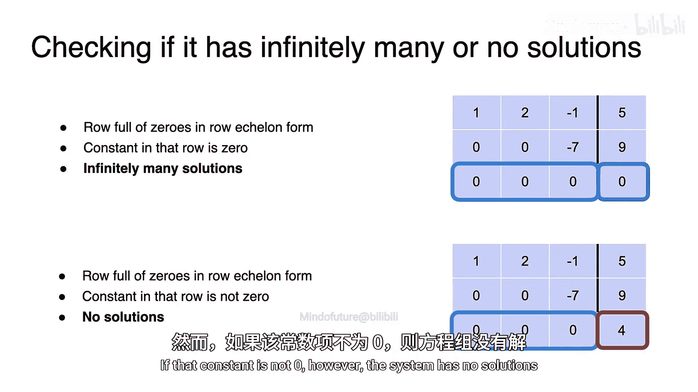
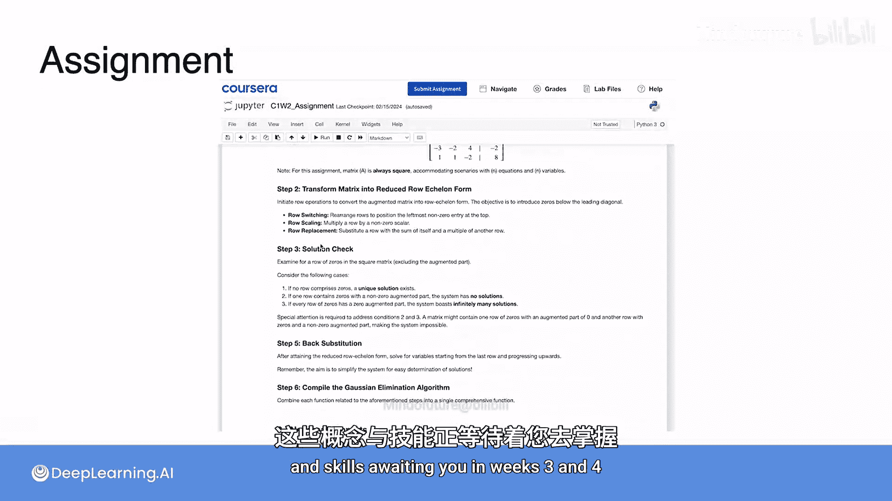

# 025：高斯消元法 🧮

在本节课中，我们将要学习一个非常著名且经典的算法——高斯消元法。你将看到，这本质上就是之前学过的消元法，但经过重构，用于求解方程组，并被形式化，以便可以手动执行或通过代码实现。

## 概述

回想一下，在学习矩阵的奇异性时，我们忽略了方程组等号右边的常数值。那些方程有常数1、-2和-1，但我们当时把它们当作0来处理。为了实际求解一个方程组，我们现在需要关注这些常数项。

以下是具体步骤。

## 构建增广矩阵

首先，像往常一样，根据方程组中的系数创建一个矩阵。

现在，在矩阵的右侧添加一列，用于存放常数值1、-2和-1。这被称为**增广矩阵**。垂直线用于分隔常数项，以便记住它们不是变量的一部分。

现在，如果像往常一样进行消元法，你可以使用增广矩阵来求解方程组。

## 消元过程

回想一下，要完成消元法，你需要反复在矩阵的对角线上找到一个称为**主元**的元素。

首先，选择左上角的单元格作为主元。你的第一个任务是使用行操作将主元设为1。接下来，使用行操作将主元下方的所有值设为0。然后，逐行重复此过程，使用行操作将矩阵简化为**行最简阶梯形**。

你对矩阵执行的任何行操作也将应用于你为形成增广矩阵而添加的常数项列。正如你将看到的，它们最终将帮助我们求解方程组。

这是高层次的概述。现在，让我们看看这个过程实际上是如何运作的。

### 第一步：处理第一列

你需要将第一行的主元变为1。由于当前主元是2，将该行乘以二分之一。执行行操作后，主元现在是1，行中的其他值也除以了2。用你刚刚计算出的更新行替换第一行。

请注意，即使是右侧的常数项也发生了变化，现在变成了二分之一。记住，这个矩阵代表你开始的方程组。因此，让我们也更新方程组以匹配矩阵中的内容。

接下来，你想使用行操作将主元下方的所有值设为0。我将从第二行的这个2开始。以下是我将用于更新第二行的行操作。希望你能明白为什么主元是1，而你想要消去的值是2。如果你从第二行中减去两倍的第一行，你将在主元下方得到一个0，正如你所愿。

完成这个行操作后，你将得到一个新的第二行：0, 3, 3, -3，稍后我将用它来更新第二行。

接下来，你需要消去第三行中的这个4。同样，由于主元是1，选择执行此操作的行操作很简单。你可以直接从第三行中减去四倍的第一行来消去主元。完成这个行操作会得到第三行的这组新值。

很好，现在第一列处理完毕。我将更新方程组以反映矩阵中的变化。注意，第一列是一个1，后面跟着两个0。所以你已准备好进入第二列和第二个主元。

### 第二步：处理第二列

沿着对角线移动，你的新主元是这个3。和之前一样，你需要将主元设为1，然后将主元下方的值设为0。

由于新主元是3，将该行乘以三分之一以将主元设为1。计算如下。再次更新方程组。

现在，你需要将第三行的第二个元素变为0。再次，由于你的主元已经是1，从第三行中减去三倍的第二行将消去3并留下一个0。完成这个行操作将给你新的第三行：0, 0, -5, 0。再次，我将更新方程组以匹配矩阵中的新值。

### 第三步：处理第三列

你快要完成了。将对角线上的-5作为你的最终主元。和之前一样，你需要将主元设为1，所以将第三行除以-5。因此，第三行的最终值将是0, 0, 1, 0。再次更新方程组。

注意，矩阵现在处于**行阶梯形**：对角线全是1，对角线下方只有0。

在矩阵上执行的行操作也改变了常数项的值，现在你将使用该列中的信息，通过一个称为**回代**的过程来实际求解方程组。

## 回代求解

以下是回代的过程。你将从最底行开始，向上工作。你将使用每一行的主元来消去其上方单元格中的值。这个过程实际上看起来与最初创建主元非常相似。

所以从最后一行的主元开始，首先消去它上面的那个1。主元是1，你需要消去一个1，所以行操作将是第二行减去第三行。执行此操作后，第二行的新值将是0, 1, 0, -1。

接下来，消去第一行中的这个二分之一。这次你需要的行操作是第一行减去二分之一倍的第三行。完成这个行操作得到第一行的新值：1, -1/2, 0, 1/2。

现在你得到以下矩阵和更新后的方程组。

最后，重复这个过程，使用第二行的主元在上方行中创建零。在这种情况下，你将向第一行加上二分之一倍的第二行，如下所示。完成。

你得到了这里的这个矩阵。注意，你得到了一个对角线全是1、其他位置全是0的矩阵。

我将最后一次更新方程组以表示矩阵，你会看到你现在有了方程组的解，其中 a = 0， b = -1， c = 0。

注意，增广矩阵的方形部分只有对角线上的1。这样的矩阵称为**单位矩阵**。通过使用高斯消元法将矩阵简化为这种形式，你已经求解了原始方程组。

## 奇异矩阵的情况

现在让我们讨论奇异情况。如果矩阵是奇异的，高斯消元法还能用吗？你已经知道，如果矩阵是奇异的，那么在行最简阶梯形中，你将有一行全是零。一旦你到达这里，无需担心，算法就停止了。高斯消元法的全部意义在于找到方程组的解。

然而，如果你发现一行全是零，你就知道你的矩阵是奇异的，并且没有解。

尽管如此，你仍然可以确定你的矩阵是矛盾的（无解）还是有无穷多解。

要做到这一点，你只需要查看常数项列。如果全零行中的常数项值也是0，那么该行只是说 0a + 0b + 0c = 0。无论你为a、b、c选择什么值，左边总是等于0，这个方程总是成立。所以方程组有无穷多解。

如果方程组稍微改变，使得第三个方程等于10呢？那么，经过行化简后，你得到以下矩阵，第三行的常数项值变为4。现在，最后一行表明 0a + 0b + 0c = 4。无论你选择什么a、b、c值，这个方程的左边都等于0，但右边等于4。这意味着方程组没有可能的解。

**总结一下**：如果你在行最简阶梯形中发现一整行零，并且该行的常数项是0，那么方程组有无穷多解。然而，如果该常数项不为零，则方程组无解。

## 高斯消元法流程总结

以下是高斯消元法整个过程的总结：

1.  首先，通过将常数项添加到右侧的新列来创建**增广矩阵**。
2.  接下来，将矩阵化为**行最简阶梯形**。
3.  最后，完成**回代**以找到变量的值。

如果你遇到一行零，请停止，因为系统是奇异的。在接下来的作业中，你将有机会进一步研究这一点。

## 课程总结与后续安排

好的，本周的课程到此结束。此后，你将有一个计分测验和一个编程作业。

测验涵盖了你本周学习的所有主题。编程作业旨在指导你实际实现高斯消元算法。将这个作业视为对你所学关于方程组以及如何通过课程前半部分求解它们的知识的顶点。这也是磨练你使用NumPy库技能的好机会，你将在未来几周使用它。这绝对是本课程中最注重数学的作业，它有助于为你准备在第三周和第四周等待你的这些概念和技能的机器学习应用。

祝你好运。😊