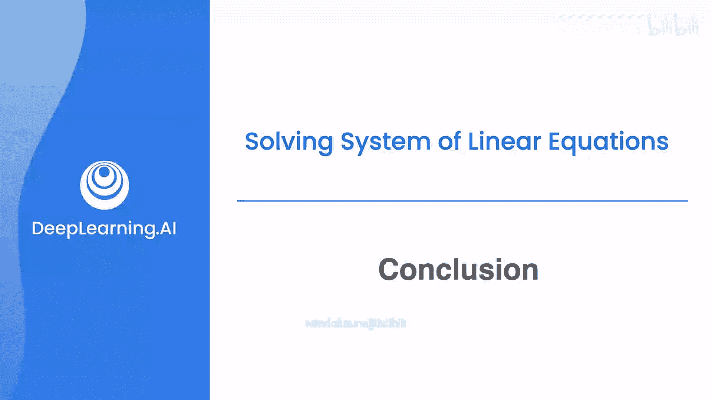
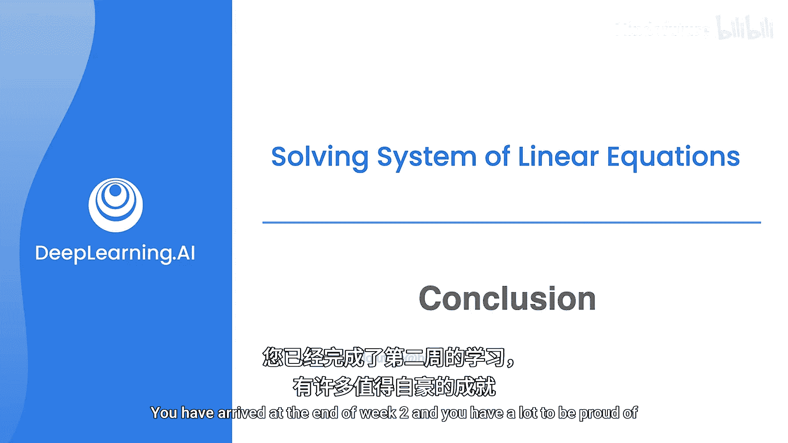

# 026：总结与回顾 🎯

在本节课中，我们将对第二周的学习内容进行总结。本周，我们从第一周掌握的求解二元和三元线性方程组的基础出发，深入探讨了矩阵的性质。现在，你已经能够熟练地将方程组转化为矩阵，并通过行操作来快速、简洁地求解。

## 核心内容回顾

上一节我们介绍了矩阵的基本操作，本节中我们来看看本周所涵盖的核心技能与概念。

以下是本周你掌握的关键能力：
*   能够将线性方程组转化为矩阵形式。
*   能够通过执行行操作来求解方程组。

以下是矩阵形式转换与简化的核心知识：
*   学会了将矩阵转化为**行阶梯形**。
*   进一步学会了将其简化为**简化行阶梯形**。

从这些形式出发，我们学习了如何提取矩阵的全部信息。

以下是基于矩阵形式可以分析的重要属性：
*   **奇异性**或**非奇异性**：判断矩阵是否可逆。
*   **行列式**：一个标量值，对于方阵 `A`，记作 `det(A)` 或 `|A|`，可用于判断奇异性（`det(A) = 0` 时奇异）。
*   **秩**：矩阵中线性无关的行或列的最大数量。
*   其对应方程组的**解**的情况（唯一解、无解或无穷多解）。
*   其**图形化表示**（在二维或三维空间中的几何意义）。

本周我们涵盖了不少概念。请跟随我一起进入令人兴奋的第三周，在那里你将学习向量、点积、矩阵乘法、线性变换以及更多内容。

## 总结

本节课中我们一起学习了第二周的核心成果：从求解方程组到深入理解矩阵的表示与性质。你现在已经掌握了通过矩阵的**行阶梯形**和**简化行阶梯形**来分析方程组解的结构、计算矩阵的**秩**和**行列式**，并判断其奇异性。这些工具为后续学习更复杂的线性代数概念奠定了坚实的基础。