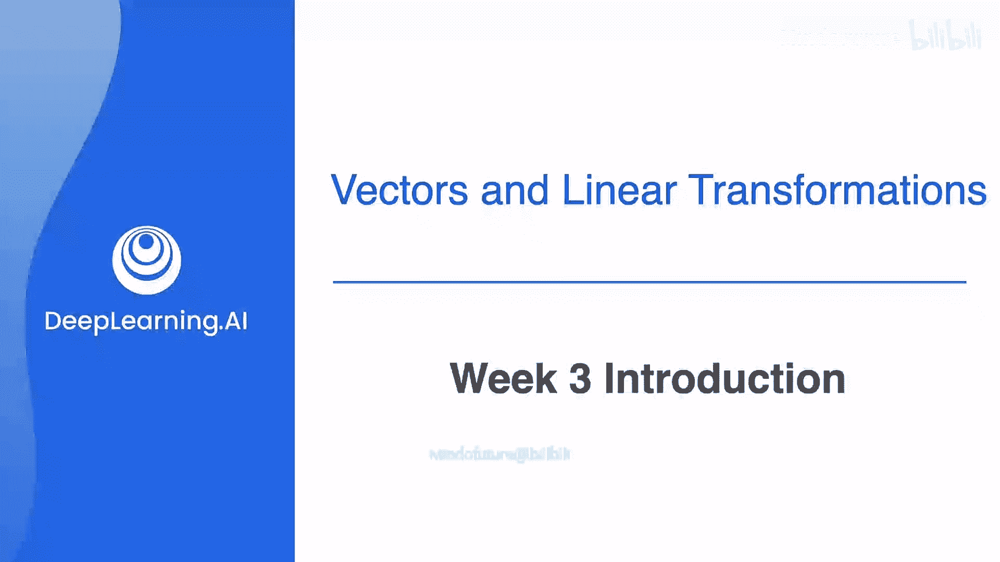
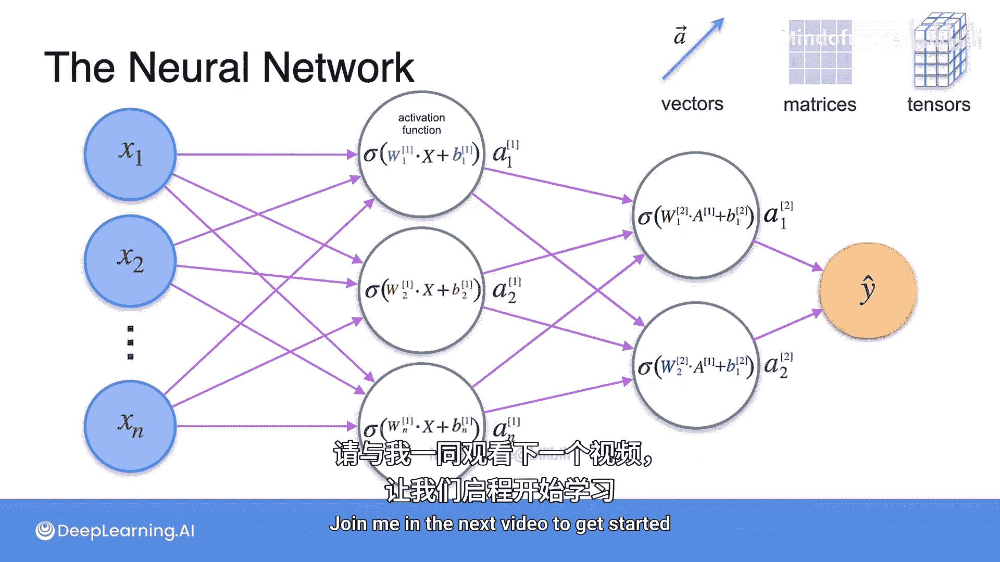

# 027：向量与矩阵入门 🧮



在本节课中，我们将要学习线性代数的核心基础：向量与矩阵。你将了解它们的基本属性（如大小和方向），以及可以对它们进行的多种运算。这些概念是理解现代机器学习模型，尤其是神经网络的基石。

## 欢迎来到第3周 👋

本周的主要主题是向量、矩阵以及它们的一些属性，例如向量的大小和方向。你还将学习可以对它们应用的许多运算。

从某种意义上说，向量和矩阵很像数字。数字可以相加、相乘、相除，而许多这类运算也可以推广到向量和矩阵上。例如，我们可以考虑两个向量的和、两个向量的乘积、两个矩阵的乘积，或者一个向量与一个矩阵的乘积。

此外，就像你可以找到一个数字的乘法逆元（例如，2的逆元是1/2），在某些条件下（你将会看到，实际上你之前已经见过），你也可以找到一个矩阵的乘法逆元。

本周你将看到，矩阵和向量对于任何类型的数据处理都至关重要。

## 线性变换：矩阵的图形化视角 🔄

本周你将学习的另一个非常重要的概念是**线性变换**。线性变换是一种非常特殊的方式，可以从图形上可视化矩阵，它能使许多概念变得更加清晰。

但在深入探讨所有这些之前，让我们先看看这些概念是如何出现在机器学习中的。

## 机器学习中的线性代数动机 🤖

在第1周开始时，我们以线性回归为例，探讨了机器学习建模场景。在那里，你将数据集视为一个线性方程组。

回顾一下，其工作原理是：你有一个由一组特征（称为 x1, x2, ..., Xn）组成的数据集。你的数据集中有多个样本，因此你的特征矩阵中有多行 x 值，就像这样：

```
x^(1) = [x1^(1), x2^(1), ..., xn^(1)]
x^(2) = [x1^(2), x2^(2), ..., xn^(2)]
...
x^(m) = [x1^(m), x2^(m), ..., xn^(m)]
```

其中上标表示每个样本的编号。你还有一个目标值或 y 值的向量。线性回归的思想是，你想出一组权重 W1, W2, ..., WN（每个 X 特征对应一个），以及一个偏置值 b。这使你能够将这个数据集描述为一个线性方程组：

```
y_hat^(i) = W1*x1^(i) + W2*x2^(i) + ... + Wn*xn^(i) + b
```

为了简化这个表达式，我可以用大写 **W** 表示 w 值的向量，用大写 **X** 表示 x 值的矩阵，加上 b，并令其等于 **y_hat** 来表示目标值的向量。这样一来，你就回到了简单的直线方程形式：

**y_hat = W * X + b**

当然，如果你已经熟悉线性代数，可能会注意到根据我如何设置这些向量和矩阵，我可能漏掉了 **W** 或 **X** 的转置。但目前我们暂不担心这一点。

当然，现实世界的数据集通常不是那种可以像上周材料中那样解析求解的方程组。但你假设这个数据集可以近似为一个线性方程组，结果证明是合理的。然后，机器学习将允许你以迭代方式求解这个系统，并对任何新的 x 值集预测你的目标 y。

## 从线性模型到神经网络 🧠

然而，事实证明，仅用线性模型近似现实世界的数据集是有限的，因为在许多情况下，特征和目标之间的关系是非线性的。用于表示非线性系统的最强大的机器学习模型之一是**神经网络**。

关于神经网络最神奇的事情之一是，在底层，它们实际上只是大量线性模型的集合。你可能见过神经网络像这样表示，有这些垂直排列的层，即所谓的人工神经元，它们之间像这样用线连接。

你可以这样理解这个图：左边的层代表网络的输入，也就是你的特征（x1, x2, ..., Xn，就像之前一样，这次我将它们垂直写在网络输入层的这些节点中）。然后，这些线表示你要将所有那些 x 值发送到下一层的每个单独的神经元。

例如，所有这些 x 都进入第一个神经元，该神经元有一个与之关联的 **w** 值向量和一个 **b** 值。因此，你可以将第一个神经元中发生的情况写为你的 **W** 向量乘以你的 **X** 特征矩阵，再加上 **b** 值。所以你有一个线性模型，就像之前一样。事实上，你有一个完整的线性方程组，但现在它都包含在这个小小的神经元里。

和之前一样，我可以将这个神经元内部的线性方程组表示为 **W * X + b**。现在，有些细节你不需要担心，但为了完整性我会提一下：在这个神经元中真正要发生的是，你将整个 **Wx + b** 表达式输入到一个称为**激活函数**的东西中，该激活函数会生成一些输出，这里我称之为 **a**（另一个向量）。然后，该层中的每个神经元都做完全相同的事情，但在每种情况下都使用一组不同的权重和偏置，并生成它们自己的输出向量 **a**。为了明确每个神经元都是唯一的，我将为所有的 **W**、**b** 和 **A** 添加下标，其中下标 1 表示你在顶部的第一个神经元中，依此类推。

当然，传递给每个神经元的 **X** 值矩阵在每种情况下都是相同的，因此不需要任何下标。另外，好像我们的符号还不够多，我将在上面添加一个上标 `[1]`（方括号内），表示这些操作发生在网络的**第一层**。这是因为接下来你要将这些 **a** 值传递到下一层，整个过程会再次发生。

在第二层，输入是你来自第一层的 **a** 值。因此，第二层的线性模型看起来相同，只是用 **A** 代替了 **X**。需要明确的是，这些上标为 `[1]` 的 **a** 现在是一个矩阵，包含了来自前一层的所有 **a** 向量（a1, a2, ..., an）。你将它们乘以一组全新的权重，并在每种情况下加上一个不同的偏置值。

所以，其他所有东西——**W**、**b** 和你生成的新 **A** 值——都获得一个上标 `[2]`，表示它们属于第二层。然后，随着你向前传播到网络的每一层，这个过程会不断重复：将前一层的输出乘以一组权重，加上一个偏置项，并应用一个激活函数，直到你得到最终输出。

## 核心：神经网络中的线性方程组 📊

这一切听起来可能相当复杂，但我想稍微详细地介绍一遍，以便你能看到线性方程组是如何成为神经网络的核心组成部分的。

如果你想详细了解所有内容，我再次推荐 DeepLearning.AI 的机器学习专项课程。但在这门课程中，重点不是担心神经网络功能的所有复杂细节。恰恰相反，这里的重点是，在这些神经网络内部并没有发生什么特别花哨的事情。它实际上只是一个大型的线性模型集合，它们共同作用，可以建模高度非线性的系统。

与其写下无数个小线性方程来表示神经网络，不如将每一层的输入和输出表示为**向量**、**矩阵**和**张量**（剧透一下：张量就像更高维的矩阵）。本周，你将应用线性代数对这些向量、矩阵和张量进行操作，并计算你的机器学习结果。

## 学习路径与评估 📝

与过去两周类似，如果你以前学习过线性代数，你可能对我们本周要涵盖的一些概念很熟悉。请查看下一个阅读材料中的知识检查。如果你能轻松回答所有问题，那么恭喜你，你已经准备好进行本周结束时的评估了。如果你不确定如何回答其中任何或所有问题，那么也要恭喜你，你来对地方了。在下一个视频中与我一起开始学习吧。

---



**本节课中我们一起学习了**：线性代数在机器学习中的基础作用，特别是向量和矩阵作为核心数据结构的重要性。我们回顾了线性回归如何用线性方程组表示，并深入探讨了神经网络在底层如何由大量线性模型（向量和矩阵运算）构成，从而能够建模复杂的非线性关系。理解这些概念是掌握更高级机器学习算法的关键第一步。