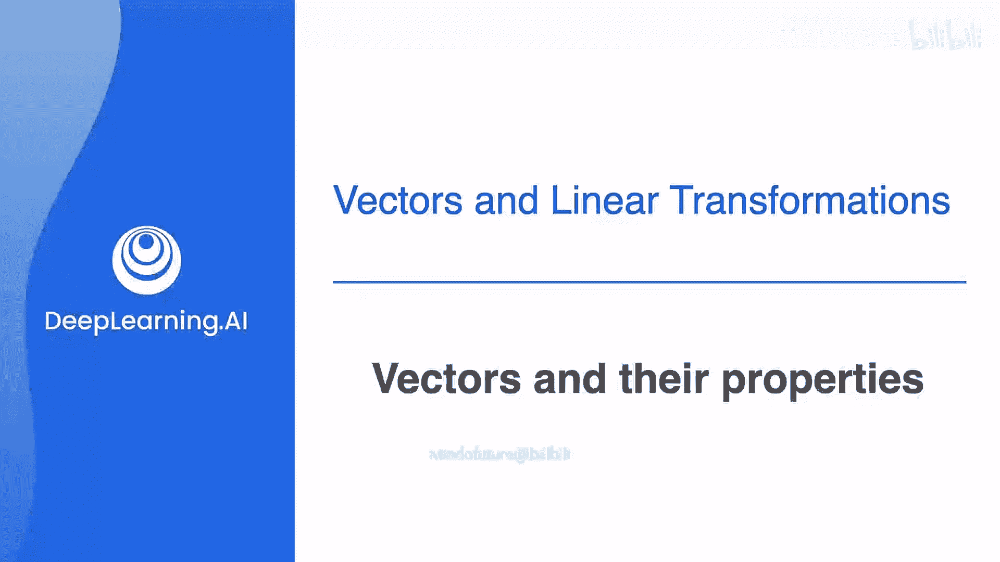
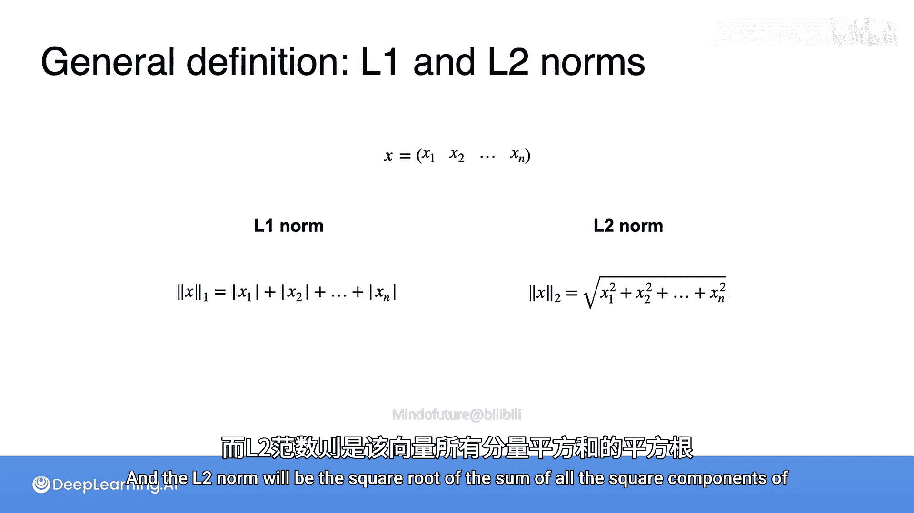

# 028：向量及其性质 📐

在本节课中，我们将要学习线性代数中最基础的概念之一：向量。我们将了解向量的定义、其几何表示、以及两个核心属性：大小（模长）和方向。

在前几周的学习中，你已经了解了矩阵，它本质上是一个数字的阵列。向量是一种更简单的数字阵列，它只有一列。实际上，向量可以被看作是平面或更高维空间中的箭头。向量的两个非常重要的组成部分是它们的大小（即模长）和方向。这就是接下来要学习的内容。

## 什么是向量？

向量本质上是一个数字元组。它可以是两个数字、三个数字，或者任意多个数字。向量中坐标的数量，就是它所处的空间的维度。

例如，坐标为 (4, 3) 的向量存在于平面中，它精确地指向水平坐标为4、垂直坐标为3的点。

你也可以有更高维度的向量空间。例如，在三维空间中，坐标为 (4, 3, 1) 的向量就存在于这个空间中，它是指向相对于x、y、z轴坐标为 (4, 3, 1) 的点的箭头。

## 向量的核心属性：大小与方向

一个向量有两个非常重要的组成部分：大小（或模长）和方向。

### 向量的大小

向量的大小（模长）可以通过几种方式来定义。好消息是，所有这些方式都模拟了你在现实生活中使用的距离概念。

第一种测量距离的方式是想象你住在一个有许多建筑和由水平或垂直街道组成的街区的城市里。你需要从家去商店，但你只能沿着街道走。因此，两点之间的距离，比如你的家和商店之间有4个水平街区和3个垂直街区，距离就是4加3的和。这被称为**出租车距离**。无论你走哪条路线，你最终走过的距离总是7个街区。

另一种去商店的方式是忘记你的车，直接乘坐直升机。直升机不需要遵循街道或拐角，它可以直线飞行。直升机能做到的最短距离是3的平方加4的平方再开平方根，正好是5。这是因为**勾股定理**，直角三角形斜边的长度等于两直角边平方和的平方根。

那么，这些距离与向量大小有什么关系呢？因为两者都为我们提供了计算坐标为 (a, b) 的向量大小的方法。

*   **L1范数**：定义为原点到点 (a, b) 的出租车距离，即 a 和 b 的绝对值之和。之所以用绝对值，是因为 a 和 b 可以是正数或负数，但行走的距离总是正的。
    *   **公式**：`||v||₁ = |a| + |b|`
*   **L2范数**：定义为原点到点 (a, b) 的直升机（直线）距离，正如你所见，它是坐标平方和的平方根。
    *   **公式**：`||v||₂ = √(a² + b²)`

默认情况下，当我们指定使用哪种范数时，通常指的是L2范数。原因是它更自然，因为它精确地代表了箭头的长度。

### 向量的方向

向量的方向也可以从其坐标推导出来。例如，对于坐标为 (4, 3) 的这个向量，如果它与水平轴的夹角是 θ，那么 θ 的正切值正好是 3/4。这意味着 θ 是 3/4 的反正切值，即 0.64 弧度，或者如果你更喜欢角度，那就是 36.87 度。

**重要提示**：向量可以具有不同的范数（大小）但指向相同的方向。例如，向量 (2, 1.5) 与向量 (4, 3) 指向相同的方向，但具有更小的范数。

## 向量的表示方法

有多种表示向量的符号，你将在本课程中看到其中一些，也可能在教科书或网上找到的其他资源中看到其他符号。

以下是表示一个简单称为 **x** 的向量的多种方式。

向量可以水平写成**行向量**，也可以垂直写成**列向量**。

向量的分量用下标编号，所以 **x** 中的第二个分量称为 `x₂`。

在其他资源中，你可能会看到向量名称上方带有一个小箭头或用粗体字书写，以突出显示它是一个向量。但在本课程中，我将坚持使用普通的 **x**。

向量也可以用方括号而不是圆括号来书写。方括号有时有助于提醒向量是矩阵的一部分，或者它本身就是一个瘦长的矩阵。但这些符号之间在概念上绝对没有区别。在本课程中，你将看到根据上下文使用圆括号和方括号。

## 范数的通用定义

现在，让我们使用向量符号将 L1 和 L2 范数的定义推广到具有 n 个分量的任何向量。

对于一个具有 n 个分量的向量 **v** = (v₁, v₂, ..., vₙ)：

*   **L1范数**（曼哈顿范数）是所有分量绝对值的和。
    *   **公式**：`||v||₁ = |v₁| + |v₂| + ... + |vₙ|`
*   **L2范数**（欧几里得范数）是所有分量平方和的平方根。
    *   **公式**：`||v||₂ = √(v₁² + v₂² + ... + vₙ²)`

---

在本节课中，我们一起学习了向量的基本概念。我们了解到向量是数字的有序列表，可以在几何上表示为箭头。我们重点探讨了向量的两个核心属性：**大小**（通过L1和L2范数衡量）和**方向**（可以通过坐标计算角度）。我们还介绍了向量的不同表示方法，并将范数的概念推广到了任意维度。理解这些基础是学习后续更复杂线性代数概念的关键。