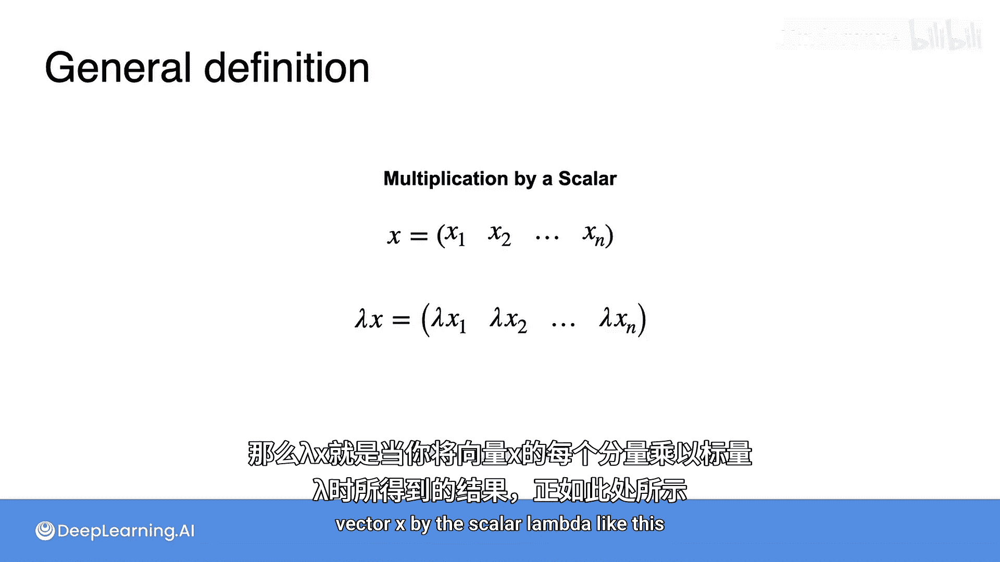

# 029：向量运算

在本节课中，我们将要学习向量的基本运算，包括向量的加法、减法以及与标量的乘法。这些运算是线性代数和机器学习中处理数据的基础。

## 向量加法与减法

上一节我们介绍了向量的基本概念，本节中我们来看看如何对向量进行加法和减法运算。

就像数字可以通过加减得到其他数字一样，向量也可以通过加减得到其他向量，并且操作方式非常直观。

以下是向量加法的具体方法：

*   如果你想将两个向量相加，例如向量 **u** = [4, 1] 和向量 **v** = [1, 3]，你只需将它们的对应坐标相加，得到新向量 [5, 4]。

这个运算有很好的几何解释：和向量恰好是以向量 **u** 和 **v** 为邻边构成的平行四边形的对角线。

向量减法的情况类似，但结果对应的是平行四边形的另一条对角线。

以下是向量减法的具体方法：

*   向量 **v** = [1, 3] 减去向量 **u** = [4, 1] 的差，同样是逐分量计算，得到向量 [-3, 2]。

这个向量本身看起来没什么特别，但如果你将它平移，它会精确地连接点 [1, 3] 和点 [4, 1]。

现在，让我们正式定义向量的和与差。

假设有两个向量 **x** 和 **y**。它们的和可以表示为逐分量相加：

**x + y = [x₁ + y₁, x₂ + y₂, ..., xₙ + yₙ]**

这意味着新向量的第一个分量是 **x** 的第一个分量与 **y** 的第一个分量之和，以此类推。注意，根据这个定义，**x** 和 **y** 必须具有相同数量的分量。

类似地，两个向量的差定义为逐分量相减：

**x - y = [x₁ - y₁, x₂ - y₂, ..., xₙ - yₙ]**

## 向量距离

向量之间的差值有助于衡量两个向量相距多远。

例如，向量 [1, 5] 与向量 [6, 2] 有多大差异？一种衡量方法是计算它们差值的 L1 距离（或称 L1 范数），即各分量绝对值的和：

**L1 距离 = |1-6| + |5-2| = 5 + 3 = 8**

另一种衡量方法是计算 L2 距离（或称 L2 范数），即欧几里得距离，在这个例子中约为 5.83。

在机器学习中，了解向量之间的距离非常有用，因为很多时候你需要计算数据点之间的不同相似度，而这些度量方法非常实用。

## 标量与向量的乘法

另一个非常有用且简单的向量运算是向量与标量的乘法。

例如，如果向量是 [1, 2]，你想将它乘以标量 λ = 3，那么结果是逐元素乘积，意味着你将向量的每个元素乘以 3，得到向量 [3, 6]。

从图形上看，这意味着你将向量 [1, 2] 拉伸了 3 倍。

如果标量是负数呢？这也没有问题。此时，向量不仅按因子缩放，还会关于原点反射。

例如，如果向量同样是 [1, 2]，而标量是 -2，那么标量与向量的乘积是 [-2, -4]，这也符合预期的逐元素乘积结果。

让我们来形式化这个定义。

再次考虑一个 n 维向量 **x**，并令 λ 为一个标量。那么 λ**x** 就是当你将向量 **x** 的每个分量乘以标量 λ 时得到的结果，如下所示：

**λx = [λx₁, λx₂, ..., λxₙ]**

本节课中我们一起学习了向量的三种基本运算：加法、减法和标量乘法。我们了解了它们的数学定义、几何意义，并探讨了向量差在衡量距离方面的应用。这些是构建更复杂线性代数概念和机器学习模型的基石。