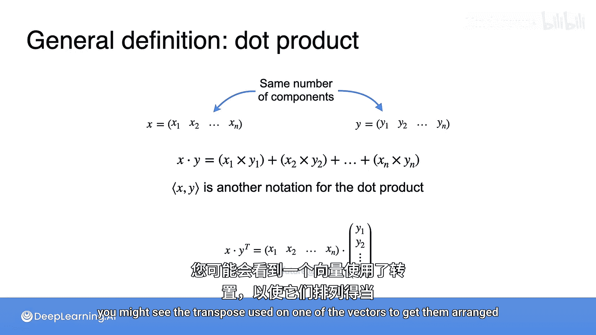

# 030：点积


## 概述
在本节课中，我们将学习一种使用矩阵和向量来表达线性方程组的简洁方法，称为点积。点积是线性代数中一个非常重要的运算。

## 点积的引入与计算
上一节我们介绍了向量的基本概念，本节中我们来看看点积运算。

点积是一种将两个向量组合成一个标量（单个数字）的运算。我们通过一个购买水果的例子来理解它。

假设你购买了一些水果：2个苹果，4个香蕉，1个樱桃。苹果单价3元，香蕉单价5元，樱桃单价2元。问题是：总共需要支付多少钱？

我们可以用两个向量来表示数量和单价：
*   **数量向量**：`[2, 4, 1]`
*   **单价向量**：`[3, 5, 2]`

计算总价的方法是分别计算每种水果的花费，然后求和：
*   苹果花费：`2 * 3 = 6`
*   香蕉花费：`4 * 5 = 20`
*   樱桃花费：`1 * 2 = 2`
*   总花费：`6 + 20 + 2 = 28`

上述计算过程就是点积运算。我们可以将其简洁地表示为两个向量的点积：

**公式**：`[2, 4, 1] · [3, 5, 2] = 2*3 + 4*5 + 1*2 = 28`

更常见的形式是将第一个向量写作行向量，第二个向量写作列向量，然后忽略具体物品，直接进行点积运算。

## 点积与向量范数的关系
接下来，我们探讨点积与之前学过的向量范数（长度）之间的联系。

回顾一下，坐标为 `[4, 3]` 的向量，其L2范数（长度）为5，因为 `sqrt(4^2 + 3^2) = 5`。

请注意，`4^2 + 3^2` 实际上就是向量 `[4, 3]` 与自身的点积：`4*4 + 3*3 = 25`。

**公式**：一个向量 **v** 的L2范数，等于该向量与自身点积的平方根。即 `||v|| = sqrt(v · v)`。

有时，点积也会用尖括号 `< , >` 来表示，例如 `<v, v>`。

## 转置操作
为了更规范地表示点积，我们需要引入**转置**操作。回顾之前将列向量转换为行向量的操作，这被称为转置。

转置操作将矩阵的列转换为行，用上标 **T** 表示。

**代码/示例**：
*   列向量转置为行向量：
    `[2, 4, 1]^T = [[2], [4], [1]]` （这里假设原向量是列向量，转置后是行向量，但为显示方便，用列表表示。严格来说，`[2, 4, 1]` 是行向量，其转置是列向量 `[[2], [4], [1]]`）。
*   行向量转置为列向量：
    `[[2], [4], [1]]^T = [2, 4, 1]`。

转置也可以应用于矩阵。给向量添加第二列，它就变成了一个3行2列的矩阵（3x2）。

**代码/示例**：
原始矩阵 A：
```
A = [[1, 4],
     [2, 5],
     [3, 6]]
```
转置矩阵 A^T：
```
A^T = [[1, 2, 3],
       [4, 5, 6]]
```
转置时，将原矩阵的每一列变成新矩阵的每一行。注意，矩阵的维度会交换：一个 `m x n` 的矩阵，其转置是一个 `n x m` 的矩阵。

## 点积的正式定义
最后，我们给出点积的正式定义。

设有两个具有相同分量数量 **n** 的向量 **x** 和 **y**：
**x** = [x1, x2, ..., xn]
**y** = [y1, y2, ..., yn]

它们的点积定义为各对应分量乘积之和：

**公式**：**x · y** = x1*y1 + x2*y2 + ... + xn*yn

在某些上下文中，点积要求左边的向量是行向量，右边的向量是列向量。这时，可能会看到对一个向量使用转置，以确保形式正确。例如，**x^T · y**，其中 **x** 和 **y** 都是列向量。

## 总结
本节课中我们一起学习了：
1.  **点积**的概念：两个向量对应分量乘积之和，结果是一个标量。
2.  点积的**计算方法**，并通过购买水果的例子进行了演示。
3.  点积与向量**L2范数**的关系：向量的长度等于其与自身点积的平方根。
4.  **转置**操作：将矩阵的行列互换，用上标T表示，是规范表示点积的重要工具。
5.  点积的**正式数学定义**。



点积是线性代数、机器学习和数据科学中最基础且最常用的运算之一，务必熟练掌握。