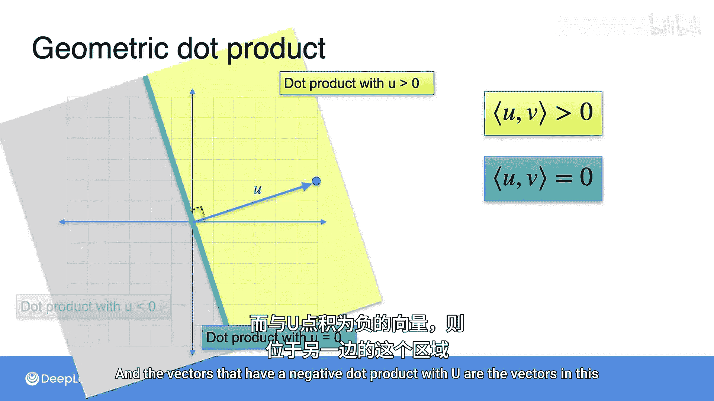

# 031：几何点积

在本节课程中，我们将学习向量点积的几何意义，特别是它与向量夹角之间的关系。我们将看到点积如何揭示两个向量是垂直、指向相同方向还是相反方向。

## 点积与垂直向量

上一节我们介绍了点积的基本计算，本节中我们来看看点积的几何特性。首先，观察两个垂直（也称为正交）的向量，例如 `[-1, 3]` 和 `[6, 2]`。

计算它们的点积：
`(-1)*6 + 3*2 = -6 + 6 = 0`

这个结果并非偶然。事实上，两个向量正交的充要条件是它们的点积为零。

以下是关于点积的两个重要事实总结：
*   一个向量与自身的点积等于其模（长度）的平方：`u · u = ||u||²`
*   两个垂直（正交）向量的点积总是 `0`：`u · v = 0`（当 `u` 与 `v` 垂直时）

## 点积的几何解释

对于两个任意向量 `u` 和 `v`，它们的点积是否有一个直观的几何解释呢？答案是肯定的。

让我们换个角度来看。向量与自身的点积是其模的平方。如果一个向量与另一个和它同方向但更长的向量做点积，结果近似于两个向量模的乘积。

当两个向量之间存在一个夹角 `θ` 时，情况类似。点积 `u · v` 等于向量 `u` 在向量 `v` 方向上的投影长度（`u'`）乘以向量 `v` 的模长。有趣的是，无论你将 `u` 投影到 `v` 上，还是将 `v` 投影到 `u` 上，得到的点积结果都是相同的。

一个更简单的表达方式是使用夹角 `θ` 的余弦值。两个向量 `u` 和 `v` 的点积公式为：
`u · v = ||u|| * ||v|| * cos(θ)`

## 点积的正负与方向

利用点积的几何知识，我们可以判断两个向量点积结果是正数、负数还是零。

以向量 `[6, 2]` 为例：
*   与垂直向量（如 `[-1, 3]`）的点积为 `0`。
*   与指向它右侧的向量（如 `[2, 4]`）的点积为 `20`，是**正数**。
*   与指向它左侧的向量（如 `[-4, 1]`）的点积为 `-22`，是**负数**。

为什么与 `[2, 4]` 的点积是正数？因为 `[2, 4]` 在 `[6, 2]` 方向上的投影长度是正的。

为什么与 `[-4, 1]` 的点积是负数？因为 `[-4, 1]` 在 `[6, 2]` 方向上的投影是负的，这意味着投影方向与 `[6, 2]` 本身的方向相反。

## 点积符号的几何区域

因此，一个向量 `u` 与其他向量的点积符号，对应着这些向量在空间中所处的区域。

*   所有与 `u` 的点积为 `0` 的向量，构成了与 `u` **垂直**的直线。
*   所有与 `u` 的点积为**正数**的向量，位于上图中右侧的阴影区域。
*   所有与 `u` 的点积为**负数**的向量，位于上图中左侧的阴影区域。

---

本节课中我们一起学习了点积的几何意义。我们了解到点积 `u · v = ||u|| * ||v|| * cos(θ)` 不仅与向量的长度有关，更关键地反映了它们之间的夹角 `θ`。点积为零表示向量垂直；点积为正表示夹角为锐角；点积为负则表示夹角为钝角。这一几何直观对于理解许多机器学习算法中的相似性度量和优化方向至关重要。