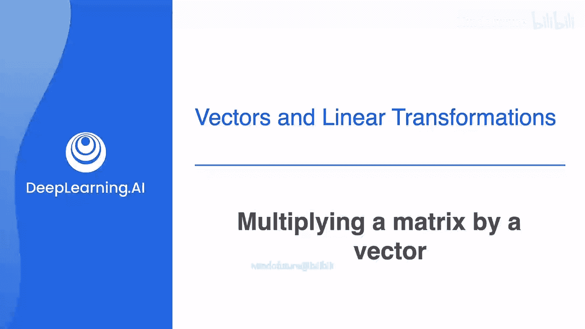
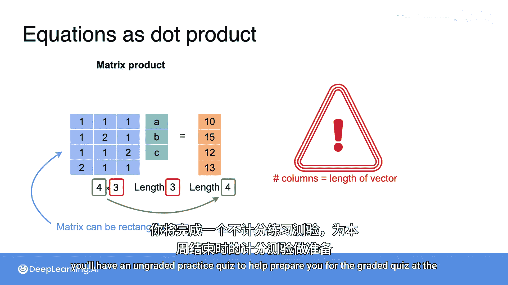
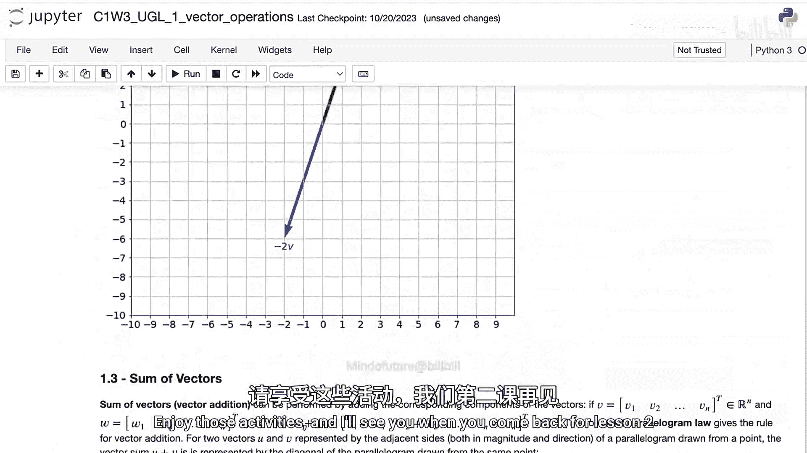

# 032：矩阵与向量的乘法



在本节课中，我们将学习如何计算矩阵与向量的乘法。这是线性代数中的核心操作，也是线性方程组的标准表示形式。

## 概述

矩阵与向量的乘法是连接线性代数与线性方程组的关键桥梁。通过将多个方程组合并成一个简洁的矩阵形式，我们可以更高效地进行计算和分析。本节将详细解释其背后的原理和计算规则。

## 从点积到矩阵向量乘法

上一节我们回顾了向量的点积运算。本节中我们来看看如何将多个点积运算组合起来。

点积是两个向量对应元素乘积之和。例如，一个包含已知系数的方程可以表示为点积。

考虑一个购买水果的例子：设苹果、香蕉、樱桃的单价分别为 `a`, `b`, `c`。购买2个苹果、4个香蕉和1个樱桃，总价为28元。这个方程可以写成：
`2*a + 4*b + 1*c = 28`

这可以表示为行向量 `[2, 4, 1]` 与列向量 `[a, b, c]` 的点积：
`[2, 4, 1] · [a, b, c] = 28`

## 线性方程组的矩阵表示

现在，假设我们有一个包含三个方程和三个未知数的系统：

1.  `a + b + c = 10`
2.  `a + 2b + c = 15`
3.  `a + b + 2c = 12`

每个方程都可以写成一个点积：

*   方程1： `[1, 1, 1] · [a, b, c] = 10`
*   方程2： `[1, 2, 1] · [a, b, c] = 15`
*   方程3： `[1, 1, 2] · [a, b, c] = 12`

注意到每个点积中都使用了相同的列向量 `[a, b, c]`。我们可以将这三个行向量堆叠起来，形成一个矩阵，从而将整个方程组简洁地表示为**矩阵与向量的乘法**。

```
[1, 1, 1]   [a]   [10]
[1, 2, 1] * [b] = [15]
[1, 1, 2]   [c]   [12]
```

**矩阵与向量的乘法，本质上就是多个点积运算的堆叠**。结果向量的每个元素，都是矩阵的对应行与向量进行点积的结果。

## 矩阵向量乘法的维度规则

理解矩阵与向量乘法的维度匹配规则至关重要。

*   矩阵的**列数**必须等于向量的**长度**（即维数）。
*   如果维度不匹配，就相当于尝试对长度不同的向量做点积，这是未定义的。

一个有趣的特性是，矩阵可以是矩形的。只要满足上述列数与向量长度相等的规则，乘法就成立。

例如，我们可以为上面的水果价格问题增加第四个方程（比如关于折扣的方程），形成一个4x3的矩阵，仍然可以与3维的向量 `[a, b, c]` 相乘。结果将是一个4维的向量，其长度等于矩阵的行数。

用公式表示，若矩阵 **A** 是 `m x n` 维，向量 **x** 是 `n x 1` 维，则乘积 **b = A x** 是一个 `m x 1` 维的向量。其中第 `i` 个元素 `b_i` 的计算公式为：
`b_i = A[i,:] · x`
这里 `A[i,:]` 表示矩阵 **A** 的第 `i` 行。

## 后续学习安排

本节课程到此结束。为了帮助你巩固知识，后续安排如下：



以下是本周的学习活动：
*   **非评分练习测验**：帮助你为本周结束时的评分测验做准备。
*   **未评分实验（Lab）**：你将学习如何使用Python的NumPy库执行点积和矩阵运算。这些技能对于完成本周的编程作业至关重要。

请享受这些练习活动。我们将在第二课再见。

## 总结



本节课中我们一起学习了矩阵与向量的乘法。我们了解到：
1.  矩阵向量乘法是表示线性方程组最紧凑和有效的方式。
2.  其计算本质是矩阵的每一行与向量进行点积。
3.  运算必须满足**矩阵列数等于向量长度**的维度规则。
4.  通过这种方式，我们可以将复杂的方程组计算转化为规范化的代数运算，为后续的机器学习算法学习打下基础。