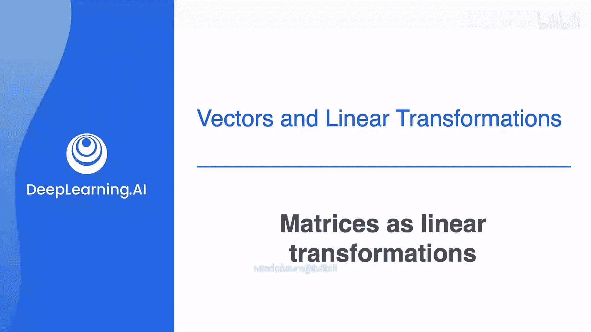
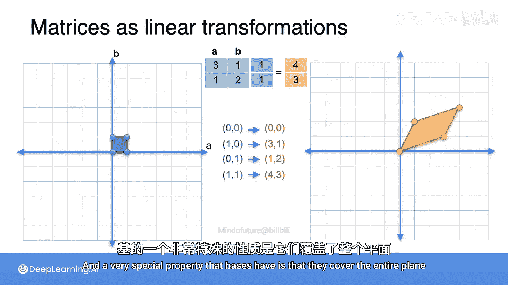
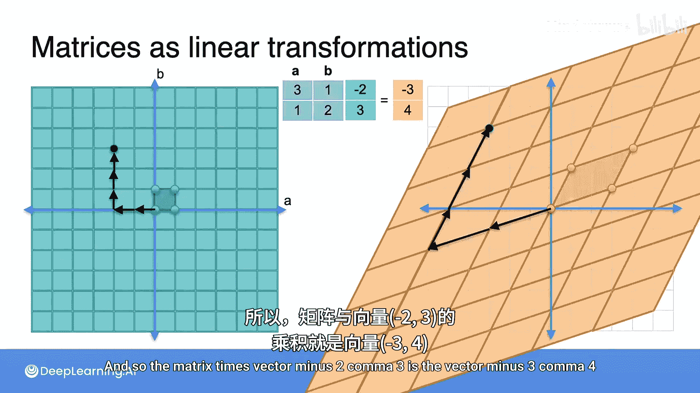

# 033：矩阵作为线性变换 🧮



在本节课中，我们将要学习矩阵的另一种强大且实用的表示方式：线性变换。我们将通过二维平面的例子来直观理解矩阵如何将空间中的点映射到新的位置，并探讨其背后的核心概念。

## 概述

在前面的视频中，我们已经看到矩阵可以表示为一组数字，用于描述线性方程组。但矩阵还有另一种非常强大且实用的表示方式，那就是作为线性变换。线性变换是一种以高度结构化的方式，将平面上的每个点发送到平面上另一个点的方法。

## 从矩阵到变换

让我们来看一个具体的例子。假设我们有一个2x2矩阵，其元素为3，1，1和2。

**矩阵 A**：
```
A = [[3, 1],
     [1, 2]]
```

这个矩阵对应一个线性变换。首先，考虑两个带有A轴和B轴标签的平面。这个变换会将左侧平面上的每一个点，按照特定的规则，映射到右侧平面上的一个点。

任何点都有两个坐标，这两个坐标构成一个列向量。为了得到右侧的向量，我们将左侧的向量乘以矩阵，得到的结果就是右侧的点。

## 关键点的变换示例

为了更好地理解，让我们看几个关键点的变换。

上一节我们介绍了矩阵作为变换的基本思想，本节中我们来看看具体的点是如何被映射的。

以下是几个基础点的变换过程：

1.  **原点 (0, 0)**：
    *   矩阵乘以向量 `[0; 0]`，得到向量 `[0; 0]`。
    *   所以，点 `(0, 0)` 被映射到 `(0, 0)`。对于线性变换，原点总是被映射到原点。

2.  **点 (1, 0)**：
    *   矩阵乘以向量 `[1; 0]`，得到向量 `[3; 1]`。
    *   所以，点 `(1, 0)` 被映射到 `(3, 1)`。

3.  **点 (0, 1)**：
    *   矩阵乘以向量 `[0; 1]`，得到向量 `[1; 2]`。
    *   所以，点 `(0, 1)` 被映射到 `(1, 2)`。

4.  **点 (1, 1)**：
    *   矩阵乘以向量 `[1; 1]`，得到向量 `[4; 3]`。
    *   所以，点 `(1, 1)` 被映射到 `(4, 3)`。

## 理解变换的整体效果

这些点的变换实际上定义了整个变换。让我们观察由这四个点形成的小正方形。它被映射成了一个平行四边形。

左侧的正方形被称为一个**基**，右侧的平行四边形也是一个基。基是线性代数中非常重要的概念，稍后你会明白为什么它们被称为基。基的一个非常特殊的性质是它们可以覆盖整个平面。

实际上，由于这个正方形可以铺满整个平面，而平行四边形同样可以铺满整个平面，因此这个线性变换可以简单地被理解为一种坐标系的改变。

## 应用变换到任意点

现在，我们来看看如何将变换应用到任意点上。例如，我们想找到点 `(-2, 3)` 被映射到了哪里。



在左侧的坐标系中，点 `(-2, 3)` 可以通过从原点出发，向左走2个单位，再向上走3个单位得到。

为了找到这个点在变换后的位置，我们只需在新的坐标系（由平行四边形定义的基）中，从原点出发，向左走2个“新单位”，再向上走3个“新单位”。

这样，我们就得到了点 `(-3, 4)`。因此，矩阵乘以向量 `[-2; 3]` 的结果就是向量 `[-3; 4]`。

**公式表示**：
```
A * v = [[3, 1],  *  [-2]   =  [-3]
         [1, 2]]     [ 3]       [ 4]
```

## 总结



本节课中我们一起学习了矩阵作为线性变换的表示方法。我们了解到，一个矩阵可以定义一种规则，将输入空间（如二维平面）中的每一个向量（点）映射到输出空间中的另一个向量。这种映射是线性的，保持了向量的加法和数乘运算。通过观察基向量（如 `(1,0)` 和 `(0,1)`）的变换，我们可以直观地看到整个空间是如何被“拉伸”、“旋转”和“剪切”的，并且可以计算出空间中任何一点的变换结果。理解矩阵作为变换，是深入掌握线性代数在机器学习和数据科学中应用的关键一步。