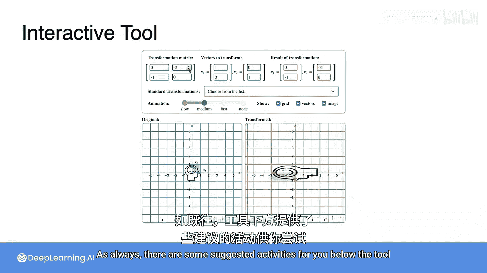

# 034：线性变换作为矩阵


## 概述
在本节课中，我们将学习如何从一个给定的线性变换出发，找到其对应的矩阵表示。我们将通过观察线性变换如何作用于二维空间中的基向量来推导出矩阵的列。

## 从线性变换到矩阵

上一节我们介绍了如何将矩阵视为线性变换。本节中，我们来看看如何逆向操作：从一个已知的线性变换推导出其对应的矩阵。

假设我们有一个未知的矩阵，我们知道它将一个基础正方形（或基）变换为另一个形状。我们的目标是找到这个矩阵的各个元素。

观察变换后几个关键点的位置：
*   点 (0, 0) 被变换到 (0, 0)。这总是成立的。
*   点 (1, 0) 被变换到 (3, -1)。
*   点 (0, 1) 被变换到 (2, 3)。
*   点 (1, 1) 被变换到 (5, 2)。

实际上，我们并不需要全部信息，只需要知道两个基向量的变换结果即可。

我们将使用箭头来表示这些点，因为向量通常被表示为从原点指向该点的箭头。

以下是基向量的变换关系：
*   向量 (1, 0) 被变换为向量 (3, -1)。
*   向量 (0, 1) 被变换为向量 (2, 3)。

你可以通过计算验证矩阵乘法是如何实现这一点的。

将向量 (1, 0) 和 (0, 1) 分别变换为 (3, -1) 和 (2, 3) 的矩阵，其列正是这两个变换后的向量。

因此，对应的矩阵是：
```
[ 3  2 ]
[ -1 3 ]
```

**核心方法**：要将一个线性变换转化为其对应的矩阵，你只需要观察两个基向量 (1, 0) 和 (0, 1) 被变换到了哪里，这两个变换后的向量就是矩阵的列。

## 互动探索

接下来，你将有机会使用一个互动工具来探索矩阵与线性变换之间的关系。

这可能是本课程中最受欢迎的工具之一。你可以为不同的 2x2 矩阵选择数值，并观察当它被视为线性变换时，是如何挤压和旋转二维空间的。

工具下方一如既往地提供了一些建议活动供你尝试。



## 总结
本节课中，我们一起学习了如何从线性变换推导出其矩阵表示。关键在于观察变换对标准基向量 (1, 0) 和 (0, 1) 的作用，并将变换后的结果直接作为矩阵的列。通过这种方法，我们可以在线性变换和矩阵之间自由转换。