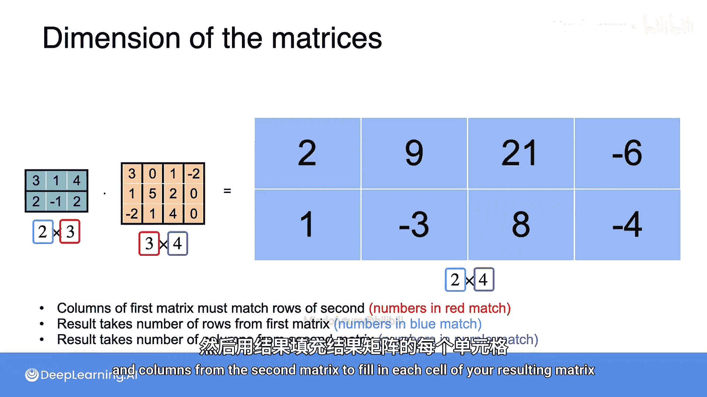

# 035：矩阵乘法


在本节课中，我们将要学习矩阵与矩阵的乘法。上一节我们介绍了矩阵与向量的乘法，本节中我们来看看如何将两个矩阵相乘。核心在于理解矩阵乘法对应着线性变换的组合。

## 概述

矩阵乘法不仅仅是数字的运算，它对应着将两个线性变换组合成一个新的线性变换。我们将通过几何直观和代数计算两种方式来理解这一过程。

## 矩阵乘法的几何视角

首先，让我们回顾一个已知的线性变换。考虑矩阵 **A**：
```
A = [[3, 1],
     [1, 2]]
```
这个变换将标准基向量 `[1, 0]` 映射到 `[3, 1]`，将 `[0, 1]` 映射到 `[1, 2]`。左边的标准基网格被变换为右边的一个平行四边形网格。

现在，我们引入第二个线性变换，对应矩阵 **B**：
```
B = [[2, -1],
     [0,  2]]
```
这个变换作用于**第一个变换后的基向量**上。例如，向量 `[3, 1]` 经过 **B** 变换后成为 `[2*3 + (-1)*1, 0*3 + 2*1] = [5, 2]`。类似地，向量 `[1, 2]` 被变换为 `[0, 4]`。

如果我们忽略中间的过渡状态，直接从最初的基向量看向最终的结果，我们发现存在一个从起点到终点的直接线性变换。这个新的变换对应一个新的矩阵 **C**。

通过观察基向量的映射关系，我们可以直接得到这个组合变换的矩阵 **C**：
*   第一个基向量 `[1, 0]` 被映射到了 `[5, 2]`。
*   第二个基向量 `[0, 1]` 被映射到了 `[0, 4]`。

因此，组合变换的矩阵是：
```
C = [[5, 0],
     [2, 4]]
```
**关键点**：这个组合变换 **C** 正是矩阵 **A** 和 **B** 的乘积，即 `C = B * A`。请注意顺序，因为线性变换是**从右向左**作用的：先应用 **A** 变换，再应用 **B** 变换。所以矩阵乘法写作 `B * A`。

## 矩阵乘法的计算方法

除了几何视角，我们也可以通过代数公式快速计算矩阵乘积。其核心是**行与列的点积**。

给定两个矩阵 **A** (m×n) 和 **B** (n×p)，它们的乘积 **C** (m×p) 中的每个元素 `C[i][j]` 由以下公式计算：
```
C[i][j] = (第 i 行 of A) · (第 j 列 of B)
```
其中 `·` 表示向量的点积运算。

让我们用之前的例子验证一下，计算 `B * A`：
*   **C[0][0]** (左上角): `[2, -1] · [3, 1]` = `2*3 + (-1)*1 = 5`
*   **C[0][1]** (右上角): `[2, -1] · [1, 2]` = `2*1 + (-1)*2 = 0`
*   **C[1][0]** (左下角): `[0, 2] · [3, 1]` = `0*3 + 2*1 = 2`
*   **C[1][1]** (右下角): `[0, 2] · [1, 2]` = `0*1 + 2*2 = 4`

计算结果 `[[5, 0], [2, 4]]` 与几何方法得到的结果完全一致。

## 非方阵的乘法

矩阵乘法不仅限于方阵。以下是乘法的维度规则。

考虑一个 2×3 的矩阵 **D** 和一个 3×4 的矩阵 **E**：
```
D = [[3, 1, 4],
     [2, -1, 2]]

E = [[3, 0, 2, 1],
     [1, 5, 1, -6],
     [-2, 1, 0, 0]]
```
它们的乘积 **F = D * E** 将是一个 2×4 的矩阵。

计算过程遵循同样的点积规则。例如，计算 **F[1][0]** (第二行，第一列)：
```
F[1][0] = D的第二行 · E的第一列
        = [2, -1, 2] · [3, 1, -2]
        = 2*3 + (-1)*1 + 2*(-2) = 6 - 1 - 4 = 1
```
通过完成所有行与列的点积，即可得到结果矩阵。

从这个例子中，我们可以总结出矩阵乘法的关键规则：

以下是矩阵乘法的三个核心规则：
1.  **可乘性条件**：第一个矩阵的**列数**必须等于第二个矩阵的**行数**。在上例中，**D** 有3列，**E** 有3行，满足条件。
2.  **结果矩阵的行数**：结果矩阵的行数等于第一个矩阵的行数。上例中，**D** 有2行，结果 **F** 也有2行。
3.  **结果矩阵的列数**：结果矩阵的列数等于第二个矩阵的列数。上例中，**E** 有4列，结果 **F** 也有4列。

简而言之，一个 `(m×n)` 矩阵与一个 `(n×p)` 矩阵相乘，结果是一个 `(m×p)` 矩阵。

## 总结

本节课中我们一起学习了矩阵乘法。
*   我们从**几何角度**理解了矩阵乘法对应着线性变换的**组合**，并且变换的应用顺序决定了矩阵的乘法顺序（从右向左）。
*   我们学习了矩阵乘法的**代数计算方法**，即用第一个矩阵的行与第二个矩阵的列进行点积来填充结果矩阵的每个位置。
*   最后，我们探讨了**非方阵的乘法**，并掌握了矩阵乘法的维度匹配规则：`(m×n) * (n×p) = (m×p)`。



理解矩阵乘法是掌握线性代数在机器学习和数据科学中应用的基础。