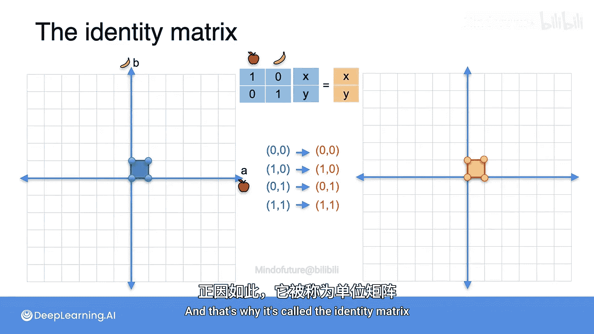

# 036：单位矩阵

在本节课中，我们将要学习线性代数中一个非常特殊且重要的概念——**单位矩阵**。它在线性变换和矩阵乘法中扮演着类似于数字“1”的角色。

## 数字“1”的类比

上一节我们介绍了矩阵乘法的基本概念，本节中我们来看看矩阵世界中的“1”。当我们思考数字和乘法时，数字“1”是一个非常特殊的数。它特殊的原因在于，**任何数乘以1，结果仍然是它本身**。

## 单位矩阵的定义与作用

单位矩阵在矩阵中满足完全相同的角色。**单位矩阵**是这样一个矩阵：当它与任何其他矩阵相乘时，结果仍然是那个矩阵。其对应的线性变换也非常简单，就是**保持平面不变**的变换。

以下是它的外观：

单位矩阵有一个非常简单的结构：**主对角线上全是1，其余位置全是0**。

## 单位矩阵的工作原理

为什么它能起到这样的作用？当我们用单位矩阵乘以任何一个向量时，例如一个包含元素 `A, B, C, D, E` 的向量，你可以验证得到的结果向量仍然是 `A, B, C, D, E`。

我鼓励你用纸笔验证一下。例如，结果向量的第一个元素是这样计算的：**第一行与向量的点积**。你可以验证这个点积的结果就是 `A`。

以下是单位矩阵 `I` 与向量 `v` 相乘的公式表示：

**I * v = v**

其中，`I` 是单位矩阵，`v` 是任意向量。

## 单位矩阵对应的线性变换

作为线性变换，单位矩阵非常简单，因为它将每个点**精确地映射到自身**。

正如你所见，这个矩阵将向量 `(0,0)` 映射到 `(0,0)`，将向量 `(1,0)` 映射到 `(1,0)`，等等。这就是为什么它被称为**单位矩阵**或**恒等矩阵**。

## 总结

本节课中我们一起学习了**单位矩阵**。我们了解到，单位矩阵在矩阵乘法中的作用类似于数字“1”，任何矩阵或向量乘以单位矩阵都保持不变。它的结构是主对角线为1，其余为0。对应的线性变换是恒等变换，不改变空间中的任何点。理解单位矩阵是掌握更复杂矩阵运算的基础。