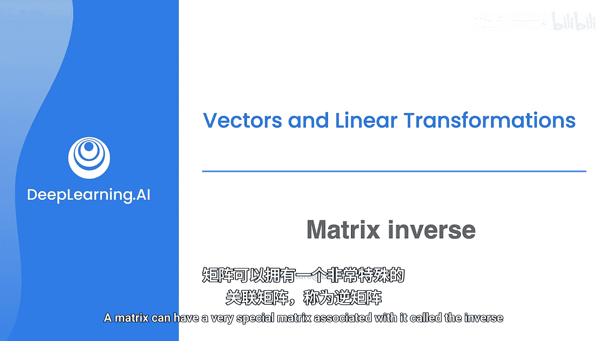
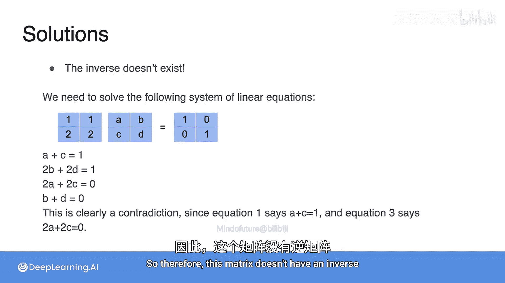

# 037：矩阵的逆

在本节课中，我们将要学习线性代数中一个核心且强大的概念——矩阵的逆。我们将从数字的逆开始类比，理解逆矩阵的几何意义，并学习如何通过求解线性方程组来找到它。

## 从数字到矩阵：逆的概念

上一节我们介绍了矩阵乘法，本节中我们来看看矩阵的“逆”是什么。

一个矩阵可以有一个与之关联的特殊矩阵，称为它的逆矩阵。当我想到矩阵的逆时，我会联想到数字的逆，即那个与它相乘后结果为1的数。

例如，数字2的逆是1/2，数字-5的逆是-1/5。用公式表示就是：
**2 × (1/2) = 1**
**(-5) × (-1/5) = 1**

逆矩阵正是这样一个矩阵：当它与原矩阵相乘时，结果是单位矩阵。单位矩阵在线性变换中的作用就像数字1，它不改变任何东西。

## 逆矩阵的几何意义

在上一节我们了解了矩阵代表线性变换，本节中我们来看看逆矩阵在几何上意味着什么。

在线性变换中，逆矩阵是“撤销”原矩阵所做工作的那个矩阵。具体来说，它是将变换后的平面恢复到初始状态的那个变换。

以下是逆矩阵的工作原理。想象你有一个线性变换，对应一个矩阵，其元素为 `[3, 1; 1, 2]`。这个变换将一个正方形变成了一个平行四边形。现在，存在另一个变换，可以将这个平行四边形变回原来的正方形。这个“撤销”变换对应的矩阵，就是原矩阵的逆矩阵。

这意味着，这两个变换的组合对应于单位矩阵，即那个对平面不做任何改变、保持原样的变换。

## 如何表示和寻找逆矩阵

既然我们理解了逆矩阵的作用，那么如何表示和计算它呢？

我们用 `A⁻¹` 来表示矩阵 `A` 的逆矩阵。就像我们说 `2⁻¹ = 1/2` 一样，`A⁻¹` 就是 `A` 的逆矩阵。逆矩阵满足以下关系：
**A × A⁻¹ = I**
其中 `I` 是单位矩阵。

那么，我们如何找到逆矩阵中的各个元素呢？答案是：通过求解一个线性方程组。

假设原矩阵为 `M`，其逆矩阵为 `M⁻¹`，它们的乘积是单位矩阵 `I`。通过将矩阵乘法的结果与单位矩阵的对应元素相等，我们可以得到一系列方程。每个方程都是一个线性方程，最终形成一个线性方程组。通过求解这个方程组（例如使用消元法），我们就能得到逆矩阵的所有元素值。

## 实践练习：计算逆矩阵

理解了方法后，让我们通过练习来巩固。以下是两个寻找逆矩阵的练习。

**练习一：**
寻找以下矩阵的逆矩阵：
`[2, 2; 1, 4]`

通过求解对应的线性方程组，我们得到以下结果：
a = 1/4， b = -1/4， c = -1/8， d = 5/8。
因此，该矩阵的逆矩阵是：
`[1/4, -1/4; -1/8, 5/8]`

**练习二：**
寻找以下矩阵的逆矩阵：
`[1, 2; 2, 1]`

我们尝试求解对应的线性方程组：
a + 2c = 1
b + 2d = 0
2a + c = 0
2b + d = 1

然而，这里存在明显的矛盾。第一个方程说 a + 2c = 1，但第三个方程 2a + c = 0 经过变换可以推出 a + 2c 不可能等于 1。因此，这个方程组无解。

这意味着，**并非所有矩阵都有逆矩阵**。当一个矩阵没有逆矩阵时，我们称它为“奇异矩阵”或“不可逆矩阵”。

## 总结

本节课中我们一起学习了矩阵的逆。我们从数字的逆进行类比，理解了逆矩阵是能够“撤销”原矩阵线性变换、使得两者乘积为单位矩阵的矩阵。我们学习了通过建立并求解线性方程组来寻找逆矩阵元素的方法。最后，我们通过练习发现，就像数字0没有倒数一样，也存在一些没有逆矩阵的矩阵，称为奇异矩阵。理解矩阵的逆是学习线性代数后续内容，如求解线性方程组、矩阵分解等的重要基础。