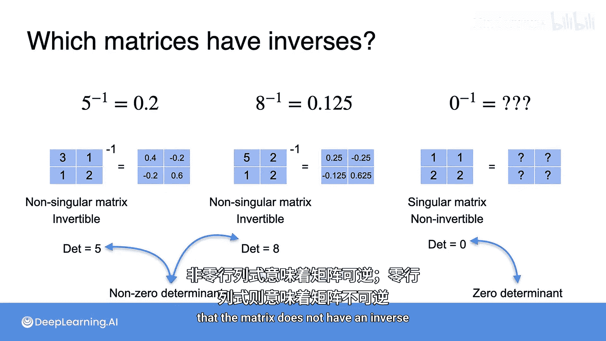

# 038：哪些矩阵有逆矩阵

在本节课中，我们将学习判断一个矩阵是否拥有逆矩阵的规则。我们将看到，矩阵与数字在拥有“乘法逆元”这一特性上非常相似，并且会引入一个关键概念——行列式，来帮助我们快速判断。

## 概述

上一节我们介绍了如何寻找矩阵的逆矩阵，并了解到有些矩阵没有逆矩阵。那么，一个矩阵拥有逆矩阵的规则是什么呢？本节将揭示这个规则，并解释它与矩阵的行列式之间的紧密联系。

## 矩阵与数字的类比

矩阵的很多行为与数字相似。正如一些数字拥有乘法逆元一样，一些矩阵也拥有乘法逆元（即逆矩阵）。

*   例如，数字 **5** 的逆是 **1/5** 或 **0.2**。
*   数字 **8** 的逆是 **1/8** 或 **0.125**。

然而，并非所有数字都有乘法逆元。例如，数字 **0** 的逆就不存在，因为没有哪个数字乘以 **0** 会等于 **1**。

从上一节的练习中我们知道，矩阵也是如此。有些矩阵有逆矩阵，而有些则没有。

## 可逆矩阵与不可逆矩阵

那么，什么样的矩阵是特殊的呢？正如之前所见，前两个矩阵是**非奇异**的，而第三个矩阵是**奇异**的。这正是判断矩阵是否可逆的关键。

*   **非奇异矩阵**总是有逆矩阵，因此我们也称它们为**可逆矩阵**。
*   **奇异矩阵**永远没有逆矩阵，因此我们称它们为**不可逆矩阵**。

## 行列式的关键作用

当我们观察这些矩阵的行列式时，会发现一个有趣的现象。行列式为我们提供了一个判断矩阵是否可逆的快速方法。

*   对于**可逆矩阵**，其行列式**不等于零**（`det(A) ≠ 0`）。这类似于非零数字拥有逆元。
*   对于**不可逆矩阵**，其行列式**等于零**（`det(A) = 0`）。这类似于数字零没有乘法逆元。

因此，我们可以这样记忆：**非零行列式意味着矩阵有逆矩阵，零行列式意味着矩阵没有逆矩阵**。

## 总结

本节课我们一起学习了判断矩阵是否可逆的核心规则。我们通过类比数字的逆元，理解了可逆（非奇异）矩阵与不可逆（奇异）矩阵的区别。最重要的是，我们掌握了利用**行列式**进行判断的简便方法：**行列式非零（`det(A) ≠ 0`）的矩阵是可逆的，而行列式为零（`det(A) = 0`）的矩阵是不可逆的**。这个规则是线性代数中连接矩阵可逆性与行列式特性的一个重要桥梁。