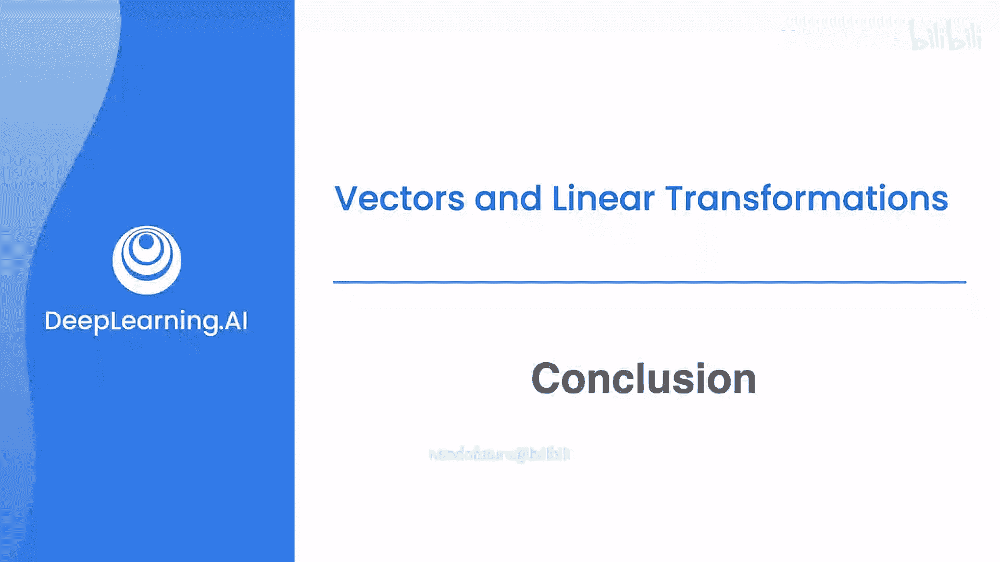
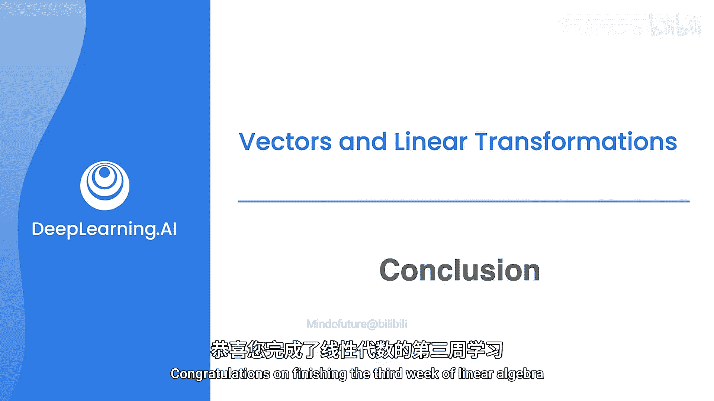

# 040：总结_03_03_01

在本节课中，我们将对线性代数第三周的学习内容进行总结。我们将回顾本周学习的核心概念，包括矩阵、向量及其运算，并介绍线性变换这一重要的可视化方法。

## 矩阵与向量运算回顾

上一节我们介绍了矩阵和向量的基本概念。本节中，我们来看看本周学习的核心内容：对矩阵和向量执行的各种运算。

以下是本周学习的主要运算：

*   **加法与减法**：相同维度的矩阵或向量可以相加或相减。公式为：**C = A + B**，其中 `c_ij = a_ij + b_ij`。
*   **标量乘法**：一个矩阵或向量可以与一个标量（单个数字）相乘。公式为：**B = k * A**，其中 `b_ij = k * a_ij`。
*   **矩阵向量乘法**：这是将数据输入模型的关键运算。一个 `m x n` 的矩阵 **A** 可以与一个 `n x 1` 的向量 **x** 相乘，得到一个 `m x 1` 的向量 **b**。公式为：**b = A * x**。
*   **矩阵乘法**：两个矩阵可以相乘，前提是第一个矩阵的列数等于第二个矩阵的行数。若 **A** 是 `m x n` 矩阵，**B** 是 `n x p` 矩阵，则乘积 **C = A * B** 是一个 `m x p` 矩阵，其中元素 `c_ij` 是 **A** 的第 `i` 行与 **B** 的第 `j` 列的点积。

## 线性变换：矩阵的可视化

掌握了基本运算后，这些运算引出了一个非常有用的概念，帮助我们直观理解矩阵的作用，即线性变换。

简单来说，**线性变换**是通过矩阵乘法来实现的几何操作，它能够对空间中的向量进行旋转、缩放、剪切等变换。一个矩阵代表一种特定的变换规则。当我们用矩阵 **A** 乘以向量 **v** 时，得到的新向量 **Av** 就是原向量 **v** 经过该线性变换后的结果。

## 课程互动与实践

我们为你准备了贯穿整个课程的交互式练习。在这些练习中，你将获得更多使用这些概念的实际经验。

通过动手实践，你将能更牢固地掌握矩阵、向量运算以及线性变换的直观含义，为后续的机器学习与数据科学学习打下坚实的数学基础。

## 总结

本节课中我们一起学习了线性代数第三周的总结。我们回顾了对矩阵和向量执行加法、标量乘法及矩阵乘法等核心运算。更重要的是，我们了解到这些运算可以通过“线性变换”来可视化，这为我们理解矩阵如何改变和操作数据空间提供了强大的直觉。恭喜你完成线性代数第三周的学习，期待你在未来的课程和职业生涯中应用这些知识。