# 041：线性变换与PCA入门 🧮

在本节课中，我们将要学习线性代数中两个核心概念：线性变换的几何意义，以及一个重要的数据科学应用——主成分分析。我们将从线性变换的奇异性与行列式入手，逐步过渡到特征向量与特征值，最终理解PCA如何实现数据降维。

## 概述

第四周我们将继续通过线性变换的视角学习线性代数的核心概念。首先，我们将探讨行列式和矩阵奇异性在线性变换中的几何含义。接着，我们将学习线性代数在现实世界中最强大的应用之一：特征值与特征向量。它们在包括机器学习在内的许多领域中被广泛使用，尤其在一个非常重要的降维算法——主成分分析中。

## 主成分分析简介

主成分分析是一种在数据科学中用于降低数据维度，同时尽可能保留原始数据信息的技术。

想象这些点构成了你的数据集，你希望简化它。例如，尽管这些点存在于二维空间中，但它们似乎都靠近某条直线。或许我们可以从这条直线的视角来看待数据。PCA能够找到这条直线，并通过将所有点投影到这条直线上来简化数据集。现在，你得到了一个更简单的、几乎包含了原始数据集所有信息的数据。这里发生的是，PCA帮助你从一个二维数据集转换到一个一维数据集，同时携带了几乎相同的信息量。这就是为什么它被称为降维算法。

所以，总结来说，主成分分析是一种用于数据科学应用的技术，旨在减少数据的维度，同时尽可能少地丢失信息。你可以想象一个包含许多数据列的数据集，有时使用起来很繁琐或难以可视化。PCA的目标是智能地减少列数，提供一个更紧凑的数据集，同时不丢失原始数据集包含的所有有用信息。

## 本周学习路径总结

以下是理解这些概念我们将要采取的路径总结。

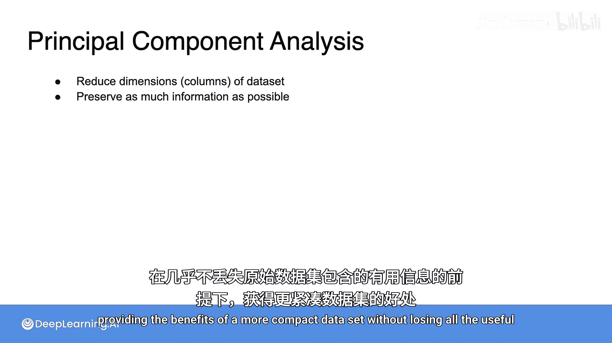

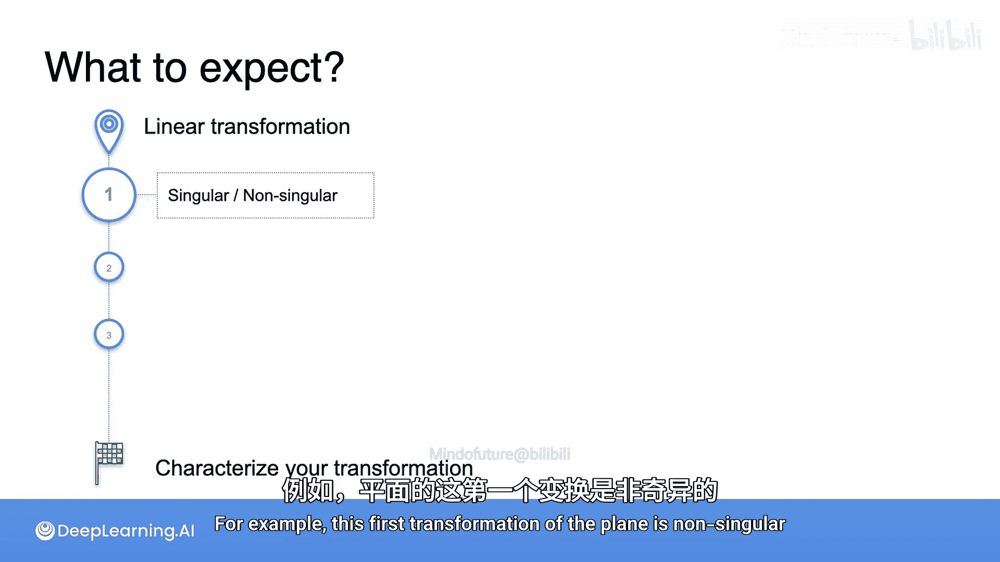

### 第一课：线性变换的特征

在第一课中，你将从用矩阵表示的线性变换开始，目标是要能够描述这个变换的特征。

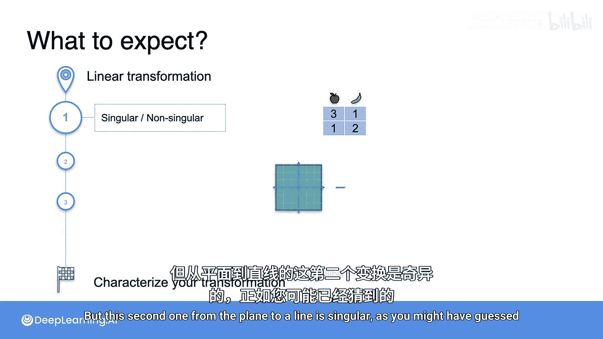

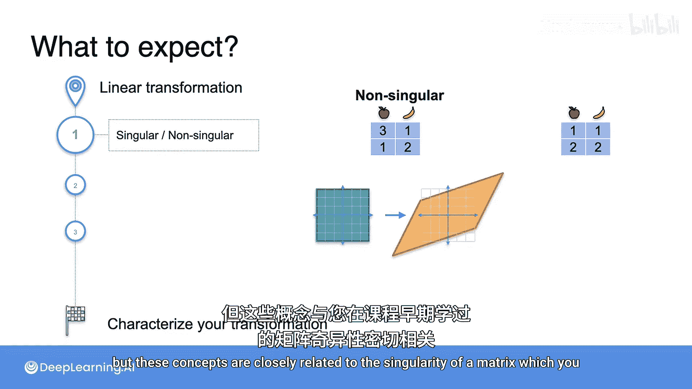

首先，你将学习判断一个变换是奇异的还是非奇异的。例如，第一个从平面到平面的变换是非奇异的，而第二个从平面到一条直线的变换是奇异的。这些概念与你之前在课程中学到的矩阵奇异性密切相关。

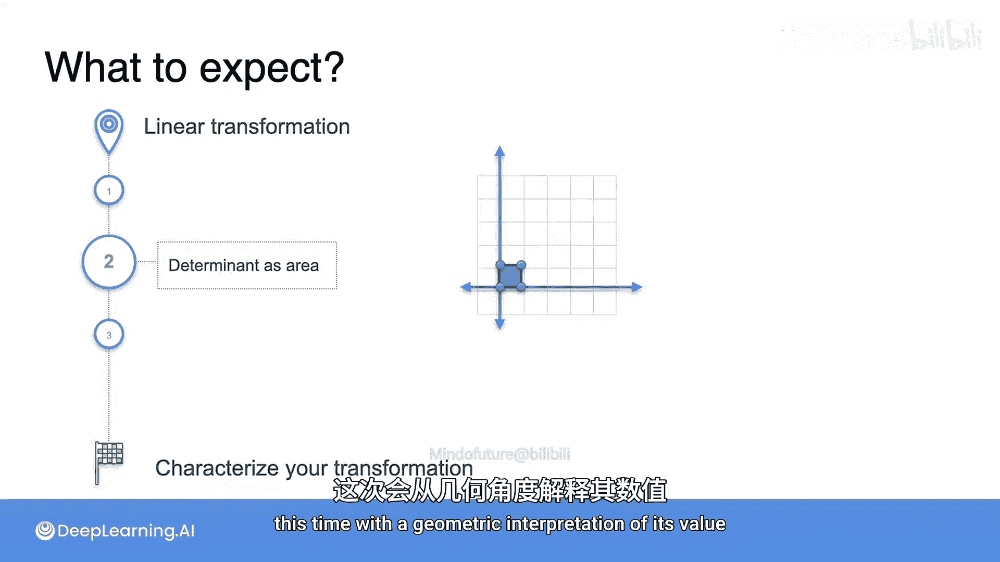

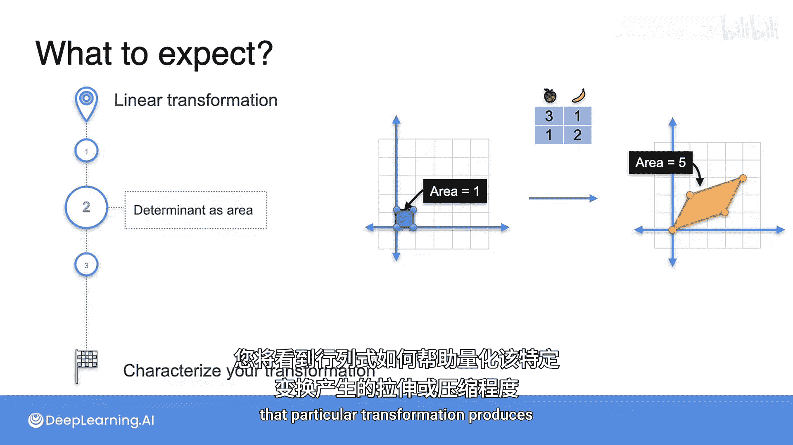

接下来，我们将回到行列式的概念，这次是从其值的几何解释出发。线性变换可以拉伸或压缩空间，你将看到行列式如何帮助量化特定变换产生的拉伸或压缩程度。

最后，你将学习行列式的一些性质。例如，当你将两个矩阵相乘或求一个矩阵的逆时，会出现一些非常直观的行列式性质。这些性质在你想要分析变换的逆，或者处理一系列连续的不同变换时非常有用。

总而言之，在第一课中，你将学习使用行列式来描述你的线性变换。

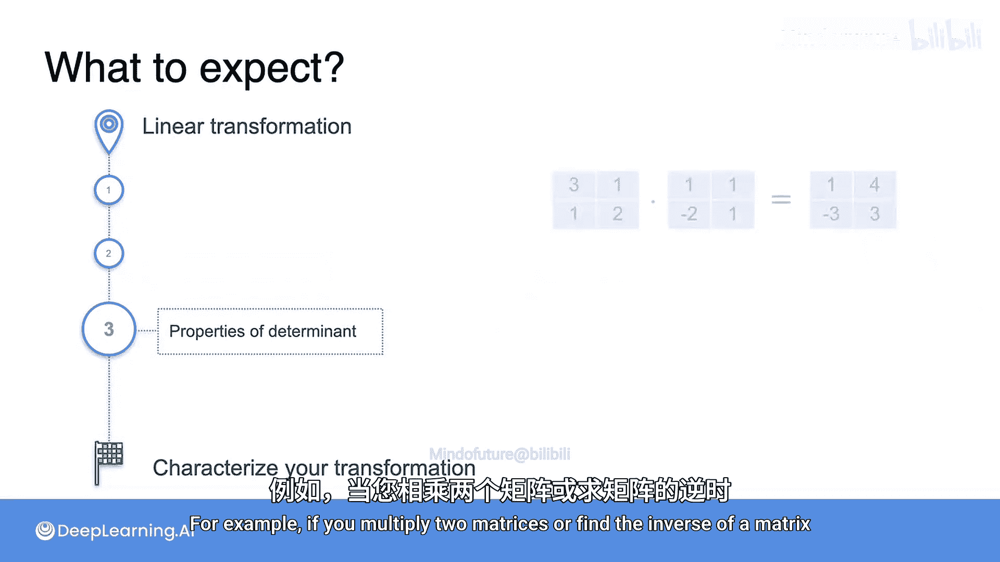

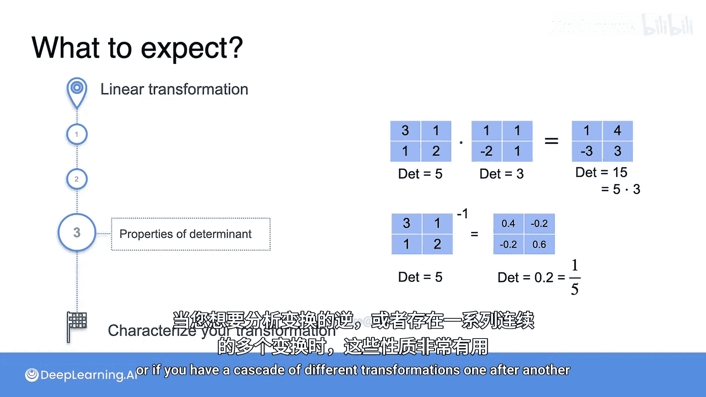

### 第二课：从基础到PCA

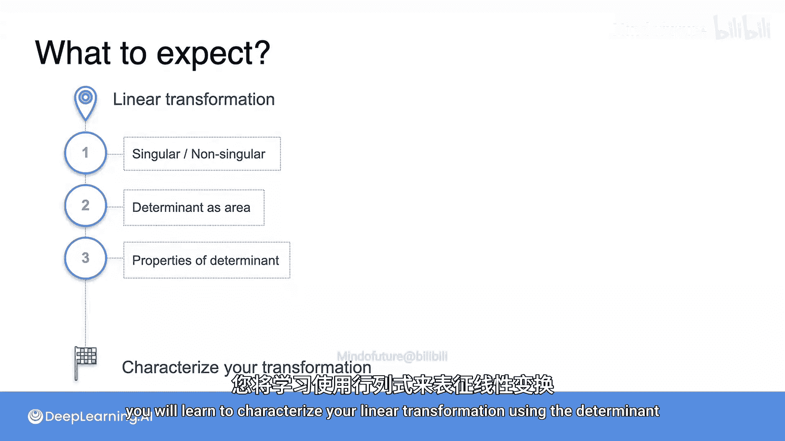

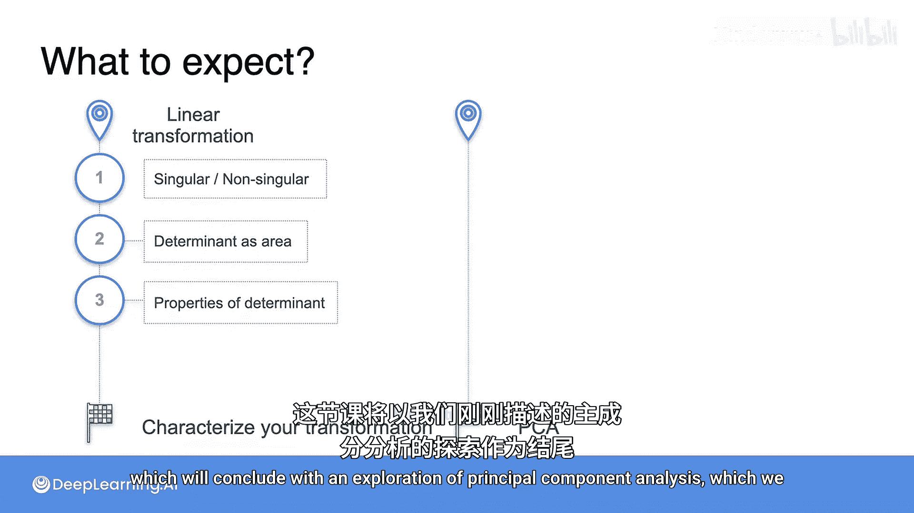

第二课将以探索我们刚刚描述的主成分分析作为结束。

首先我们需要引入基的定义。基是一组定义空间的向量，沿着构成基的向量移动，可以到达空间中的任何点。例如，右边展示的任意向量组合都是平面的一个基。

接下来，我们将学习张成空间的概念。这个概念非常有用，因为它告诉我们通过向量组的线性组合可以访问或生成哪个空间。例如，单个向量总是张成一条线；两个不指向同一方向，也不完全指向相反方向（180度）的向量总是张成一个平面。

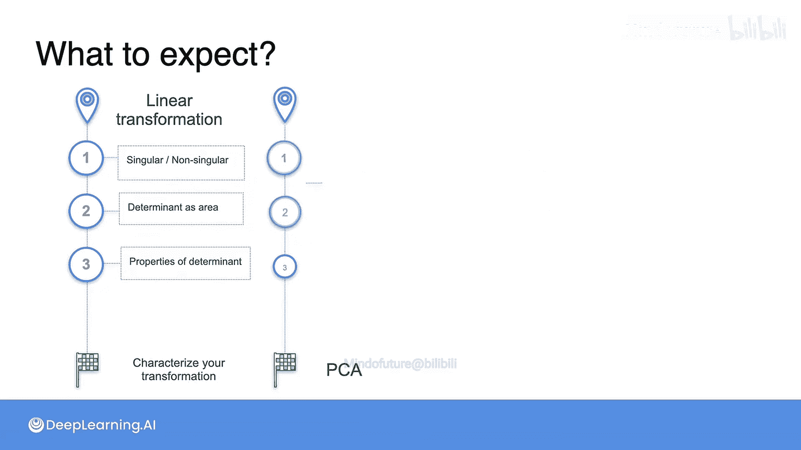

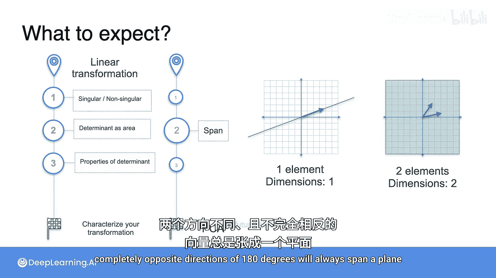

学习PCA所需的最后一个要素是特征向量和特征值的概念。你将更详细地学习这些概念，但现在你可以将特征向量看作是矩阵所指向的方向。将线性变换应用于其特征向量上的一个点，只会将该点移动到同一向量上的不同位置。

换句话说，对于这些特殊向量上的点，乘以一个矩阵等同于乘以一个常数。特征向量帮助我们快速描述与给定矩阵相关的线性变换，并在许多机器学习应用中使用。其中之一就是PCA，这将是我们本周涵盖的最后一个主题。

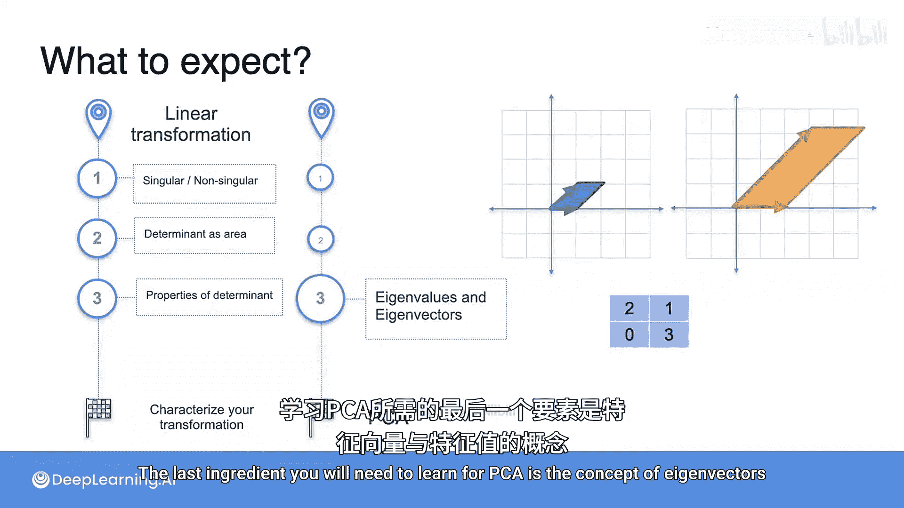

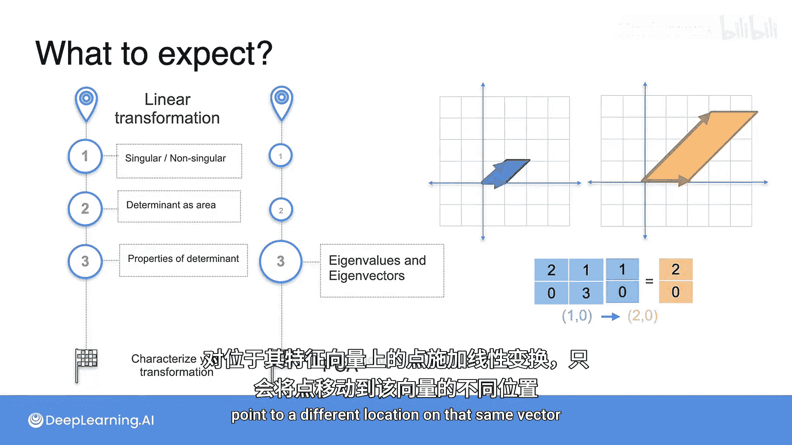

好的，这就是你可以期待的内容的快速总结。让我们开始深入学习吧。

## 总结

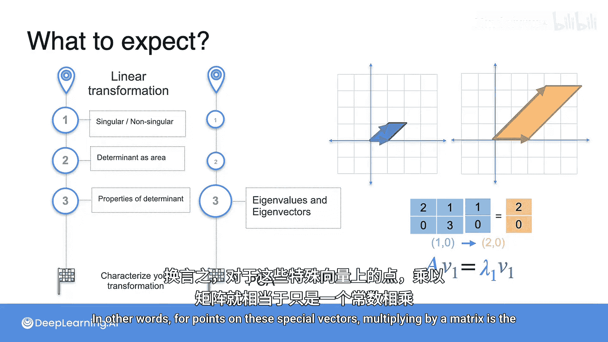

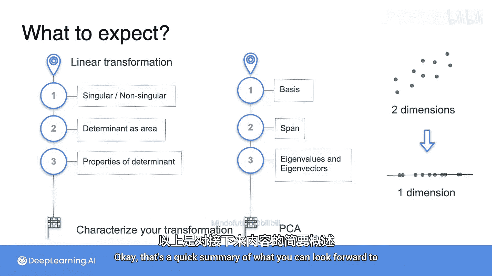

本节课中我们一起学习了第四周的课程概览。我们了解到本周将通过线性变换的视角深入理解行列式、奇异性、基、张成空间、特征值与特征值等核心概念，并最终将这些知识应用于理解主成分分析这一强大的数据降维技术。接下来的课程将带领我们一步步构建起完整的知识体系。