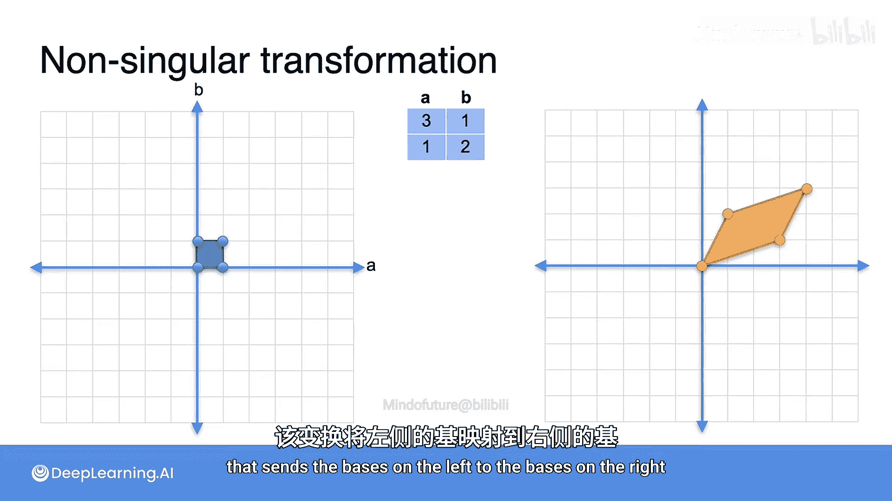
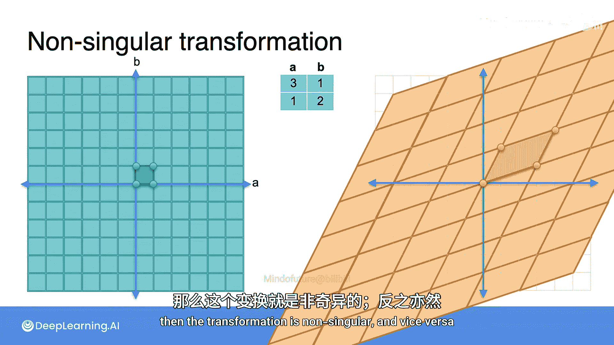
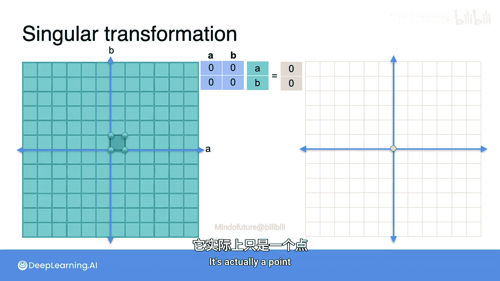
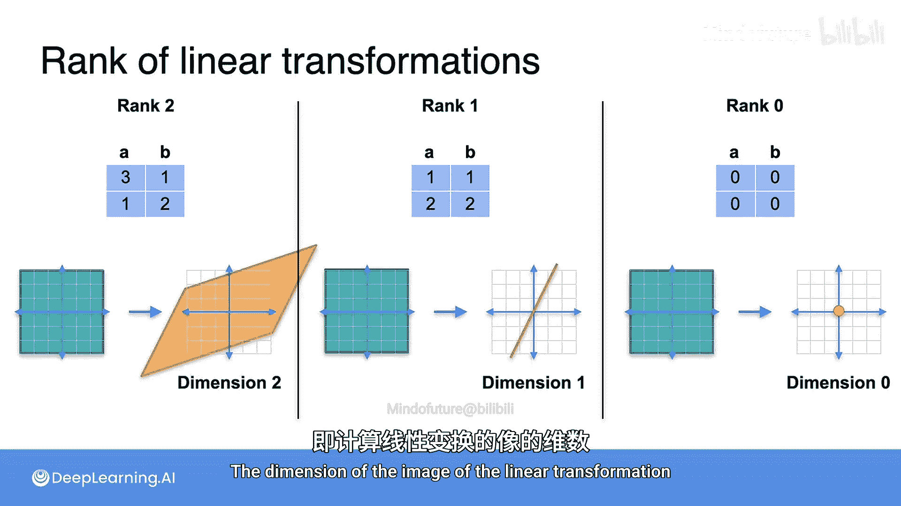

# 042：线性变换的奇偶性与秩 🧮

在本节课中，我们将要学习线性代数中两个核心概念：**奇异矩阵**与**非奇异矩阵**。我们将看到，矩阵对应着线性变换，而线性变换的“奇异性”可以通过其变换结果是否覆盖整个平面来直观判断。同时，我们还将揭示矩阵的**秩**与变换后图像维度之间的紧密联系。

---

上一节我们介绍了矩阵与线性变换的对应关系。本节中，我们来看看如何判断一个线性变换是奇异的还是非奇异的。

矩阵对应着线性变换。因此，线性变换也可以分为奇异和非奇异两种。你会发现，有一种非常直观的方法来识别它们。线性变换的秩也能被轻松识别。

你已经知道，一个矩阵如何对应一个线性变换。例如，矩阵 `[[3, 1], [1, 2]]` 对应一个将左侧蓝色网格变换为右侧橙色网格的线性变换。

这个变换将左侧的蓝色正方形基底，映射为右侧的橙色平行四边形基底。一个关键特性是：**橙色网格覆盖了平面上的每一个点**。

事实证明，这正是**非奇异变换**的特征。如果矩阵乘法变换后的点覆盖了整个平面，那么这个变换就是非奇异的。反之，则是奇异的。

变换后覆盖的点集，被称为该变换的**像**。

---

为了理解奇异变换，让我们看一个奇异矩阵的例子，例如矩阵 `[[1, 1], [2, 2]]`。

*   将矩阵乘以向量 `[0, 0]`，得到 `[0, 0]`。
*   乘以向量 `[1, 0]`，得到 `[1, 2]`。
*   乘以向量 `[0, 1]`，得到 `[1, 2]`。
*   乘以向量 `[1, 1]`，得到 `[2, 4]`。

这意味着，左侧的正方形基底被映射成了一个**退化的平行四边形**——实际上是一条线段。

问题在于，左侧的网格并没有被映射到整个右侧平面，而是只映射到了这条线上。因为一个平行四边形（无论多薄）可以覆盖整个平面，但如果它“扁平”成一条线段，就只能覆盖右侧的这条橙色线，无法覆盖整个平面。

所以，总结来说：**当一个矩阵是奇异的，变换后的像无法覆盖整个平面，只能覆盖它的一小部分**。在这个例子中，它覆盖的是一条线。

---

现在，让我们看一个更极端的奇异矩阵：`[[0, 0], [0, 0]]`。

这个矩阵将任何坐标的向量都映射到向量 `[0, 0]`，即原点。

因此，整个平面被映射到了原点处的那个橙色点上。这个矩阵无疑是高度奇异的，因为它的像甚至不是一条线，而是一个点。

---

以下是核心概念的总结：

1.  **第一个矩阵** `[[3, 1], [1, 2]]` 将整个平面映射到整个平面，所以它是**非奇异的**。
2.  **第二个矩阵** `[[1, 1], [2, 2]]` 将整个平面映射到一条线，所以它是**奇异的**。
3.  **第三个矩阵** `[[0, 0], [0, 0]]` 将整个平面映射到一个点，所以它是**更奇异的**。

注意观察：

*   第一个变换的像的维度是 **2**，这恰好就是这个矩阵的**秩**。
*   第二个变换的像的维度是 **1**（因为它是一条线），这就是该矩阵的秩。
*   第三个变换的像的维度是 **0**（因为它是一个点），这就是该矩阵的秩。

因此，我们得到了另一种计算秩的方法：**矩阵的秩等于其对应线性变换的像的维度**。

---

本节课中，我们一起学习了如何通过观察线性变换后图像覆盖平面的情况，来直观判断矩阵的奇偶性。非奇异变换的像覆盖整个平面，而奇异变换的像则坍缩为更低维度的空间（如线或点）。更重要的是，我们揭示了矩阵的**秩**的几何意义：它就是变换后**像空间的维度**。理解这一联系，将为后续学习矩阵的性质和应用打下坚实基础。