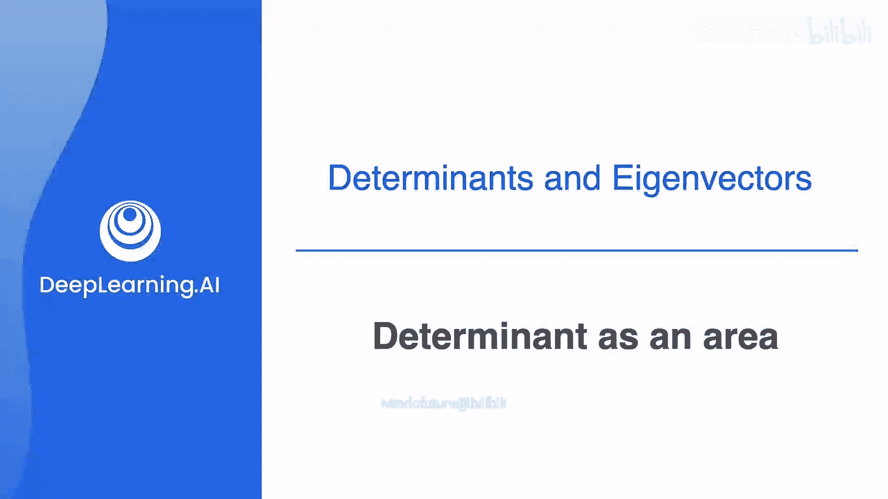
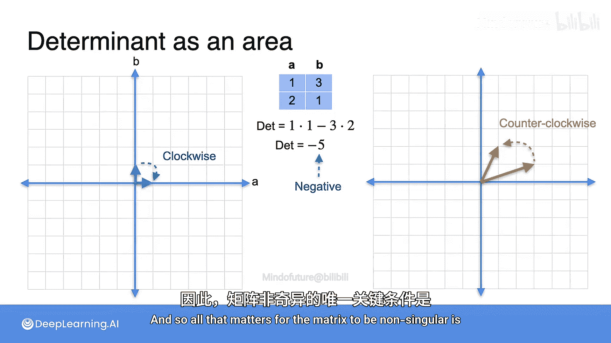

# 043：行列式作为面积 📐



在本节课中，我们将学习行列式在线性变换中的几何意义。我们将看到，行列式的绝对值等于变换后单位正方形（或单位立方体）面积的缩放倍数。当这个面积为0时，对应的矩阵是奇异的。

## 行列式与面积的关系

上一节我们介绍了行列式的计算，本节中我们来看看它的几何解释。对于一个2x2矩阵，其行列式的绝对值等于它将单位正方形变换后所得到的平行四边形的面积。

以矩阵 **A** 为例：
```
A = [[3, 1],
     [1, 2]]
```
其行列式为：
```
det(A) = (3 * 2) - (1 * 1) = 5
```
这个矩阵将左边的蓝色单位正方形变换为右边的橙色平行四边形。单位正方形的面积为1，而变换后的平行四边形面积恰好等于5，即行列式的值。这是一个普遍规律：矩阵的行列式等于由标准基向量构成的单位正方形经过变换后所成图形的面积。

## 奇异变换与零面积

那么，奇异变换会发生什么？我们来看一个行列式为0的矩阵。

考虑矩阵 **B**：
```
B = [[1, 2],
     [2, 4]]
```
其行列式为：
```
det(B) = (1 * 4) - (2 * 2) = 0
```
在此变换下，单位正方形被压缩成一条非常细的平行四边形，实际上是一条线段。线段的面积为0，这正好对应矩阵的行列式0。

再看一个更极端的奇异矩阵 **C**：
```
C = [[0, 0],
     [0, 0]]
```
其行列式显然为0。这个变换将单位正方形坍缩到原点(0,0)。一个点的面积也是0。

以下是三种情况的总结：
*   **非奇异矩阵**：行列式为5，对应变换后图形的面积为5。
*   **奇异矩阵（压缩为线段）**：行列式为0，对应变换后图形（线段）的面积为0。
*   **奇异矩阵（坍缩为点）**：行列式为0，对应变换后图形（点）的面积为0。

## 负行列式的含义

你可能会问，负的行列式代表什么？考虑将矩阵 **A** 的两列交换后得到的矩阵 **D**：
```
D = [[1, 3],
     [2, 1]]
```
其行列式为：
```
det(D) = (1 * 1) - (3 * 2) = -5
```
这里有一个技术细节：平行四边形的面积可以有正负，这取决于我们选取基向量的顺序（方向）。

矩阵 **D** 将向量(1,0)映射到(1,2)，将向量(0,1)映射到(3,1)。这与矩阵 **A** 的变换效果相同，但两个基向量的输出顺序相反。因此，如果我们按逆时针顺序取向量，面积为正；如果按顺时针顺序取，面积则为负。所以，左边单位正方形的面积为1，右边平行四边形的“有向面积”将是-5。

需要注意的是，行列式的正负并不影响矩阵的奇异性。判断一个矩阵是否非奇异，**唯一关键的条件是行列式不等于0**。

## 总结



本节课中我们一起学习了行列式的几何意义。我们了解到，2x2矩阵的行列式绝对值，表示该矩阵所代表的线性变换对单位正方形面积的缩放因子。当行列式为0时，意味着变换将图形压缩到了更低的维度（如线段或点），面积为零，此时矩阵是奇异的。行列式的符号则反映了基向量顺序（空间取向）是否发生了翻转。理解这一几何直观，对于后续学习矩阵的性质和应用至关重要。