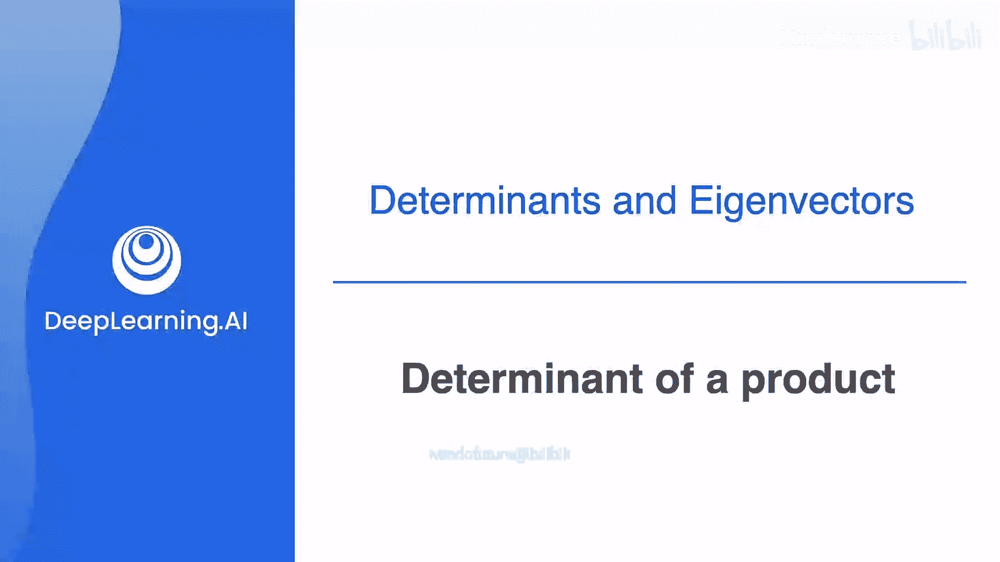
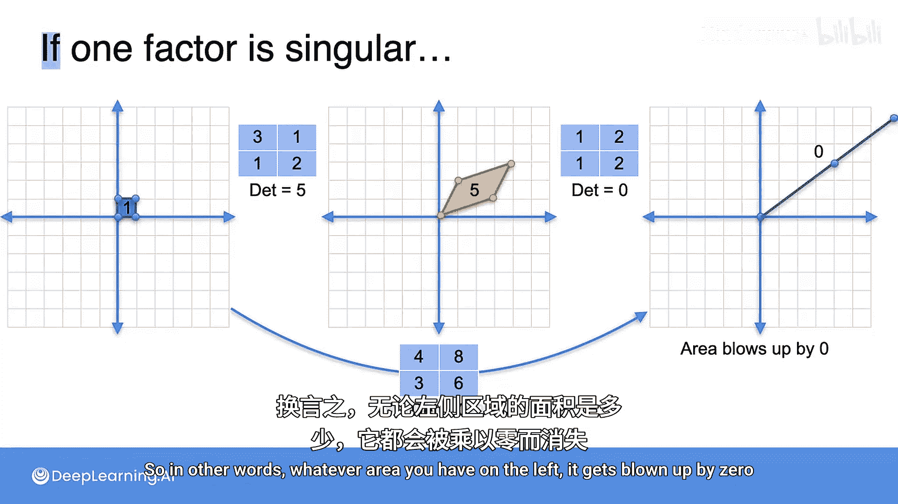

# 044：乘积的行列式




在本节中，我们将学习矩阵乘积的行列式遵循的一个简洁规则。我们将从几何变换的角度来理解这个规则，并探讨奇异矩阵与非奇异矩阵相乘时的性质。

## 乘积行列式规则

上一节我们介绍了行列式在线性变换中的几何意义。本节中我们来看看两个矩阵相乘时，其行列式之间的关系。

以下是三个矩阵相乘的例子，你可以自行验证其正确性：
```
A = [[3, 1],
     [1, 2]]

B = [[1, 1],
     [1, -2]]

C = [[1, 4],
     [-3, 3]]
```

现在，我们来计算这些矩阵的行列式：
*   矩阵A的行列式为 **5**，计算公式为 `3*2 - 1*1`。
*   矩阵B的行列式为 **3**，计算公式为 `1*(-2) - 1*1`。
*   矩阵C的行列式为 **15**，计算公式为 `1*3 - 4*(-3)`。

我们注意到 `5 * 3 = 15`。那么，矩阵乘积的行列式是否总是等于各矩阵行列式的乘积呢？

答案是肯定的。对于任意两个矩阵A和B，其乘积的行列式满足以下公式：
**det(AB) = det(A) * det(B)**

## 几何解释

如果仅从矩阵代数角度推导这个公式，过程可能有些繁琐。我们可以从线性变换的几何视角来更直观地理解它。

矩阵A（`[[3, 1], [1, 2]]`）将标准基向量变换为一个平行四边形，其面积为5。这意味着该变换将任何区域的面积放大5倍。

矩阵B（`[[1, 1], [1, -2]]`）将标准基向量变换为另一个面积为3的平行四边形。这意味着该变换将任何区域的面积放大3倍。

现在考虑这两个变换的复合。首先，矩阵A的变换将面积放大5倍。接着，矩阵B的变换在A变换后的基础上，再将面积放大3倍。因此，总的放大倍数是 `5 * 3 = 15`。

矩阵C（`[[1, 4], [-3, 3]]`）正是矩阵A和B的乘积（`C = A * B`）。它直接将标准基向量变换为一个面积为15的平行四边形，其行列式正好是15。这验证了乘积的行列式等于行列式的乘积。

## 奇异矩阵的乘积

现在来测试一下你的直觉。以下是一个思考题：一个奇异矩阵和一个非奇异矩阵以任意顺序相乘，结果是奇异的、非奇异的，还是两者都有可能？

让我们来分析。假设矩阵A是非奇异的，矩阵B是奇异的。我们知道 `det(AB) = det(A) * det(B)`。由于B是奇异的，其行列式 `det(B) = 0`。因此，`det(AB) = det(A) * 0 = 0`。所以，乘积矩阵AB也是奇异的。

这个逻辑类似于数字乘法：任何数字（比如5）乘以0，结果都是0。同样，任何矩阵乘以一个奇异矩阵（行列式为0），结果矩阵的行列式也必然为0，因此它也是奇异的。

从几何角度看，这也很容易理解。如果一个矩阵是奇异的（例如矩阵 `[[1, 1], [1, 1]]`），意味着它将整个平面压缩到一条直线上，变换后的“面积”为0。



假设我们先将一个非奇异矩阵A作用于一个区域，然后再用奇异矩阵B作用于结果。无论矩阵A将区域放大到多大，奇异矩阵B都会将其压缩到一条线段上，最终的面积仍然是0。因此，复合变换的行列式也为0。

## 总结


本节课中我们一起学习了矩阵乘积的行列式规则。核心结论是：**两个矩阵乘积的行列式等于它们各自行列式的乘积**，即 `det(AB) = det(A) * det(B)`。我们从几何变换的角度理解了这一规则，并推导出一个重要推论：**任何矩阵与一个奇异矩阵相乘，结果仍然是奇异矩阵**。这个性质在判断矩阵可逆性时非常有用。