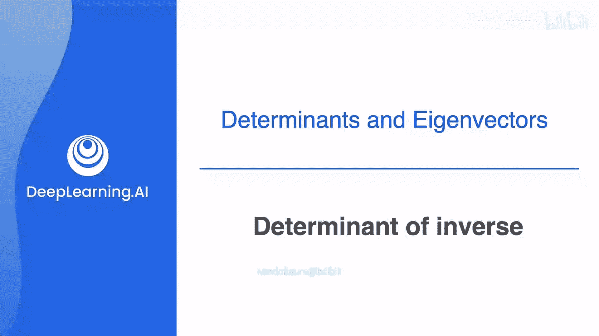
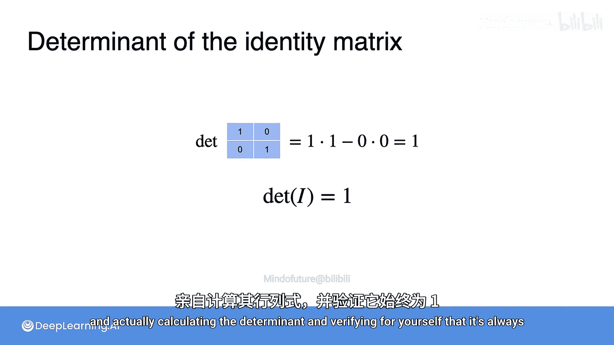

# 045：逆矩阵的行列式 🧮

在本节中，我们将学习一个关于逆矩阵行列式的有趣且重要的规则。我们将通过具体的例子来推导和理解这个规则。

## 概述

本节课程将探讨一个核心概念：**逆矩阵的行列式**与其**原矩阵的行列式**之间的关系。我们将通过计算和逻辑推导来证明，一个可逆矩阵的行列式与其逆矩阵的行列式互为倒数。

## 从观察开始

首先，我们来看两个具体的矩阵及其行列式。

以下是两个矩阵的行列式计算结果：
*   第一个矩阵的行列式是 **0.2**。
*   第二个矩阵的行列式是 **0.125**。

现在，回忆一下我们之前课程中使用过的矩阵。第一个矩阵（行列式为0.2）实际上是另一个矩阵（行列式为5）的逆矩阵。可以看到，0.2 恰好是 5 的倒数（即 1/5）。

同样，第二个矩阵（行列式为0.125）是另一个矩阵（行列式为8）的逆矩阵。0.125 也恰好是 8 的倒数（即 1/8）。

此外，我们之前学过，一个行列式为 0 的矩阵（奇异矩阵）没有逆矩阵。而数字 0 本身也没有倒数。

基于这些观察，我们似乎发现了一个规律：**一个可逆矩阵的逆矩阵的行列式，等于原矩阵行列式的倒数**。

## 公式推导与证明

这个观察到的规律确实是正确的。我们可以用行列式的乘法性质来严格证明它。

上一节我们介绍了行列式的乘法公式，本节中我们来看看如何用它来证明逆矩阵的行列式规则。

我们知道行列式的乘法公式为：
`det(A * B) = det(A) * det(B)`

现在，令矩阵 **B** 为矩阵 **A** 的逆矩阵，即 **B = A⁻¹**。代入公式得到：
`det(A * A⁻¹) = det(A) * det(A⁻¹)`

根据逆矩阵的定义，**A * A⁻¹** 的结果是单位矩阵 **I**。因此上式变为：
`det(I) = det(A) * det(A⁻¹)`

接下来，我们需要知道单位矩阵的行列式值。对于任意大小的单位矩阵，其行列式总是 **1**。我们可以验证一下：
*   对于一个 2x2 的单位矩阵，其行列式为 `1*1 - 0*0 = 1`。
*   你可以自行计算更高维度的单位矩阵，其行列式同样为 1。

因此，公式简化为：
`1 = det(A) * det(A⁻¹)`

由此，我们可以直接推导出逆矩阵行列式的公式：
`det(A⁻¹) = 1 / det(A)`

这个公式清晰地表明：**一个可逆矩阵的逆矩阵的行列式，确实等于原矩阵行列式的倒数**。

## 总结

本节课中我们一起学习了逆矩阵行列式的重要性质。我们首先通过具体计算观察到了规律，然后利用行列式的乘法公式 `det(A * B) = det(A) * det(B)` 进行了严谨的推导，最终证明了核心公式：**`det(A⁻¹) = 1 / det(A)`**。记住，这个性质仅适用于可逆矩阵（即 `det(A) ≠ 0` 的矩阵）。理解这个关系对于后续学习矩阵理论和机器学习算法中的许多概念都非常有帮助。