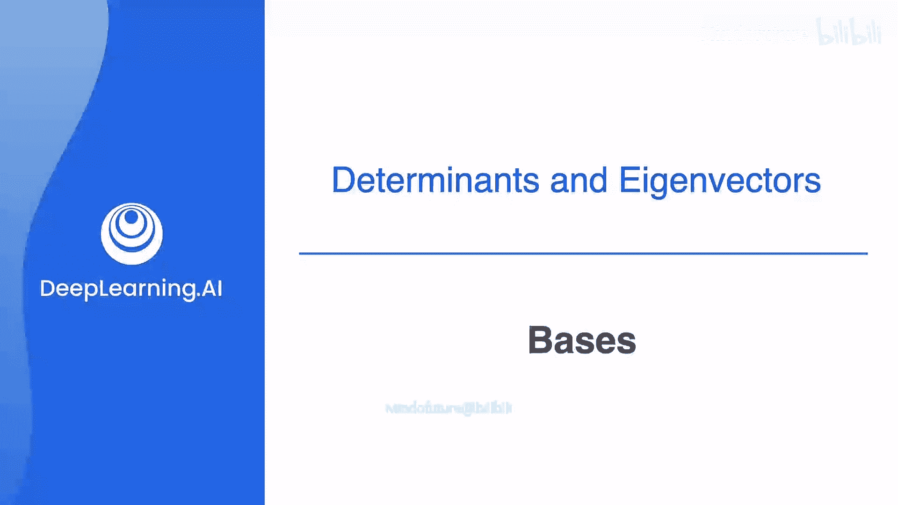
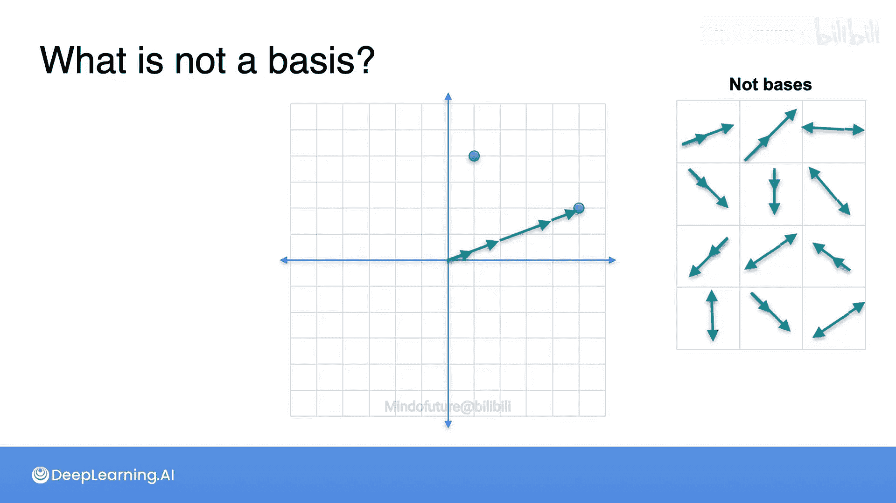

# 046：线性代数中的基

在本节课中，我们将要学习线性代数的一个核心概念——基。这个概念在本课程中已经以多种形式出现过，本周我们将学习如何识别基，并利用它们解决问题。

## 什么是基？🤔

上一周我们学习了矩阵可以被视为一个从平面到平面的线性变换，它将一个基本正方形变换成一个平行四边形。这两者都被称为基。

为什么它们被称为基呢？实际上，这里重要的不是正方形的四个点或平行四边形的四个点，而是定义它们的两个向量，即从原点出发的那两个向量。从现在开始，我将把这两个向量称为一个基。

基的主要特性是：**空间中的每一个点都可以表示为基中元素的线性组合**。

这是什么意思呢？假设我们有这两个向量，我告诉你它们构成一个基。为什么？选择空间中的任意一点，比如这个点。我们能否只沿着基定义的两个方向“行走”到达这个点？当然可以。我们可以这样走，或者那样走，或者另一种走法。实际上，有无限多种走法，因为你不需要走单位步长，可以走很小的步长，甚至可以在某个方向上“向后”走。

所以，这是平面的一个可能的基。

## 更多基的例子 📐

你能帮我再想一些基吗？有很多很多。例如，看这个基。我可以用这两个方向到达任意一点，比如这个点。一种走法是先朝这个方向走，然后再朝那个方向走。记住，如果需要，我可以向后走。所以这两个向量也构成一个基。

那么这两个向量构成基吗？是的，它们构成。我可以这样走，然后再这样走，就能到达那个点。

事实上，几乎任意两个向量都能构成一个基。现在，思考什么不是基反而有点困难了。

## 什么不是基？❌

以下是一个非基的例子。我们取这里的两个向量。用这两个向量，我可以到达例如这里的这个点，但我无法通过只沿着这两个方向“行走”到达这里的这个点，因为我实际上只有一个方向。我只能覆盖那条线，无法覆盖整个平面。

因此，任何包含两个方向相同（或相反）向量的组合，只要它们属于同一条直线，这两个向量就不构成一个基。

## 总结 📝

本节课中，我们一起学习了线性代数中基的概念。我们了解到，基是一组向量，空间中的任何点都可以表示为这些向量的线性组合。我们看到了平面中基的例子，也了解了什么情况下两个向量不能构成基（即它们共线时）。理解基是理解线性变换和向量空间的关键一步。