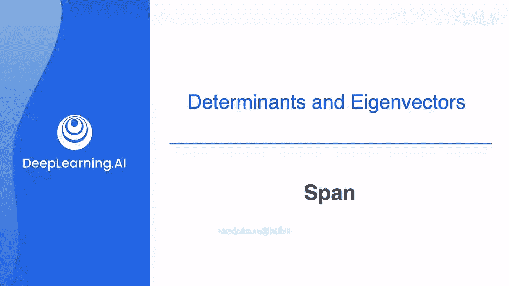
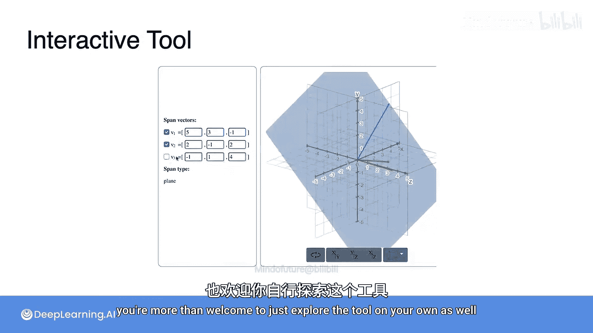

# 047：张成空间与基

在本节课中，我们将要学习线性代数中的两个核心概念：**张成空间**和**基**。我们将了解一组向量能“到达”哪些点，以及如何用最少的向量来描述一个空间。

## 张成空间

上一节我们介绍了基的概念，本节中我们来看看一个相关的问题：一组向量如果不是平面的基，它还能是其他空间的基吗？为了回答这个问题，需要引入**张成空间**的概念。

一组向量的**张成空间**，是指通过以任意组合方式沿这些向量方向移动所能到达的所有点的集合。

例如，以下两个向量的张成空间是整个平面，因为你可以通过沿这两个方向移动到达平面上的任意一点。同样，以下两个向量的张成空间也是整个平面，虽然到达某些点可能需要走很多步，但仅使用这两个方向就足够了。

然而，以下两个向量并不张成整个平面，因为正如之前所见，并非平面上的每个点都能通过沿这两个方向移动到达，它们指向同一个方向。那么它们张成什么空间呢？这条直线上的任何点都可以通过沿这些向量的方向移动到达，因此这两个向量的张成空间就是那条直线。

对于夹角为180度的两个向量，它们的张成空间同样是包含它们的那条直线，因为你可以通过沿这两个方向移动到达该直线上的每一个点。

对于一个单独的向量，它的张成空间是包含它并穿过原点的那条直线，因为那是通过沿该方向移动所能到达的所有点的集合。

## 基的定义

现在有一个问题：这两个向量构成这条直线的基吗？答案是否定的。原因是，**基必须是一个最小的张成集**。在这里，向量太多了。这两个向量中的任何一个都能单独张成这条直线，所以两个向量就多余了。基是最小的张成集。因此，它们各自单独是这条直线的基，但两个一起则不是。它们是一个张成集，但不是基。

那么，这个向量是某个空间的基吗？是的，它是这条直线的基。事实上，任何从原点出发并指向相同方向的向量也都是这条直线的基。

总而言之，基是一个最小的张成集。因此，左边的向量构成了这条直线的基，但右边的两个向量没有，因为它们数量过多。

## 高维空间中的基

这种现象也适用于更高维度。让我们看这个集合。这个集合构成了平面的一个基，因为它张成了整个平面，我们可以通过沿那两个方向移动到达任何点。但是，如果我们移动其中任何一个向量，它们就不再张成平面，而只能张成一条直线。

然而，这边的这组向量并不构成平面的基。它们确实张成了平面，因为平面上的任何点都可以通过这三个方向的某种组合到达。但是，作为基来说，它们太大了。这三个向量中任意两个的子集都是一个基，但第三个是多余的，所以这不是一个基。

现在注意一个有趣的现象：**一个空间的基的长度（即向量个数）等于该空间的维数**。

*   在左边，直线有一个长度为1的基，其维数也是1。
*   在右边，平面有一个由两个向量组成的、长度为2的基，平面的维数是2。

这意味着，**任何空间的任何基，其元素数量都与其他基相同**。你可以想象一下三维空间，思考那里的基会是什么样子。

## 线性相关与线性无关

现在你对基有了良好的直觉，让我们看看正式的定义。为此，需要引入**线性无关**和**线性相关**向量的概念。

一组向量被称为**线性无关**，如果组中没有任何一个向量可以表示为其他向量的线性组合。

*   考虑平面上的一个向量，它总是线性无关的。
*   现在添加第二个向量。注意，你无法将新向量表示为第一个向量的线性组合，因为它们指向不同的方向。这两个向量仍然是线性无关的。
*   如果添加的是这个红色向量呢？在这种情况下，红色向量与绿色向量方向相同，但长度是原向量的两倍。由于一个向量可以表示为其他向量的线性组合，这组向量被称为**线性相关**。同时注意，即使我们向集合中添加了新向量，这些向量的张成空间也没有改变，仍然是一条直线。

让我们看另一个例子。这次我们保留线性无关的橙色和绿色向量，并添加第三个红色向量。虽然这三个向量中没有任何一个是另一个的倍数，但它们不再是线性无关的。这是因为你可以通过将绿色向量乘以1加上橙色向量乘以3来得到第三个向量。一个明显的迹象是，我们再次向集合中添加了新向量，但向量的张成空间没有改变，它们仍然只张成平面。

事实证明，你添加的任何其他向量都可以写成前两个向量的线性组合。这个结论具有普遍性：如果你拥有的向量数量多于你试图张成的空间的维数，你将总是得到一个线性相关的向量组。这意味着在平面上有三个或更多向量，或在三维空间中有四个或更多向量，依此类推。

## 如何判断线性相关性

让我们看看如何检查一组向量是否线性相关。使用上一张幻灯片的例子。

*   设橙色向量为 **v₁**，坐标为 (-1, 1)。
*   设绿色向量为 **v₂**，坐标为 (2, 1)。
*   设红色向量为 **v₃**，坐标为 (-5, 3)。

要证明这组向量线性相关，需要找到常数 α 和 β，满足：
`α * v₁ + β * v₂ = v₃`
换句话说，你正在寻找能给出 **v₃** 的线性组合系数。

这产生了一个包含两个方程和两个未知数的方程组：
1.  `-α + 2β = -5`
2.  `α + β = 3`

我们可以解这个方程组。将方程1和方程2相加，得到 `3β = -2`，所以 `β = -2/3`。将这个结果代入方程2，得到 `α - 2/3 = 3`，所以 `α = 11/3`。

由于你能找到方程组的解，那么 **v₃** 就是 **v₁** 和 **v₂** 的线性组合，因此这组向量是线性相关的。如果你发现方程组无解，则意味着这组向量是线性无关的。

## 小测验

考虑以下三个向量：
`v₁ = (1, 0, 0)`, `v₂ = (0, 1, 0)`, `v₃ = (1, -1, 0)`
它们线性无关吗？实际上，它们不是，因为第一个向量乘以1加上第二个向量乘以-1等于第三个向量，所以它们是线性相关的。然而，如果你移除这三个向量中的任何一个，那么你将得到一个线性无关的集合。但由于每个线性无关的集合只有两个向量，并且它们存在于三维空间中（因为它们有三个坐标），所以没有一个集合是三维空间的基。从几何上讲，这意味着如果你在三维空间中绘制这三个向量，它们都将位于同一个平面内。

## 基的正式定义

现在你已经看了一些线性无关的例子，让我们回到基的正式定义。

一个**基**是一个满足以下两个条件的向量集合：
1.  该集合必须张成一个向量空间。
2.  该集合中的向量必须是线性无关的。

回顾之前的例子，前两组向量分别张成了一维空间（直线）和二维空间（平面），并且它们是线性无关的，因此它们构成了基。后两组向量是线性相关的，它们不构成基。从这两个例子中我们看到，需要记住：并非所有包含n个向量的集合都会构成一个n维空间的基。

## 总结

本节课中我们一起学习了：
*   **张成空间**：一组向量通过线性组合所能到达的所有点的集合。
*   **基**：一个**最小**的、能张成整个向量空间的**线性无关**向量集。
*   **线性无关**：组中没有任何向量可表示为其他向量的线性组合。
*   **维数**：一个向量空间的基所包含的向量数量，称为该空间的维数。

希望你现在对张成空间的概念更有信心了。接下来，你将有机会使用一个新的交互式工具，它可以帮助你可视化三维空间中向量的张成。