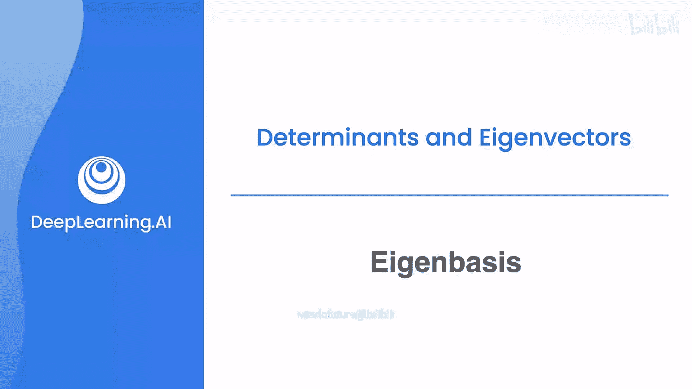
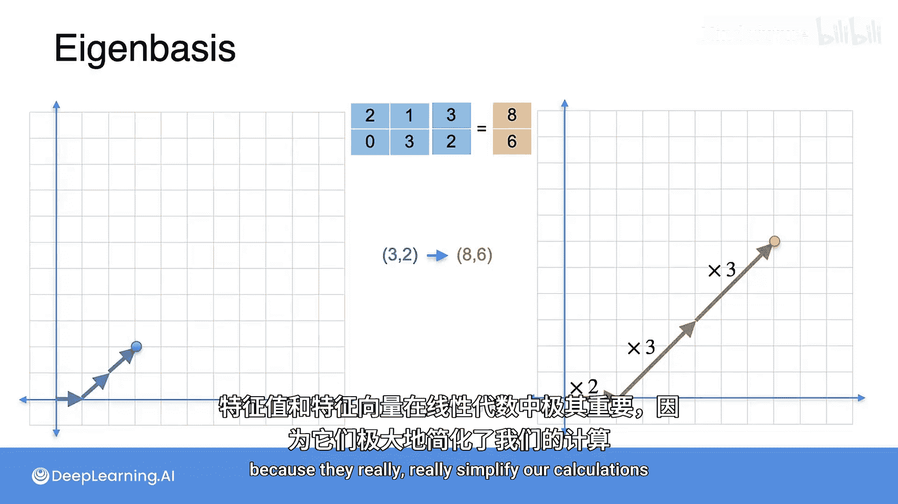

# 048：特征基




在本节课中，我们将要学习线性代数中一个极其重要的概念——特征基。我们将了解什么是特征基，它与特征向量和特征值的关系，以及为什么它在机器学习和数据分析（如主成分分析）中如此有用。

## 什么是特征基？

上一节我们介绍了基的概念。现在你应该知道，有些基比其他基更有用。特别地，有一个被称为“特征基”的基，它在所有基中具有特殊的地位。

特征基对于机器学习应用（如我们之前提到的主成分分析）来说非常有用。

## 特征基如何工作？

让我们来看一个具体的线性变换，它对应的矩阵是：
```
[[2, 1],
 [0, 3]]
```
我们将观察它相对于标准基的作用。

以下是该变换在标准基下的作用过程：

*   标准基有两个向量：向量 `[1, 0]`。将其乘以矩阵，得到向量 `[2, 0]`。
*   标准基的另一个向量是 `[0, 1]`。将其乘以矩阵，得到向量 `[1, 3]`。

因此，左侧的正方形（由标准基张成）变换为右侧的平行四边形，平面上的其余点也随之变换。这被称为坐标变换或基变换，因为你正在从左边的正方形坐标转换到右边的平行四边形坐标。

## 选择不同的基

但选择正方形（标准基）是非常任意的。让我们实际选择一个不同的基，看看会发生什么。

让我们再次选择向量 `[1, 0]`，它变换为向量 `[2, 0]`。作为该基的第二个元素，我们选择向量 `[1, 1]`，它变换为向量 `[3, 3]`。

于是，这个平行四边形变换为另一个平行四边形。这里有什么特别之处？请注意，两个平行四边形的边与另一个基中对应的边是平行的。这非常特殊，并且平面上的其余部分也遵循这个规律。

## 特征基的定义

因为这些边是平行的，所以我们对平面所做的操作是：在这个方向（水平方向）上拉伸2倍，在这个对角线方向上拉伸3倍。

这是一个非常特殊的基，它只包含两个拉伸操作。这就是所谓的**特征基**。这是一种非常特殊的看待线性变换的方式：相对于一个基，变换将一个平行四边形映射到另一个平行四边形，且新平行四边形的边与原平行四边形的边平行。

## 为什么特征基有用？

假设你想找到点 `[0, 3]` 的像。你可以直接乘以矩阵得到 `[8, 6]`，这个点就在图中所示位置。

但你也可以将该点表示为特征基中向量的组合。这意味着我们找到一条路径，利用我们已有的两个方向到达那个点。现在，线性变换对应于将水平向量拉伸2倍，将对角线向量拉伸3倍。

这极大地简化了线性变换，它仅仅由两个拉伸操作组成。

## 特征向量与特征值

因此，基中的这两个向量被称为**特征向量**，而拉伸因子（2和3）被称为**特征值**。

特征值和特征向量在线性代数中极其重要，因为它们能极大地简化我们的计算。

## 总结

本节课中我们一起学习了特征基的概念。我们了解到，特征基是一组特殊的基向量（特征向量），线性变换在这组基下的作用仅仅是沿着每个基向量方向进行缩放（缩放因子就是特征值）。这种表示方法将复杂的矩阵乘法简化为简单的拉伸操作，是理解线性变换本质和简化计算（例如在PCA中）的强大工具。



