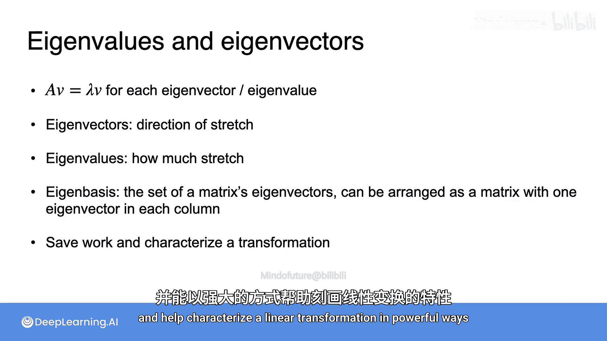

# 049：特征值与特征向量


在本节课中，我们将深入探讨线性代数中两个核心概念：特征值与特征向量。我们将通过具体的例子来理解它们的定义、几何意义以及为何它们在简化计算和描述线性变换方面如此重要。

## 特征向量的直观验证

上一节我们介绍了特征值与特征向量的基本概念，本节中我们来看看它们在实际计算中为何特殊。

让我们仔细观察矩阵 **A** 与不同向量相乘的结果。矩阵 **A** 定义为：
```
A = [[2, 1],
     [0, 3]]
```

以下是三个向量与矩阵 **A** 相乘的结果分析：

*   **向量 v1 = [1, 0]**
    *   这是一个特征向量。经过变换 **A * v1** 后，得到向量 **[2, 0]**。
    *   结果向量与原向量方向相同，可以写成 **2 * [1, 0]**。这里的标量 **2** 就是特征值。

*   **向量 v2 = [1, 1]**
    *   这也是一个特征向量。经过变换 **A * v2** 后，得到向量 **[3, 3]**。
    *   结果向量同样与原向量方向相同，可以写成 **3 * [1, 1]**。这里的标量 **3** 是另一个特征值。

*   **向量 v3 = [-1, 2]**
    *   这不是一个特征向量。经过变换 **A * v3** 后，得到向量 **[0, 6]**。
    *   结果向量与原向量方向不同，无法找到一个标量 λ 使得 **A * v3 = λ * v3** 成立。

## 特征值与特征向量的正式定义

让我们将上面的观察形式化。对于一个方阵 **A**，如果存在一个非零向量 **v** 和一个标量 **λ**，满足以下方程：
```
A * v = λ * v
```
那么，**v** 就是矩阵 **A** 的一个**特征向量**，**λ** 是其对应的**特征值**。

在我们的例子中：
*   对于 **v1 = [1, 0]**，有 **A * v1 = 2 * v1**，所以特征值 **λ1 = 2**。
*   对于 **v2 = [1, 1]**，有 **A * v2 = 3 * v2**，所以特征值 **λ2 = 3**。

特征向量和特征值总是成对出现的。

## 特征向量的核心优势：简化计算

你可能仍然好奇特征向量为何如此特殊。让我们仔细分析这个核心方程 `A * v = λ * v`。

方程的左边是**矩阵乘法**，右边是**标量乘法**。这两者的计算量差异巨大。即使对于我们的 2x2 小矩阵，计算左边需要 8 次乘法和加法，而右边仅需 2 次标量乘法。对于成百上千维的矩阵，这种计算量的差距将是天文数字。

这个方程表明，**沿着特征向量的方向，复杂的矩阵乘法可以简化为简单的标量乘法**。更重要的是，如果你结合基向量的知识，可以将这个“捷径”应用到所有向量上。

## 利用特征基简化任意向量的变换

接下来，我们看看如何利用特征向量来简化非特征向量的变换计算。

之前例子中的红色向量 **v3 = [-1, 2]** 不是特征向量。通常，要找到它的变换结果，我们需要直接进行矩阵乘法。

然而，我们注意到矩阵 **A** 的两个特征向量 **[1, 0]** 和 **[1, 1]** 是线性无关的，并且张成了整个二维平面。因此，它们构成了一个基，我们称之为**特征基**。

以下是利用特征基简化计算的步骤：

1.  **将向量表示为特征基的线性组合**。
    由于特征向量构成基，我们可以将任意向量用它们表示。对于 **v3 = [-1, 2]**，可以写成：
    ```
    v3 = -3 * [1, 0] + 2 * [1, 1]
    ```
    即，**v3** 在特征基下的坐标为 **[-3, 2]**。

2.  **应用线性变换**。
    现在计算 **A * v3**：
    ```
    A * v3 = A * (-3 * [1, 0] + 2 * [1, 1])
           = -3 * (A * [1, 0]) + 2 * (A * [1, 1])
    ```

3.  **使用特征向量“捷径”**。
    我们已经知道 `A * [1, 0] = 2 * [1, 0]` 和 `A * [1, 1] = 3 * [1, 1]`。代入上式：
    ```
    A * v3 = -3 * (2 * [1, 0]) + 2 * (3 * [1, 1])
           = (-6 * [1, 0]) + (6 * [1, 1])
    ```

4.  **计算结果**。
    进行简单的标量乘法和向量加法：
    ```
    A * v3 = [-6, 0] + [6, 6] = [0, 6]
    ```
    这与直接进行矩阵乘法得到的结果完全一致，但整个过程**没有进行任何矩阵乘法**，只使用了标量乘法和向量加法。

## 重要说明与总结

需要说明的是，上述方法的第一步——求取向量在特征基下的坐标——本身通常涉及计算（需要用到特征基矩阵的逆）。因此，更准确地说，特征向量的价值在于**允许你将计算工作前置**。在机器学习等应用中，预先计算好坐标变换，可以在后续需要频繁应用线性变换时，极大地提升计算效率。

本节课中我们一起学习了：



*   **定义**：特征向量 **v** 和特征值 **λ** 满足 `A * v = λ * v`。特征向量在变换后方向不变（或反向），特征值表示拉伸的倍数。
*   **几何意义**：特征向量指示了线性变换中“纯拉伸”的方向，特征值表示在该方向上拉伸的尺度。
*   **特征基**：由所有线性无关的特征向量构成的基。从特征基的视角看，线性变换 **A** 仅仅是一系列沿着坐标轴方向的拉伸（缩放）操作。
*   **核心价值**：特征值与特征向量是理解和简化线性变换的强大工具。它们能将复杂的矩阵运算转化为标量运算，帮助表征系统的内在性质，并在许多算法（如主成分分析PCA、PageRank等）中扮演关键角色。