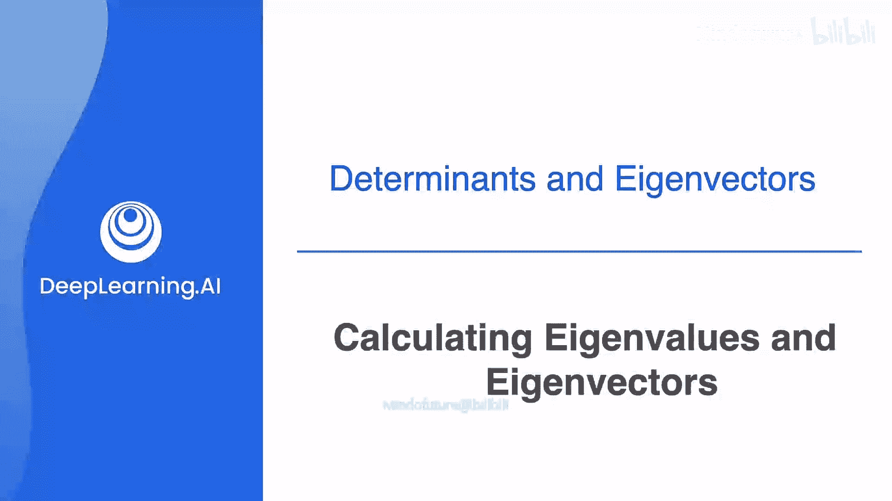
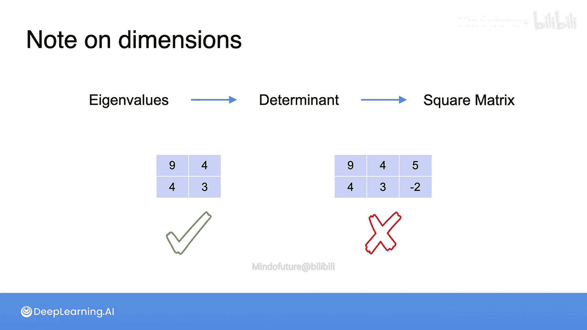

# 050：特征值与特征向量 🧮



在本节课中，我们将要学习线性代数中的一个核心概念：特征值与特征向量。理解它们对于掌握机器学习中的降维、主成分分析等算法至关重要。我们将从直观的几何变换入手，逐步推导出计算特征值和特征向量的具体方法。

## 特征值的几何意义

上一节我们介绍了线性变换的基本概念，本节中我们来看看特征值在几何变换中的直观表现。

观察一个矩阵 `A = [[2, 1], [0, 3]]` 对平面上一个正方形区域点的变换作用。水平方向的向量被拉伸了2倍，而对角线方向的向量被拉伸了3倍。

现在，将这个变换与另一个矩阵 `B = [[3, 0], [0, 3]]` 进行比较。矩阵 `B` 的作用是在所有方向上均匀地将平面拉伸3倍。虽然这两个变换不同，但它们在这条对角线上对所有点的作用效果完全相同。

这意味着，对于这条对角线上的所有向量 `v`，都有 `A * v = B * v`。当两个不同的线性变换在无穷多个点上作用相同时，表明它们的差 `(A - B)` 是一个奇异的变换。

## 从几何关系到代数方程

上一节我们看到了特征值对应的特殊方向，本节中我们来看看如何将这种几何关系转化为代数方程。

如果 `λ` 是一个特征值，那么由矩阵 `A` 定义的变换与由 `λ` 倍单位矩阵定义的变换（即整体缩放 `λ` 倍），会在特征向量方向上的所有点作用相同。即：

`A * v = λ * v` 对于特征向量 `v` 成立。

移项后得到：
`(A - λI) * v = 0`

其中 `I` 是单位矩阵。这意味着矩阵 `(A - λI)` 作用在特征向量 `v` 上会得到零向量。一个非零向量 `v` 使得 `(A - λI) * v = 0`，这只有当矩阵 `(A - λI)` 是**奇异矩阵**（不可逆）时才可能有无穷多解（即整条线上的向量都是解）。而一个矩阵是奇异矩阵的充要条件是其行列式为0。

因此，我们得到了求解特征值 `λ` 的关键方程：
`det(A - λI) = 0`

这个方程被称为矩阵 `A` 的**特征方程**。

## 计算特征值：特征多项式

上一节我们推导出了特征方程，本节中我们来看看如何具体求解。

对于矩阵 `A = [[2, 1], [0, 3]]`，计算 `A - λI`：
`A - λI = [[2-λ, 1], [0, 3-λ]]`

计算其行列式并令其为零：
`det = (2-λ)(3-λ) - (1*0) = λ² - 5λ + 6 = 0`

解这个一元二次方程：
`(λ - 2)(λ - 3) = 0`

得到特征值：
`λ₁ = 2`, `λ₂ = 3`

这个行列式展开后得到的多项式 `λ² - 5λ + 6` 被称为**特征多项式**。特征值就是特征多项式的根。

## 计算特征向量

上一节我们找到了特征值，本节中我们来寻找对应的特征向量。

特征向量是满足方程 `A * v = λ * v` 的非零向量 `v`。对于每个特征值，我们都需要解这个方程。

**对于 λ₁ = 2：**
代入方程 `A * v = 2 * v`：
`[[2, 1], [0, 3]] * [x, y]ᵀ = 2 * [x, y]ᵀ`

得到方程组：
`2x + y = 2x`
`3y = 2y`

由第二个方程得 `y = 0`。第一个方程自动满足（`2x + 0 = 2x`）。因此，解的形式为 `[x, 0]ᵀ`，其中 `x` 为任意非零实数。一个简单的特征向量是 `v₁ = [1, 0]ᵀ`。

**对于 λ₂ = 3：**
代入方程 `A * v = 3 * v`：
`[[2, 1], [0, 3]] * [x, y]ᵀ = 3 * [x, y]ᵀ`

得到方程组：
`2x + y = 3x`  => `y = x`
`3y = 3y`

因此，解的形式为 `[x, x]ᵀ`，其中 `x` 为非零实数。一个简单的特征向量是 `v₂ = [1, 1]ᵀ`。

## 示例与练习

以下是另一个2x2矩阵的求解示例，请尝试理解其过程。

**例题：** 求矩阵 `M = [[9, 4], [4, 3]]` 的特征值和特征向量。

1.  构造特征方程：
    `det(M - λI) = det([[9-λ, 4], [4, 3-λ]]) = 0`
2.  计算行列式：
    `(9-λ)(3-λ) - (4*4) = λ² - 12λ + 11 = 0`
3.  解方程：
    `(λ - 11)(λ - 1) = 0`
    得到特征值：`λ₁ = 11`, `λ₂ = 1`。
4.  分别求解特征向量（过程略）：
    *   对于 `λ₁ = 11`，可得特征向量为 `[2, 1]ᵀ` 或其任意倍数。
    *   对于 `λ₂ = 1`，可得特征向量为 `[-1, 2]ᵀ` 或其任意倍数。

## 扩展到3x3矩阵

上一节我们处理了2维情况，本节中我们来看看3x3矩阵的求解过程，原理完全一致。

考虑3x3矩阵：
`A = [[2, 1, -1], [1, 0, -3], [-1, -3, 0]]`

求解步骤如下：

1.  **构造特征多项式**：
    计算 `det(A - λI)`，其中 `I` 是3阶单位矩阵。
    `A - λI = [[2-λ, 1, -1], [1, -λ, -3], [-1, -3, -λ]]`

2.  **计算3x3矩阵的行列式**（例如使用对角线法则）：
    经过计算（具体展开步骤略），得到特征多项式为：
    `-λ³ + 2λ² + 11λ - 12 = 0`

3.  **求特征多项式的根**：
    因式分解为：`-(λ - 4)(λ - 1)(λ + 3) = 0`
    因此，特征值为：`λ₁ = 4`, `λ₂ = 1`, `λ₃ = -3`。

## 求解3x3矩阵的特征向量

上一节我们找到了特征值，本节我们来求解其中一个特征向量作为示范。

**以特征值 λ₁ = 4 为例**：
我们需要解方程 `(A - 4I) * v = 0`，即：
`[[-2, 1, -1], [1, -4, -3], [-1, -3, -4]] * [x₁, x₂, x₃]ᵀ = [0, 0, 0]ᵀ`

得到齐次线性方程组：
```
-2x₁ + x₂ - x₃ = 0  ...(1)
 x₁ - 4x₂ - 3x₃ = 0  ...(2)
- x₁ - 3x₂ - 4x₃ = 0  ...(3)
```

以下是求解此方程组的步骤：
*   将方程(2)和方程(3)相加：`(x₁ - 4x₂ - 3x₃) + (-x₁ - 3x₂ - 4x₃) = 0` => `-7x₂ - 7x₃ = 0` => `x₂ = -x₃`。
*   将方程(1)乘以3后与方程(3)相加（或其他消元方法），最终可推导出 `x₁ = -x₃`。

因此，方程组的解为：`x₁ = k`, `x₂ = k`, `x₃ = -k`，其中 `k` 为任意非零实数。
这意味着所有形如 `[k, k, -k]ᵀ` 的向量都是对应于特征值4的特征向量。我们可以取 `k=1`，得到一个简单的特征向量：`v₁ = [1, 1, -1]ᵀ`。

对于特征值1和-3，重复上述解方程的过程，可以分别找到对应的特征向量（例如 `[1, 1, 2]ᵀ` 和 `[-1, 1, 1]ᵀ`）。

## 重要限制：仅适用于方阵

在以上所有例子中，我们处理的矩阵都是方阵（2x2或3x3）。这是因为特征值和特征向量的定义 `A * v = λ * v` 以及求解过程中用到的行列式 `det(A - λI)`，都只对**方阵**有意义。

对于一个非方阵（例如2x3矩阵），它没有特征值和特征向量的定义。

**本节课中我们一起学习了：**
1.  **特征值与特征向量的几何意义**：特征向量是在线性变换下方向保持不变的向量，特征值是该方向上拉伸或压缩的尺度。
2.  **特征方程**：通过求解 `det(A - λI) = 0` 可以得到矩阵的所有特征值。
3.  **特征向量的求解**：对每个特征值 `λ`，解齐次线性方程组 `(A - λI)v = 0`，其非零解即为对应的特征向量。
4.  **核心限制**：特征值与特征向量只对方阵有定义。



理解并掌握这些计算方法是深入学习主成分分析、谱聚类等机器学习算法的基础。