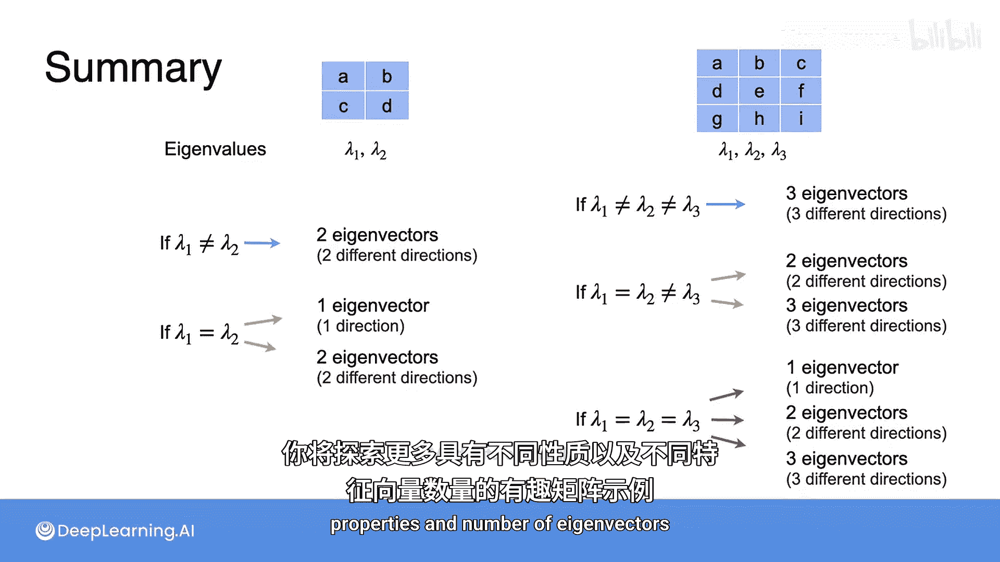

# 051：特征向量的数量探究 🔍


在本节课中，我们将要学习特征向量的数量问题。我们将通过具体的矩阵例子，探讨特征值重复时，对应的特征向量数量可能发生的变化。理解这一点对于掌握矩阵对角化和特征分解至关重要。

## 特征向量数量并非固定

上一节我们介绍了特征值和特征向量的基本概念。本节中我们来看看，对于一个给定的矩阵，其特征向量的数量是否总是等于其维度。

在上一视频的例子中，我们有一个3x3矩阵，它有三个不同的特征值和三个不同的特征向量，每个特征值对应一个特征向量。那么，是否所有3x3矩阵都恰好有三个特征向量？事实证明，情况并非总是如此。让我们通过一些例子来探究。

## 示例一：重复特征值但仍有三个特征向量

考虑以下3x3矩阵 **A**：

```
A = [[2, 0, 0],
     [-1, 4, -0.5],
     [0, 0, 2]]
```

首先，我们求其特征多项式，即计算 **det(A - λI)**。利用3x3矩阵的行列式公式，我们得到：

**det(A - λI) = (2 - λ)² * (4 - λ)**

由于原矩阵中的零元素，其余项均为零。

接下来，我们寻找特征值，即找到该多项式的零点。这非常简单，得到特征值为：**λ₁ = 4**， **λ₂ = 2**， **λ₃ = 2**。注意，数值2重复了两次。

现在，我们观察寻找对应特征向量时会发生什么。

### 寻找特征值 λ=4 的特征向量

特征向量 **v** 需满足 **A * v = 4 * v**。设 **v = [x₁, x₂, x₃]ᵀ**，得到方程组：

```
2x₁ = 4x₁
-x₁ + 4x₂ - 0.5x₃ = 4x₂
2x₃ = 4x₃
```

将所有项移到等号左边并简化：

```
-2x₁ = 0
-x₁ - 0.5x₃ = 0
-2x₃ = 0
```

由此可得 **x₁ = 0**， **x₃ = 0**。由于 **x₂** 未出现在任何方程中，它可以取任意值。为简化，设 **x₂ = 1**，得到对应于特征值4的特征向量 **v₁ = [0, 1, 0]ᵀ**。

### 寻找特征值 λ=2 的特征向量

此时需满足 **A * v = 2 * v**。得到方程组：

```
2x₁ = 2x₁
-x₁ + 4x₂ - 0.5x₃ = 2x₂
2x₃ = 2x₃
```

简化后：

```
0 = 0
-x₁ + 2x₂ - 0.5x₃ = 0
0 = 0
```

第二个方程可重写为 **x₁ = 2x₂ - 0.5x₃**。该方程有无穷多解，取决于 **x₂** 和 **x₃** 的取值。

以下是两个不同的解：

*   选择 **x₂ = 1**， **x₃ = 0**，则 **x₁ = 2**，得到特征向量 **v₂ = [2, 1, 0]ᵀ**。
*   选择 **x₂ = 1**， **x₃ = 2**，则 **x₁ = 1**，得到特征向量 **v₃ = [1, 1, 2]ᵀ**。

这两个向量指向不同方向，因此是两个不同的特征向量。请记住，我们只关心特征向量的方向，因为它的任何缩放版本仍然是同一特征值的特征向量。

综上所述，对于矩阵 **A**，我们找到了三组不同的特征值与特征向量对：

*   特征值 **λ₁ = 4**， 特征向量 **v₁ = [0, 1, 0]ᵀ**
*   特征值 **λ₂ = 2**， 特征向量 **v₂ = [2, 1, 0]ᵀ**
*   特征值 **λ₃ = 2**， 特征向量 **v₃ = [1, 1, 2]ᵀ**

在这个案例中，即使存在重复的特征值，我们仍然能够找到三个线性无关的特征向量。

## 示例二：重复特征值且特征向量不足

现在，让我们看一个特征向量数量不足的例子。我们稍微修改矩阵中的一个值：

```
A' = [[2, 0, 0],
      [-1, 4, -0.5],
      [0, 4, 2]]
```

其特征多项式保持不变，特征值依然是 **λ₁ = 4**， **λ₂ = 2**， **λ₃ = 2**。

### 寻找特征值 λ=4 的特征向量

过程与之前类似，唯一变化的是最后一个方程。最终我们同样得到特征向量 **v₁ = [0, 1, 0]ᵀ**。

### 寻找特征值 λ=2 的特征向量

此时方程组变为：

```
2x₁ = 2x₁
-x₁ + 4x₂ - 0.5x₃ = 2x₂
4x₂ + 2x₃ = 2x₃
```

简化后得到：

```
0 = 0
-x₁ + 2x₂ - 0.5x₃ = 0  ... (2)
4x₂ = 0                ... (3)
```

由方程(3)可得 **x₂ = 0**。代入方程(2)得到 **-x₁ - 0.5x₃ = 0**，即 **x₁ = -0.5x₃**。此时，**x₁** 和 **x₃** 并非完全自由，它们之间存在比例关系。

例如：
*   选择 **x₃ = 1**，则 **x₁ = -0.5**，得到特征向量 **v' = [-0.5, 0, 1]ᵀ**。
*   选择 **x₃ = 2**，则 **x₁ = -1**，得到特征向量 **v'' = [-1, 0, 2]ᵀ**。

然而，向量 **v'** 和 **v''** 位于同一条直线上（**v'' = 2 * v'**），它们本质上是同一个特征方向。我们无法找到一个满足所有方程且指向不同方向的向量。

这意味着，尽管数值2作为特征值出现了两次，但我们只能找到一个与之关联的线性无关的特征向量。所有特征向量都具有 **[-0.5k, 0, k]ᵀ** 的形式，但只代表一个方向。

因此，对于矩阵 **A'**：
*   特征值 **4** 对应特征向量 **[0, 1, 0]ᵀ**。
*   特征值 **2** 对应特征向量 **[-0.5, 0, 1]ᵀ**（及其所有缩放版本）。
*   我们缺少第三个线性无关的特征向量来构成三维空间的一组基。

## 总结与规律 📊

本节课中我们一起学习了特征向量数量与特征值重复性的关系。

以下是对不同大小矩阵的规律总结：

*   **对于2x2矩阵**，若两个特征值 **λ₁** 和 **λ₂** 不同，则总有两个不同的特征向量。若两个特征值相同，则可能有一个或两个特征向量。

*   **对于3x3矩阵**，情况更多样：
    1.  若三个特征值 **λ₁**， **λ₂**， **λ₃** 均不同，则总能找到三个不同的特征向量。
    2.  若一个特征值重复两次，另一个不同（例如 **λ₁**， **λ₂=λ₂**），则可能找到两个或三个特征向量（正如我们刚刚探索的两个例子）。
    3.  若同一个特征值重复三次，则特征向量的数量可能在一到三个之间。



在本周的编程练习中，你将有机会探索更多具有不同性质和特征向量数量的有趣矩阵示例。理解这些概念是深入学习矩阵对角化、奇异值分解等高级主题的基础。