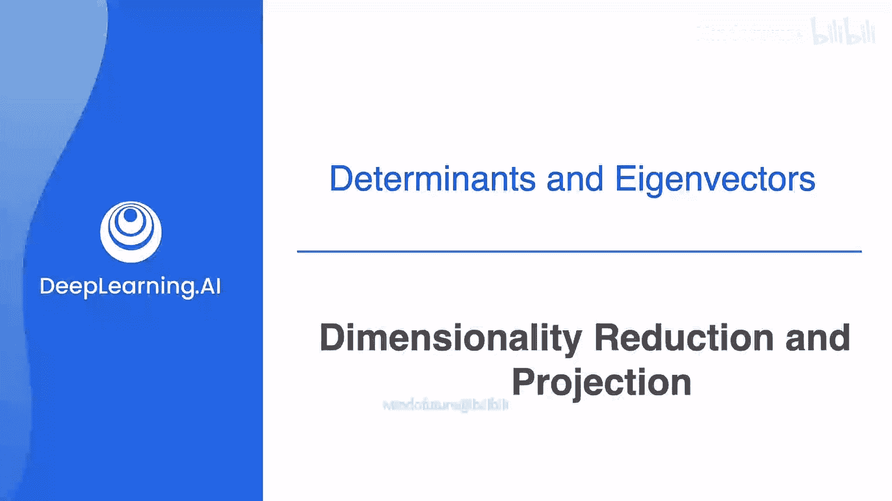
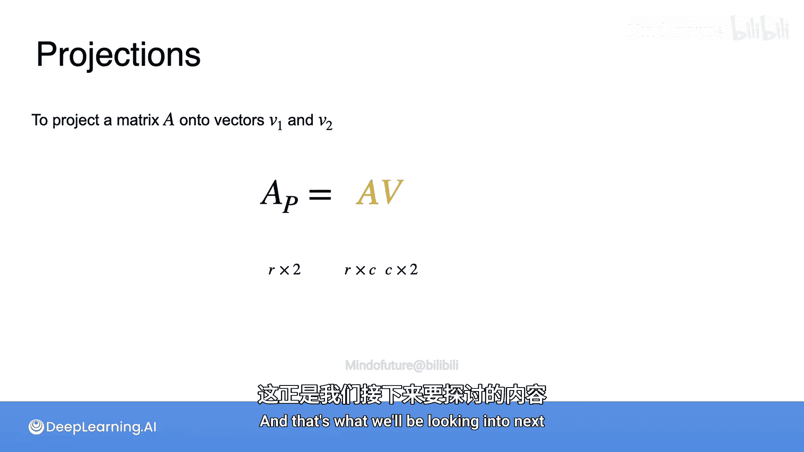

# 052：降维与投影

在本节课中，我们将学习主成分分析（PCA）。PCA的目标是在尽可能保留信息的前提下，减少数据的维度或列数。简单来说，PCA能将一个大型的数据表或数据集转换为一个更小的版本。

## 📊 什么是降维？

你的原始数据集通常包含许多行（观测值）和许多列（特征），这些特征存储了每个观测值的有用信息。PCA会减少数据表中特征的数量，同时保持观测值的数量不变。换句话说，数据集的行数不变，但列数变少。数据集会变得“一样高，但更瘦”。

以下是一个在线商店收集的客户数据示例。这个表格有4个观测值和5个特征：客户年龄、账户年龄、上次登录天数、总购买次数和总消费金额。

## 🤔 为何需要降维？

主要有两个原因促使我们想要降低数据集的维度。

**第一个原因是数据集实在太大**，我们希望处理更小的数据。在这个例子中，你只有5个特征，但在某些机器学习场景中，你很容易拥有成百上千个特征。将数据集缩小到一个更易于管理的规模非常有用。

**第二个原因是为了辅助可视化**，尤其是在探索性分析中。许多常见的图表，如散点图或条形图，通常一次只能帮助你可视化一两个特征。减少需要考虑的维度或列数，可以让你更容易地快速可视化数据并寻找规律。

## ❓ 如何降维？

那么，你想减少数据表的维度，问题是如何做到呢？一个简单的方法是直接删除列。例如，你可以轻松删除最后两列，即每位客户的总购买次数和总消费金额。这样，数据集看起来更容易使用了。

然而，不幸的是，你也因此删除了大量有用信息。数据集的维度减少了，但你可能从这两列中获得的所有洞察也随之丢失。

## 🎯 PCA的解决方案

PCA正是为解决这个问题而设计的。它允许你减少数据的维度，同时又能保留如果你简单删除列可能会丢失的大部分信息。

降维背后的核心思想是将你的数据点移动到一个维度更少的向量空间中。这被称为**投影**。你已经学习了所有关于投影的基础概念，现在让我们通过一个例子来看看它们是如何工作的。

## 📐 投影示例

假设你有这样一个数据表，其中包含变量X和Y的四个观测值。在平面上，这些点看起来是这样的。

现在，假设你想将数据移动（或投影）到这条方程为 `y = x` 的直线上。所有的点都垂直地向这条线移动，除了点 `(1, 1)`，因为它本来就在线上。

这些点最终会落在哪里呢？让我们从最简单的例子开始，点 `(1, 1)` 根本没有移动。之前，我会用 `(1, 1)` 这个二维坐标来描述这个点的位置。但现在，我可以只用**一个坐标**来描述这个点的位置：它沿着直线到原点的距离。根据基本的三角学，你可以知道这段距离的长度是 `√2`。仅凭这个数字，你就能找到该点在线上的位置。

你可能不太清楚为什么要这样做。但请注意，`√2` 可以写成 `(1 + 1) / √2`。这里，原始点的坐标开始显现出来了。让我们看看这是如何发生的。

首先，我们尝试得到那个 `1 + 1`。这来自于第一个点的坐标与某个橙色向量的点积。为了选择这个橙色向量，请注意直线 `y = x` 实际上是坐标为 `(1, 1)` 的向量的张成空间，所以我们使用向量 `[1, 1]`。

现在，如果你取数据表中第一行与这个橙色向量的点积，本质上就是取 `1` 乘以点的X坐标加上 `1` 乘以点的Y坐标，以找到沿直线投影后的新位置。

然而，将两个变量相加会得到一个比预期更长的向量。这个向量的长度是 `2`，但你知道这个新向量的最终长度应该是 `√2`。换句话说，它超出了 `√2` 倍。所以，继续除以 `√2`。现在，你得到了你正在寻找的确切点。

请注意，`1 / √2` 实际上是向量 `[1, 1]` 的范数的倒数，这就是投影的主要思想。乘以向量将点投影到该向量的方向上，而除以向量的范数则确保不会引入拉伸。

另一种思考方式是，你只是将你的向量改变为具有新的范数 `1`。

## 🔄 推广到其他点

现在让我们看看第二行会发生什么。当你将第二行乘以向量 `[1, 1]` 时，你得到 `1.2 + 1.6` 的和，这同样超出了范围。然而，如果你将其缩放回 `√2`，你就能得到你正在寻找的确切点。

同样的情况发生在第三行，你将它与向量 `[1, 1]` 相乘。和之前一样，你超出了范围。再次除以 `√2` 会让你到达期望的点。

最后，同样的过程也适用于第四个观测值。

因此，这个向量给出了每个点投影到 `x = y` 直线上后的最终坐标。所以，原来有2个变量的四个点，现在简化为一个向量：`[1.4142, 1.9799, -0.2121, -1.344]`。

你可能已经注意到，你现在只需要一个列向量，而不是一个两列的矩阵，就能表示你的点在这些线上的位置。

## 📈 投影的通用公式

一般来说，如果你想将任何矩阵 **A** 投影到由向量 **v** 给出的方向上，你首先需要将矩阵 **A** 乘以向量 **v**。然而，正如你刚才看到的，你需要缩放向量 **v**，使其范数为 `1`，所以将 **v** 除以其自身的L2范数。

这就是投影矩阵，我们称之为 **A_p**。

**公式：**
`A_p = A * (v / ||v||)`

保持维度清晰很重要。如果 **A** 有 `r` 行和 `c` 列，那么向量 **v** 的长度必须为 `c`。你也可以将其视为一个 `c x 1` 的矩阵，因此投影结果有 `r` 行和 `1` 列。

## ✈️ 投影到多个向量

你可以同时投影到多个向量上。投影到两个向量上，等同于投影到这两个向量张成的平面上。在这种情况下，只需创建一个大小为 `c x 2` 的矩阵 **V**，其中每一列是每个向量 **v1** 和 **v2** 除以其范数后的结果。

结果将是一个有 `r` 行和 `2` 列的投影，这意味着你有相同数量的数据点，但现在只有两个变量。

最终，投影可以用一个简单的方程表示：

**公式：**
`A_p = A * V`

一旦你构建了你的 **V** 矩阵，你需要做的就是进行矩阵乘法。

## 🎓 总结

投影是一种非常有用的方法，可以减少数据集中需要存储的信息量。现在的问题变成了：**如何选择要投影到的向量？** 这将是我们接下来要探讨的内容。

