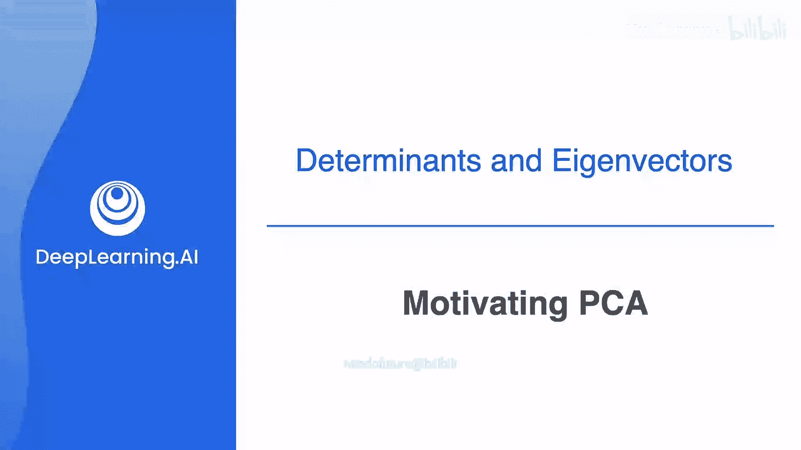
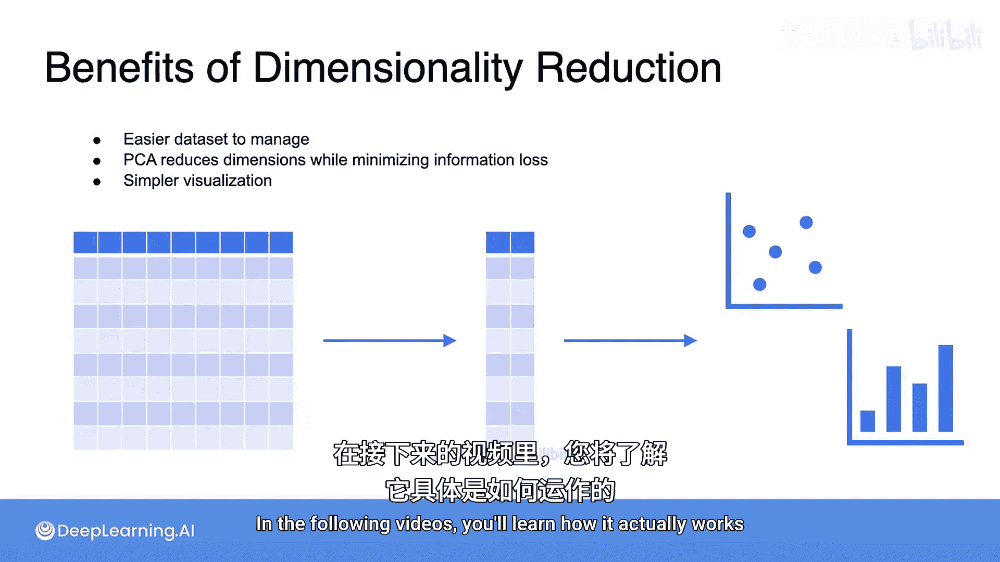

# 053：主成分分析动机

## 概述
在本节课中，我们将要学习主成分分析（PCA）的核心动机。我们将了解PCA如何利用投影的概念来降低数据集的维度，并解释为什么在降维过程中，保持数据的最大“展布”至关重要。

## 从投影到降维
上一节我们介绍了投影的概念，本节中我们来看看它如何被PCA用于降低数据集的维度。

在下图中，每个点代表一个由两个特征组成的观测值，这两个特征分别被绘制为X轴和Y轴上的位置。

降低此数据的维度意味着从二维数据（平面上的点）转换为一维数据（直线上的点）。

## 数据预处理：中心化
如图所示，数据集并未围绕原点(0,0)中心化，因此我们首先进行这一步操作。

## 探索不同的投影方向
现在，让我们看看如果将数据投影到X轴上会发生什么。我们暂时保留这个投影结果。

接着，将数据投影到Y轴上。你可以立即看到，这个投影中的点展布较小，因为点与点之间更接近。

实际上，你可以将数据投影到任意一条直线上，例如下面这条。

这条直线可以用方程 **y + x = 0** 表示。

这等价于投影到向量 **[1, -1]** 上，因为该向量张成了这条直线。

或者，你也可以考虑另一条满足方程 **2x - y = 0** 的直线。

这相当于投影到向量 **[1, 2]** 上。甚至也可以投影到这个方向。

请注意，这条直线与数据的拟合度相当好，并且投影后的点仍然相对分散。

## 展布与信息保留
正如你所见，经过这些投影后，数据点的展布程度各不相同。

这一点最终将变得非常重要。原因是，展布更大的数据点保留了更多原始数据的信息。

换句话说，保留更大的展布意味着保留更多的信息。现在，我将按照投影点展布从大到小的顺序进行排序。

顶部的投影器使点的展布最大，因此它保留了原始数据中最多的信息。

底部的投影展布最小，因此保留的信息也最少。

所以，PCA的目标是找到一个投影，即使在你降低数据集的维度时，也能最大可能地保留数据的展布。

## 降维与PCA的优势
以下是降维技术（特别是PCA）的主要优势。

以下是降维的主要好处：

*   **数据管理更简单**：降维使数据集更易于管理，因为它们的规模变小了。
*   **最小化信息损失**：PCA特别允许你在减少维度的同时，最小化信息损失。
*   **新的分析与可视化可能**：得益于维度的降低，以前难以或不可能实现的数据分析和可视化方式成为可能。

## 总结
本节课中，我们一起学习了主成分分析（PCA）的基本动机。我们了解到PCA通过寻找能最大化数据展布（即信息）的投影方向来实现降维。这使得我们能够在缩小数据规模的同时，尽可能多地保留原始信息，为后续的数据分析和可视化打下基础。

在接下来的视频中，你将学习PCA具体是如何工作的。

