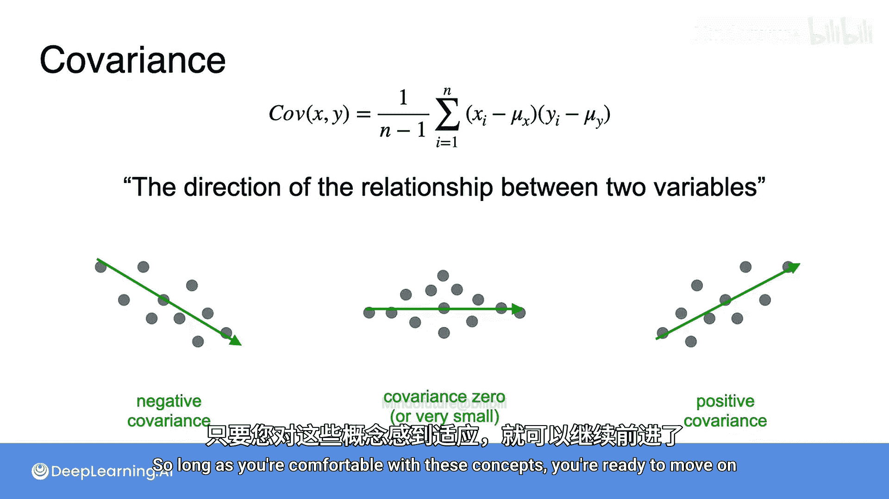

# 054：方差与协方差

## 概述

在本节课中，我们将学习主成分分析（PCA）所依赖的两个核心统计学概念：**方差**与**协方差**。理解这两个概念对于掌握数据如何分布以及不同特征之间如何关联至关重要。

## 均值：数据的中心点

首先，我们介绍一个基础概念：均值。考虑一个包含两个变量X和Y的数据集。图中的每个点代表一个观测值，其坐标为 (X_i, Y_i)。

数据的均值是所有观测值的平均值。在数学上，X变量的均值计算如下：将所有n个X值相加，然后除以n。Y变量的均值计算方式相同，即对每个特征的值取平均。

因此，这个中心点的坐标就是 (X的均值, Y的均值)。

## 方差：衡量数据的离散程度

上一节我们介绍了如何找到数据的中心点。本节中，我们来看看如何衡量数据围绕这个中心点的**离散程度**，这由**方差**来描述。

如果你想描述图中点的分布情况，可能会说这些点沿水平轴（X轴）分布得更分散（即离散程度更大），而沿垂直轴（Y轴）分布得更紧凑（即离散程度更小）。在统计学中，这种离散程度由**方差**来度量。一个数值没有离散的数据集方差为0，而离散程度大的数据集方差也大。

为了更清晰地展示这一点，我们可以将二维图表中的每个点投影到水平轴上。即使不计算方差，我们也能看出沿X轴的方差相对较大。如果重复这个过程到Y轴上，数值分布的范围更小，因此Y方差相对较小，但由于数值存在一些变化，它仍然大于零。

以下是计算一组数值方差的公式：

**方差公式：**
`Var(X) = Σ (X_i - μ)^2 / (n - 1)`

为了帮助你理解这个公式的不同部分，我们来看一个简单的数据集。假设有一个变量X，包含5个观测值：1, 3, 5, 7, 9。

1.  首先，计算X的均值μ：将所有X值相加（1+3+5+7+9=25），然后除以5，得到均值μ=5。
2.  接下来，计算每个观测值X_i与均值μ的差值：即每个值减去5。
3.  然后，将这些差值平方，并将结果放入新列。
4.  求和符号Σ表示将这五个平方值相加，得到总和40。
5.  最后，将这个总和除以n-1（这里n=5，所以除以4），得到方差为10。

在正式符号中，方差常缩写为Var，希腊字母μ常用来表示均值。另一种理解方差的方式是：它是所有数据点到均值的**平均平方距离**。虽然使用平均平方差有点特别，但最重要的结论是：当你的数据分布更分散、平均距离均值更远时，方差就会增大。

回到之前的数据集，现在你可以将那个平均点称为(μ_x, μ_y)，并使用刚复习的公式计算X和Y的方差。X方差大于Y方差，从公式可以清楚地看出原因：沿X轴看，这些点距离μ_x更远，所以平均平方距离也更大；而沿Y轴看，距离μ_y的平均平方距离则更小。

## 协方差：衡量两个变量的共同变化

方差帮助我们量化单个数据特征的离散程度。但现在考虑一种情况，仅凭方差可能不够。请看以下两个数据集，它们各有三个观测值。它们的Y方差和X方差将是相同的，但很明显，这两个数据集的模式存在显著差异。

解决方案是引入一个称为**协方差**的度量。协方差有助于衡量数据集中两个特征如何**共同变化**。注意，在左侧数据集中，数据内部的模式是向右下方倾斜：随着X值增加，Y值减小。在右侧数据集中，模式相反：随着X值增大，Y值也增大。协方差量化了这种关系，导致左侧数据具有**负协方差**，而右侧数据具有**正协方差**。

现在你对其衡量的内容有了高层次的理解，让我们看看协方差是如何实际计算的。

协方差的公式如下：

**协方差公式：**
`Cov(X, Y) = Σ [(X_i - μ_x) * (Y_i - μ_y)] / (n - 1)`

这个公式初看可能有点复杂，但我们可以分解来看。你会发现，它看起来与方差公式非常相似。实际上，如果将方差公式末尾的平方项展开，它们几乎相同。唯一的区别在于，现在方括号内的项同时依赖于X和Y变量的值以及它们的均值μ_x和μ_y。

为了理解这个方程如何工作，我们来看三个示例数据集。对于第一个数据集，我们预期计算出负协方差，因为数据呈下降趋势。在第二种情况下，拟合观测值的趋势线似乎是平的，因此我们预期协方差为0或一个非常小的值。在第三种情况下，X和Y似乎一起向上趋势，这应该导致正协方差。

为了理解方括号内项的影响，你可以在每个数据集上标出均值点(μ_x, μ_y)。从每个X中减去μ_x，从每个Y中减去μ_y，本质上是将数据围绕这个点重新中心化。你可以想象它将平面分成四个象限。

数据中的每个点都位于其中一个象限中，并对总体协方差产生或正或负的贡献：
*   在第一象限，X和Y都大于各自的均值，因此方括号内的乘积为正。
*   在第二象限，X小于其均值，但Y仍大于其均值。方括号内的项现在是一个负数和一个正数的乘积，结果为负。
*   在第三象限，X和Y都小于各自的均值，方括号内的项是两个负数的乘积，结果为正。
*   在第四象限，X大于其均值，但Y小于其均值。方括号内的项是一个正数和一个负数的乘积，结果为负。

回想一下，协方差方程的第一部分只是要求取总和，然后除以数值个数减1。换句话说，我们基本上是在平均所有这些乘积。因此，以一种简化的方式，你可以将协方差理解为：**平均而言，数据点是更多地落在正象限还是负象限？**
*   对于第一个数据集，更多的点落在负象限，因此协方差为负。
*   对于第二个数据集，点大致均匀分布在正负象限之间，导致协方差接近0。
*   对于第三个数据集，大部分点落在正象限，导致正协方差。

无论你是否觉得完全理解了协方差公式，现阶段最重要的是直观地理解它衡量的是什么。目前，你可以将协方差视为衡量两个变量之间**关系的方向**：
*   **负协方差**表示负相关趋势。
*   **小协方差（接近0）** 表示平坦趋势或无关系。
*   **正协方差**表示正相关趋势。

只要你熟悉了这些概念，就可以继续前进了。

## 总结

本节课中，我们一起学习了主成分分析（PCA）的两个关键统计学基础：**方差**与**协方差**。我们了解到，**方差**（`Var(X) = Σ (X_i - μ)^2 / (n - 1)`）用于量化单个数据特征的离散程度。而**协方差**（`Cov(X, Y) = Σ [(X_i - μ_x) * (Y_i - μ_y)] / (n - 1)`）则用于衡量两个变量共同变化的方向和程度，其值的正负指示了变量间是正相关、负相关还是无关。理解这两个概念是后续深入学习数据降维和特征提取技术的重要基石。