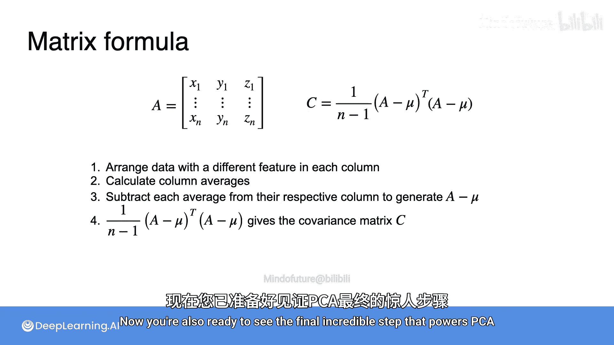

# 055：协方差矩阵


在本节课中，我们将要学习协方差矩阵。协方差矩阵是一种紧凑地存储数据集中所有变量对之间关系的特殊矩阵。理解它是掌握主成分分析等高级机器学习技术的关键一步。

## 什么是协方差矩阵？📊

上一节我们介绍了方差和协方差的概念，本节中我们来看看如何将它们组织成一个矩阵。

为了引入这个概念，让我们观察三个数据集。所有三个数据集中，在水平轴（X轴）上测量的变量都具有大致相同的离散程度。我们可以粗略地说，每个数据集的X方差都是3。在垂直轴（Y轴）上，这些数据集也具有大致相同的离散程度，但比X方向的离散程度稍小，我们可以说它们的Y方差是1。

然而，它们的协方差明显不同。第一个例子呈下降趋势，其协方差约为-2。第二个例子似乎没有明显趋势，协方差约为0。最后一个例子呈上升趋势，协方差约为+2。

利用这些度量，我们可以为每个数据集构建一个协方差矩阵。在矩阵的对角线上，我们放置X和Y的方差；在非对角线上，我们放置协方差。这个矩阵就是协方差矩阵，它简单地存储了每对变量之间的协方差和方差。

## 构建协方差矩阵的步骤 🛠️

让我们将这个过程形式化。以下是构建协方差矩阵的标准步骤：

1.  **计算方差和协方差**：首先，计算数据集中每个变量的方差，以及每对变量之间的协方差。对于两个变量X和Y，需要计算 `Var(X)`、`Var(Y)` 和 `Cov(X, Y)`。
2.  **构建方阵**：创建一个行和列的数量都等于数据集中变量数量的方阵。对于两个变量X和Y，这是一个2x2的矩阵。
3.  **填充矩阵**：在矩阵的每个位置 `(i, j)`，填入第 `i` 个变量和第 `j` 个变量的协方差。由于 `Cov(X, Y) = Cov(Y, X)`，矩阵是对称的。在主对角线上，填入每个变量自身的方差。实际上，一个变量与自身的协方差就是其方差，因此协方差矩阵可以完全看作是变量间协方差的集合。

## 协方差矩阵的矩阵表示法 🧮

协方差矩阵通常用矩阵符号表示，这为从数据中计算协方差矩阵提供了一种直接且高效的方法。

首先，需要将所有数据点存储在一个矩阵 `A` 中。矩阵 `A` 的每一行代表一个观测样本（包含所有变量的值），每一列代表一个变量的所有观测值。

其次，定义一个与 `A` 形状相同的矩阵 `μ`，其中每一列都是对应变量的均值。

使用这两个矩阵，协方差矩阵 `C` 可以表示为：
```
C = (1 / (n - 1)) * (A - μ)^T * (A - μ)
```
其中 `n` 是观测样本的数量，`^T` 表示矩阵转置。

让我们分解这个公式：
1.  `(A - μ)`：从每个观测值中减去其对应变量的均值，这被称为“中心化”数据。
2.  `(A - μ)^T * (A - μ)`：将中心化后的矩阵与其转置相乘。这个矩阵乘法的结果是一个方阵，其行和列的数量等于变量的数量。
3.  `(1 / (n - 1))`：这是一个缩放因子，用于得到样本协方差的无偏估计。

这个矩阵乘法运算非常巧妙。最终得到的 `C` 矩阵中：
*   对角线元素 `C[i][i]` 就是变量 `i` 的方差公式。
*   非对角线元素 `C[i][j]` 就是变量 `i` 和变量 `j` 的协方差公式。

## 实例演示 🔍

理论可能有些复杂，让我们通过一个真实数据集来看看这些计算过程。

假设我们有一个包含8个观测值的数据集，有两个特征X和Y。数据分布显示，X和Y的方差应该大致相同，并且由于呈下降趋势，协方差应为负值。

以下是计算步骤：
1.  **组织数据**：将数据整理成两列的表格，一列是X，一列是Y。
2.  **计算均值**：计算每列的平均值 `μ_X` 和 `μ_Y`。假设 `μ_X = 8`， `μ_Y = 6`。
3.  **中心化数据**：创建矩阵 `(A - μ)`，即每个值减去其所在列的平均值。
4.  **矩阵运算**：计算 `(1/(8-1)) * (A - μ)^T * (A - μ)`。
5.  **得到结果**：最终得到一个2x2的协方差矩阵 `C`。正如预测的那样，对角线上的X方差和Y方差数值相近，而协方差为负值。

## 扩展到更多变量 🌐

以上例子都是针对两个变量的数据集。但同样的过程适用于任意大小的数据集。当添加一个新特征Z时，步骤完全一致：
1.  将数据排列成矩阵，每列一个特征。
2.  计算列均值向量 `μ`。
3.  生成中心化矩阵 `(A - μ)`。
4.  计算 `(A - μ)^T * (A - μ)` 并除以 `(n-1)`，得到协方差矩阵 `C`。

## 总结 📝

本节课中我们一起学习了协方差矩阵。我们了解到，协方差矩阵是一个对称矩阵，它紧凑地汇总了数据集中所有变量对之间的方差和协方差关系。我们学习了构建它的分步方法，并深入探讨了其优雅的矩阵表示法 `C = (1/(n-1)) * (A - μ)^T * (A - μ)`。这个公式表明，看似复杂的协方差计算，可以通过简洁的矩阵乘法高效完成。理解协方差矩阵是进行主成分分析等降维技术的重要基础。



