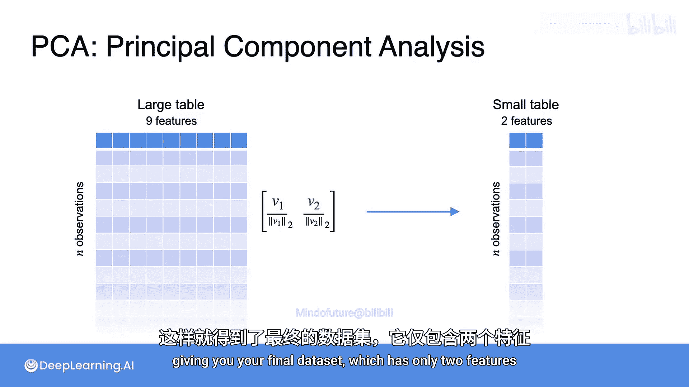

# 056：主成分分析概述

在本节课中，我们将学习主成分分析（PCA）的核心步骤，并将之前学过的所有概念整合起来。我们将从投影、特征值和特征向量、协方差矩阵等基础概念出发，最终理解PCA如何通过一个巧妙的过程来降低数据维度并保留最大方差。

## 概述

PCA的目标是将数据投影到一条能保留最多信息的直线上。这条“最佳”直线就是能保留数据中最大方差的方向。核心问题在于如何找到这条直线。答案在于结合投影、特征值/特征向量以及协方差矩阵这三个概念。

## 寻找最佳投影线

上一节我们介绍了协方差矩阵，它紧凑地表示了数据集中变量之间的关系。本节中，我们来看看如何利用它来找到PCA的最佳投影方向。

我们从同一个已中心化的数据集开始。首先，计算数据点的协方差矩阵 **C**。

假设x方向的方差是9，y方向的方差是3，协方差是4。这符合数据呈现的正向趋势。

## 核心步骤：特征值与特征向量

整个PCA过程的关键一步是：计算协方差矩阵的特征值和特征向量。这正是你找到数据应该投影到的那条线的方法。

特征值和特征向量成对出现，特征向量给出方向，特征值给出大小。

*   第一个特征向量是 `[2, 1]`，对应的特征值是 `11`。
*   第二个特征向量是 `[-1, 2]`，对应的特征值是 `1`。

你可能注意到这两个向量彼此成90度角（正交）。这不是巧合，对于对角线对称的矩阵（协方差矩阵总是对称的），其特征向量总是正交的。

现在，你有了两个特征向量，在PCA中它们被称为**主成分**。你需要将数据投影到其中一个方向上。

从直观上看，沿红色向量（`[2, 1]`）的方差远大于沿绿色向量（`[-1, 2]`）的方差。数学上如何确定呢？事实证明，**具有最大特征值的特征向量，在将数据投影到其上时，总能给出最大的方差**。

因此，向量 `[2, 1]` 的特征值 `11` 远大于 `1`，所以它是“获胜者”。这就是你要将数据投影上去的直线。同时，你可以丢弃特征值较小的第二个特征向量。

## 完成降维

现在，画出向量 `[2, 1]` 张成的直线，剩下的工作就是将数据投影到这条线上。

当点沿着这个向量投影后，你不再需要在二维空间中绘制它们，重要的是它们沿该向量的位置。因此，我们可以像这样绘制投影后的数据。

就这样，你降低了数据的维度，并尽可能保留了最大的方差，这正是PCA的两个目标。从视觉上看，你的数据从二维降到了一维。

你不再需要存储x和y两个变量，可以认为数据被简化为一个单一的新值 **Z**，它告诉你每个观测值在特征向量上的投影位置。你的数据维度更少，并保留了最大可能的方差。

## 扩展到高维数据

这个过程也适用于更大的数据集。假设你有一个九维数据集，即一个有9列（特征）和任意多行（观测值，设为n行）的表格。

以下是你在这些数据上执行PCA的方法：

1.  **计算协方差矩阵**：从你的数据中获取协方差矩阵，就像在之前的课程中看到的那样。由于有9个变量，这将得到一个9x9的协方差矩阵。
2.  **计算特征值与特征向量**：接下来，你需要找到这个矩阵的特征值和特征向量，并按照特征值从大到小对它们进行排序。
3.  **选择主成分**：假设你想将数据集减少到只有两个变量。那么你只需保留两个最大的特征值及其相关的特征向量，并丢弃其余部分。
4.  **投影数据**：现在你有了希望将数据投影到其上的两个向量 **V1** 和 **V2**。为了投影数据，创建一个新矩阵，其中每一列是这两个特征向量之一（通常已按自身范数缩放）。最后，进行矩阵乘法，将你的数据投影到这两个向量上，得到最终的数据集，它现在只有两个特征。

## 总结

本节课中，我们一起学习了主成分分析（PCA）的完整流程。我们回顾了将数据投影到保留最大方差直线上的目标，并了解到实现这一目标的关键在于计算数据协方差矩阵的特征值和特征向量。具有最大特征值的特征向量指明了最佳投影方向。通过将原始数据投影到选定的主成分上，我们成功实现了数据降维，同时最大限度地保留了数据中的信息（方差）。这个过程从二维示例直观展开，其原理同样适用于处理更高维度的数据集。