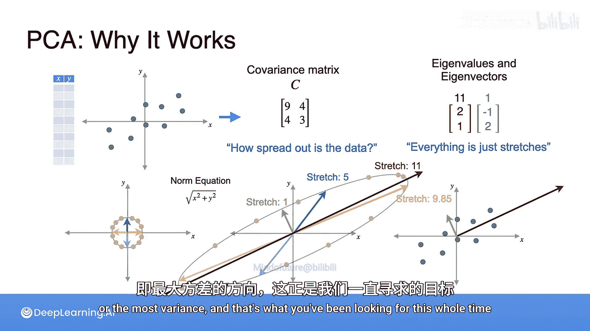

# 057：主成分分析原理

在本节课中，我们将要学习主成分分析（PCA）背后的核心数学原理。我们将通过一个直观的几何视角，理解为什么选择协方差矩阵的特征向量能够帮助我们找到数据中方差最大的方向。

上一节我们介绍了PCA的基本步骤，本节中我们来看看其背后的数学直觉。

## 协方差矩阵与空间变换

首先，考虑一个仅有两个特征的数据集，我们称之为X和Y。这些数据既可以看作一个数据表，也可以看作空间中的点。

得到数据后，可以计算其协方差矩阵 **C**。这个矩阵包含了数据分布的信息，特别是从每对变量的视角看数据是如何分散的。更准确地说，它描述了数据的“伸展”程度。

将 **C** 视为一个基变换，有助于理解其作用。它将如何改变空间？

*   基向量 `[1, 0]` 被变换到 `[9, 4]`。
*   基向量 `[0, 1]` 被变换到 `[4, 3]`。

同样可以验证，向量 `[-1, 0]` 变换到 `[-9, -4]`，向量 `[0, -1]` 变换到 `[-4, -3]`。

## 可视化变换：从圆到椭圆

为了看清这个变换的全貌，我们观察单位圆（半径为1的圆）上所有点经过变换后的结果。我们只关心方向上的拉伸，所以选择单位圆是合适的。

以下是变换过程的直观展示：

*   从单位圆上的一个点开始，观察其变换后的位置。
*   继续处理圆上所有方向的点。
*   将所有变换后的点连接起来，它们会描绘出一个椭圆。

因此，单位圆被变换成了一个椭圆。可以看到，所有点在不同方向上被拉伸了。如果选择一个更大的圆，会得到形状相同但尺寸更大的椭圆。

观察变换后的点，哪个方向是最大的拉伸方向？答案是与椭圆长轴对齐的红色线方向。沿任何其他方向切割椭圆，得到的线段都会更短。

## 特征值与特征向量的作用

这正是特征值和特征向量登场的地方。回顾一下，这个协方差矩阵 **C** 有两个特征向量：

*   特征向量 `[2, 1]`，对应的特征值为 **11**。
*   特征向量 `[-1, 2]`，对应的特征值为 **1**。

这两个向量共同构成了一个特征基。从这个特征基的视角来看，变换 **C** 仅仅是对平面进行拉伸。

最大的拉伸方向似乎沿着最大特征值对应的特征向量，事实确实如此。以下解释为何这符合逻辑：

计算特征值和特征向量的全部意义，在于将线性变换重新表述为沿特定方向的拉伸。

*   任何沿着向量 `[2, 1]` 方向的点，都会被拉伸 **11** 倍（即其特征值）。
*   任何沿着向量 `[-1, 2]` 方向的点，都会被拉伸 **1** 倍（即其特征值）。
*   平面上的任何其他向量，其拉伸因子将介于 **1** 和 **11** 之间。

让我们用几个例子来验证这一点。我将使用范数公式计算向量变换前后的范数，并找出它们之间的比率。

以下是具体计算示例：

*   **向量 `[0, 1]`**：如前所述，它被变换到 `[4, 3]`。其初始范数为 `1`，最终范数为 `5`。因此，它被拉伸了 **5** 倍。
*   **向量 `[1, 0]`**：它被变换到 `[9, 4]`。其初始范数为 `1`，最终范数约为 `9.85`。因此，它被拉伸了约 **9.85** 倍。

这次的拉伸更接近最大值 **11**，但仍然小于沿特征向量 `[2, 1]` 方向所能达到的最大拉伸。虽然这不是一个严格的证明，但希望这能帮助你建立起选择最大特征值对应特征向量的直观理解。

## 核心结论

总结一下其中的逻辑关系：

1.  你的协方差矩阵 **C** 刻画了数据的分散程度。
2.  矩阵 **C** 的特征向量指明了矩阵可以被视为“纯粹拉伸”的方向。
3.  最大的特征值告诉你哪个方向的拉伸程度最大，而任何其他方向都会被拉伸得较少。

因此，**选择具有最大特征值的特征向量，就能得到具有最大拉伸（即最大方差）的方向**，而这正是你在主成分分析中一直寻找的目标。

本节课中我们一起学习了主成分分析的数学原理。我们了解到，协方差矩阵的特征向量定义了数据分布的主要方向，而对应的特征值大小则表明了数据在这些方向上的方差大小。选择最大特征值对应的特征向量，就能捕获数据中最主要的变异信息，这是PCA降维和特征提取的核心思想。