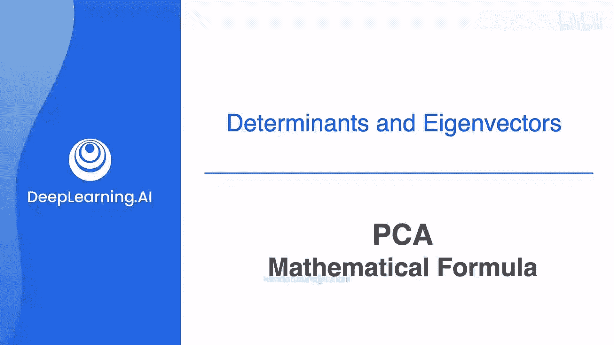
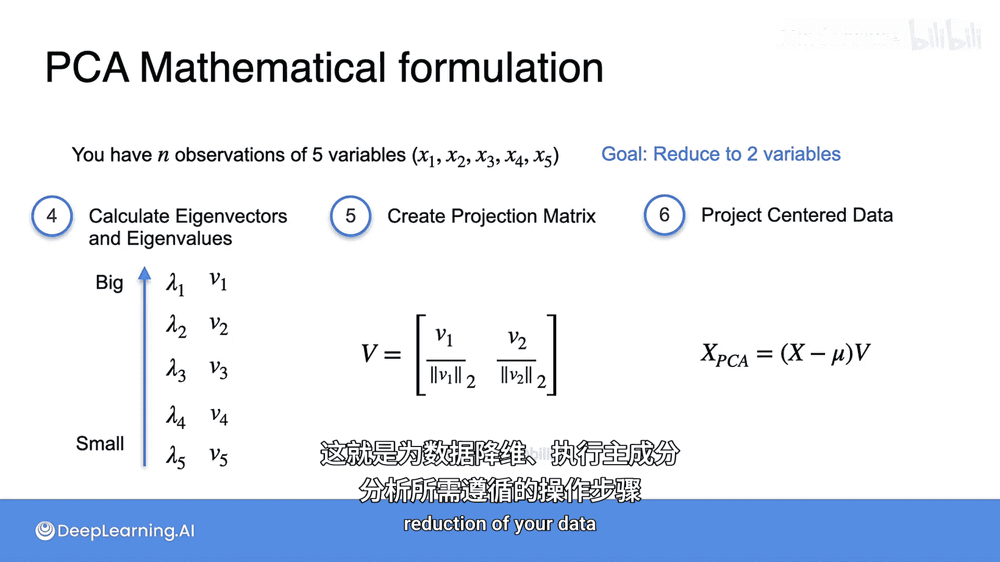

# 058：主成分分析数学步骤详解 🧮

在本节课中，我们将学习主成分分析（PCA）的完整数学步骤。我们将把之前介绍的概念和公式整合起来，形成一个清晰、可操作的计算流程。

理解了PCA背后的核心思想后，让我们最后一次用本例中学习到的所有公式来形式化其步骤。此流程适用于任意数量的变量，本例将以五个变量为例进行说明。

## 数据准备与中心化

首先，你有一个包含五个变量（x1, x2, x3, x4, x5）的n个观测值的数据集。你的目标是将数据从五维降至二维。

第一步是构建数据矩阵。这个矩阵被称为 **X**，它有五列（对应每个变量或特征）和n行（对应每个观测值）。这与之前用于计算协方差矩阵的矩阵（当时称为a）是同一个矩阵。现在所有变量都称为Xi，因此使用X作为矩阵名称，这也是更标准的记法。

接下来，对数据进行中心化处理。为此，计算每列的平均值，并从该列的每个元素中减去这个平均值，得到中心化后的矩阵 **X - μ**。

## 计算协方差矩阵与特征分解

现在计算协方差矩阵。这只是一个简单的矩阵乘法，使用你刚刚计算出的中心化矩阵 **X - μ**。在本例中，你将得到一个5x5的协方差矩阵，它包含了每对变量之间的协方差。

下一步，为协方差矩阵寻找特征值和特征向量。得到它们之后，按照特征值从小到大的顺序对特征值-特征向量对进行排序。

## 构建投影矩阵与数据降维

现在你将创建一个矩阵来投影你的数据。由于你的目标是将数据集降至两个变量，因此你只保留前两个（即最大特征值对应的）特征值-特征向量对。

创建一个矩阵 **V**，它有两列，每一列是你选择的一个特征向量，并已按其范数进行了缩放。

最后，通过将中心化后的数据乘以你的投影矩阵，将数据投影到你所选的向量上。结果是一个新的数据矩阵 **X_PCA**，它将只有两列数据，代表你的原始数据在你选择的两个主成分上的投影。

以上就是全部步骤。这是为你的数据进行降维而执行PCA所需的分步操作。

---

本节课中，我们一起学习了主成分分析（PCA）从数据准备、中心化、协方差矩阵计算、特征分解到最终数据投影的完整数学流程。通过这个标准化的步骤，你可以将任意高维数据集有效地降至更低的维度，同时尽可能保留数据中的主要变化信息。