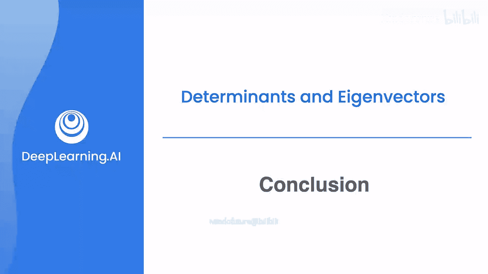

# 060：总结

## 概述
在本节课中，我们将对已完成的线性代数课程内容进行总结。我们将回顾解决线性方程组、矩阵与向量的转换，以及将矩阵视为线性变换等核心概念。

## 课程内容回顾

上一节我们介绍了线性代数的多种应用，本节中我们来回顾一下整个课程的核心要点。

以下是我们在第四周课程中学习的主要内容：

*   **解决线性方程组**：我们学习了如何求解包含多个线性方程的方程组。
*   **矩阵与向量表示**：我们掌握了如何将线性方程组转化为矩阵和向量的形式，例如将方程组 `Ax = b` 表示为矩阵乘法。
*   **矩阵作为线性变换**：我们理解了矩阵可以被视为对向量空间进行旋转、缩放等操作的线性变换。

## 总结
本节课中我们一起学习了线性代数课程的核心内容，包括求解线性方程组、使用矩阵和向量表示问题，以及理解矩阵的几何意义——线性变换。这些知识为后续的机器学习旅程奠定了坚实的数学基础。