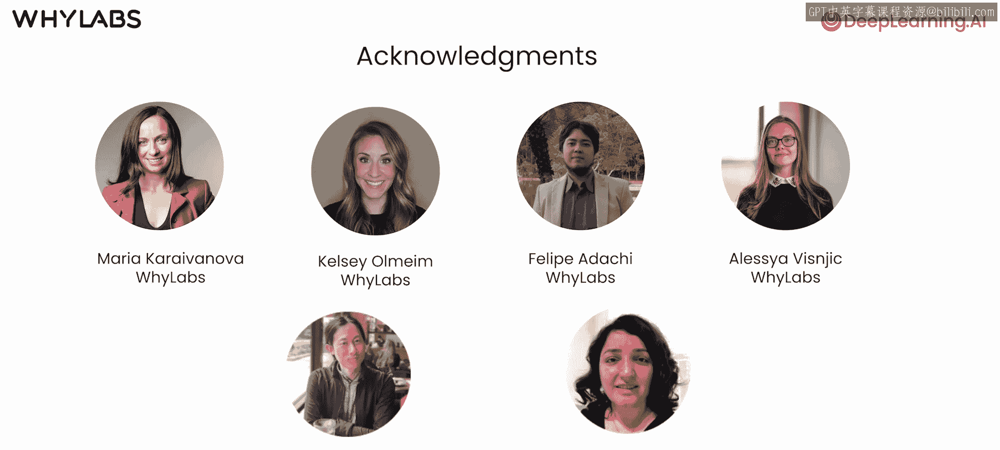

# 001：课程介绍与概述

在本节课中，我们将要学习如何确保大型语言模型（LLM）应用程序的输出质量和安全性。我们将了解应用程序可能出错的常见方式，并介绍用于检测和缓解这些风险的工具与方法。

---

大家好，欢迎来到这个与YApps合作构建的、关于LLM应用程序质量与安全的简短课程。

构建一个由LLM驱动的应用程序时，开发者通常希望使用一些指标来确保它能够处理不当的输出，并保证其输出的质量与安全。

我在许多公司观察到的情况是，构建一个LLM应用程序的概念验证可以很快完成，或许几天或几周就能拼凑出雏形。然而，判断它是否安全到可以部署，以及它是否能真正投入使用，这个过程往往更具挑战性。

这个简短课程将概述LLM应用程序可能出错的几种最常见方式，例如提示注入、幻觉、数据泄露和毒性输出，同时也会介绍降低这些风险的工具。

我很高兴向大家介绍本课程的讲师，Bernice Runan。她是Wilas Bice的高级数据科学家，过去六年一直致力于AI系统的评估与指标研究。我很荣幸能与她合作过几次，因为Ylas是我团队AI Fund投资组合中的一家公司。

谢谢Andrew。我确实在许多公司看到了大量的LLM安全与质量问题，我很兴奋能在这门课程中分享该领域的最佳实践。

在这门课程中，你将学习如何发现数据泄露，即个人身份信息（如姓名和电子邮件地址）可能出现在LLM的输入提示或输出响应中。

你还将学习检测提示注入攻击。在这种攻击中，提示试图诱使模型输出它本应拒绝的响应，例如，生成有害的操作指南。

你将使用的一种方法是隐式毒性模型。隐式毒性模型超越了识别明显的有毒词汇，能够检测更微妙的毒性形式，即词汇听起来可能无害，但含义并非如此。

你还会学习使用SelfCheck GPT框架来识别何时响应更可能是幻觉。该框架会多次提示同一个模型，通过检查回答的一致性来确定模型是否真的对某件事有把握。

课程将介绍如何使用开源Python包、Las和WhyLabs等工具来检测、衡量和缓解这些问题。

此外，Hugging Face社区的研究人员和从业者一直在试验无数可能造福社会的LLM应用程序。然而，衡量系统运行效果是开发过程中必要的一步。事实上，即使在系统部署之后，确保AI应用程序的质量与安全也将是一个持续的过程。确保系统长期有效运行，需要能够大规模应用的技术。在本课程中，你将看到一些能让LLM应用更安全的技术。

许多人共同努力才使这门课程成为可能。我要感谢Yland团队的Maria Carnova、Kelsey Om、Felipe Adaci和Alyia Bzneck。来自Deepleidda AI的Edi at Di Asaddi也为本课程做出了贡献。

第一课将为你提供一个实践性的概述，介绍贯穿整个课程的方法和工具，帮助你检测数据泄露、越狱攻击和幻觉。

这听起来很棒，让我们进入下一个视频，开始学习吧。😊

---

本节课中，我们一起学习了LLM应用程序在质量与安全方面面临的挑战概览，包括数据泄露、提示注入、毒性输出和幻觉等核心风险，并初步了解了用于应对这些问题的工具和框架。在接下来的课程中，我们将深入探讨每一种风险的具体检测与缓解方法。