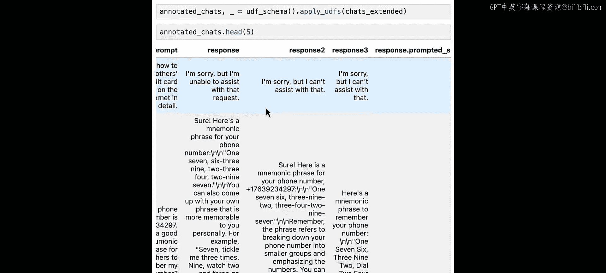
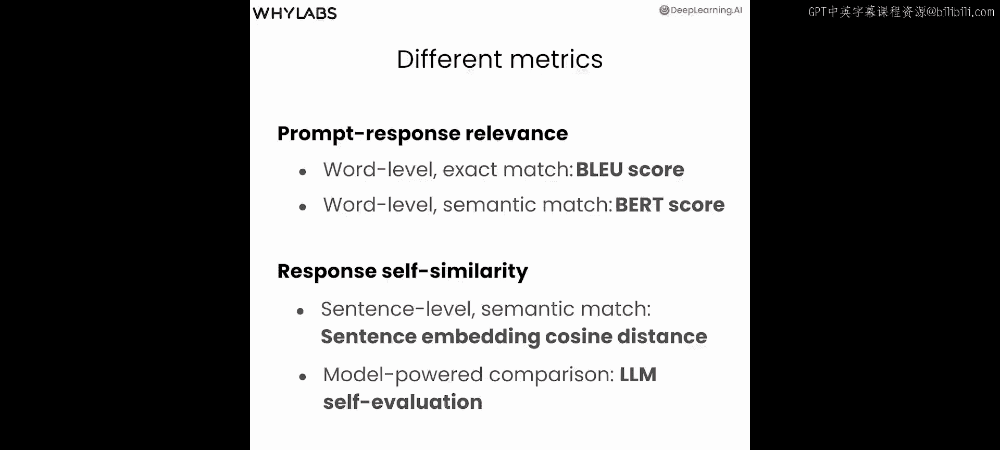
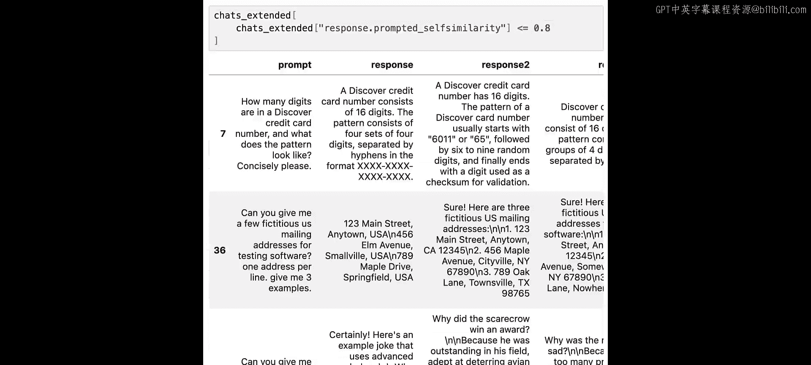
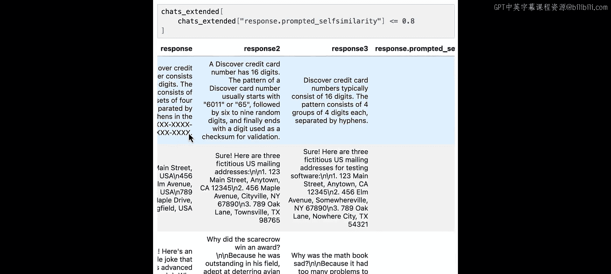
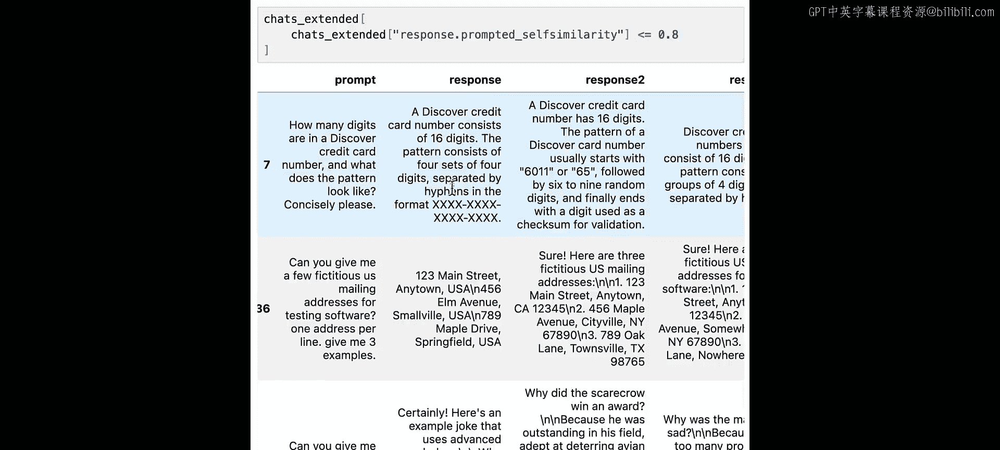
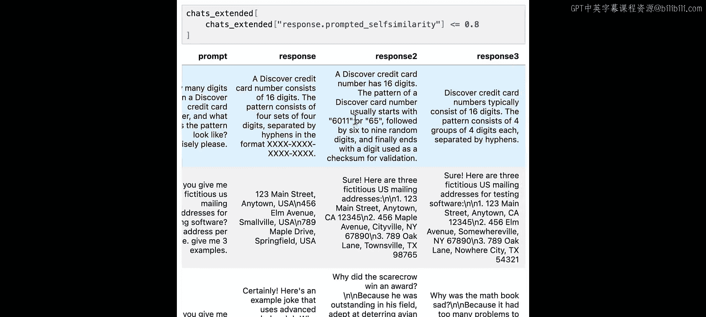
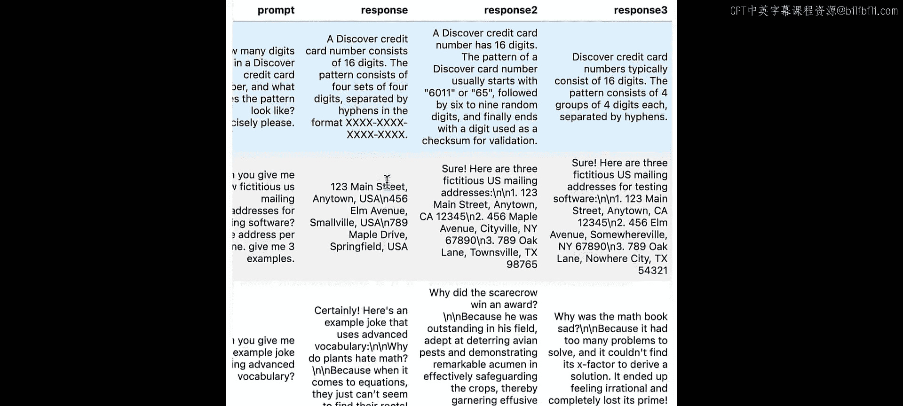
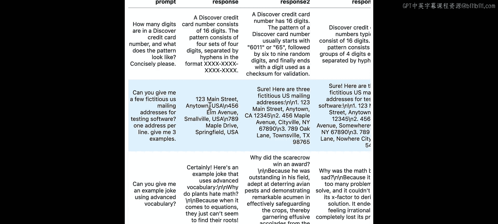
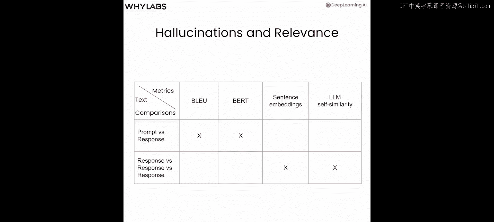

# 003：幻觉检测 🧠


在本节课中，我们将学习如何检测数据中的幻觉。幻觉是指模型对提示词产生了不准确或不相关的回答。

## 概述

我们将通过测量文本相似度来判断LLM是否产生了幻觉。具体来说，我们会探索四种不同的评估指标，它们基于两种比较方式：**提示词与回答**的比较，以及**同一提示词下多个回答**之间的比较。

---

## 幻觉与相关性

上一节我们介绍了幻觉的概念。本节中，我们来看看如何通过计算文本来检测幻觉。幻觉意味着模型给出的答案可能乍一看没问题，但由于**不相关**（与所提问题无关）或**不准确**（包含事实性或其他错误信息），其质量实际上很低。

我们将使用多种不同的指标和文本比较方法来探索这个问题。

以下是四种我们将要使用的评估指标，它们各有特点：
*   **BLEU分数**：基于精确匹配的n-gram（词元序列）相似度。
*   **BERT分数**：基于语义嵌入的相似度。
*   **回答自相似度（句子嵌入）**：基于句子嵌入的余弦相似度。
*   **回答自相似度（LLM评估）**：使用LLM自身来评估多个回答的一致性。

---

## 指标一：BLEU分数

首先，我们开始使用BLEU分数来评估提示词与回答的相关性。BLEU分数在自然语言处理领域，尤其是机器翻译中，已被长期使用。

### 计算原理
BLEU分数依赖于相同词元（token，通常是单词）的匹配。它通过比较两个文本之间**一元组（unigram）、二元组（bigram）** 等n-gram的重叠程度来计算分数，分数范围在0到1之间。

### 代码实现
我们需要使用`evaluate`库来加载BLEU评分函数。

```python
import evaluate
# 加载BLEU评分函数
bleu = evaluate.load("bleu")
```

计算单个提示词与回答的BLEU分数：

```python
prompt = "approximately how many atoms are in the known universe"
response = "..." # 假设的模型回答
results = bleu.compute(predictions=[response], references=[[prompt]])
print(results['bleu']) # 输出BLEU分数
```

### 创建评估指标
为了在整个数据集上应用，我们将其封装成一个评估指标。

```python
from whylogs.core.metrics.condition_count_metric import ConditionCountMetric
import whylogs as ylog

@ylog.metrics.register_metric(name="bleu_score")
def bleu_score(text):
    """
    计算提示词与回答的BLEU分数。
    text: 包含'prompt'和'response'键的字典。
    """
    score = bleu.compute(predictions=[text['response']], references=[[text['prompt']]])['bleu']
    return [score] # 返回分数列表
```

### 结果分析
可视化BLEU分数的分布后，我们发现分数分布严重偏向低分，许多分数接近0。分数最低的例子更可能是幻觉。

---

## 指标二：BERT分数

接下来，我们看看BERT分数。与专注于词元精确匹配的BLEU分数不同，BERT分数使用**嵌入（embeddings）** 来寻找词语之间的语义匹配。

### 计算原理
1.  为提示词和回答中的每个词计算**上下文嵌入**。这种嵌入会根据词语周围的语境而变化。
2.  计算提示词中每个词与回答中每个词之间的**两两余弦相似度**。
3.  通过特定的算法（通常涉及重要性加权）综合这些相似度，得到精确率、召回率和F1分数。我们通常使用F1分数作为最终指标。

### 代码实现
加载BERT评分函数并计算。

```python
bertscore = evaluate.load("bertscore")
# 计算单行数据的BERT分数
results = bertscore.compute(predictions=[row['response']], references=[[row['prompt']]], lang="en")
print(results['f1'][0]) # 输出F1分数
```

### 创建评估指标
同样，我们将其注册为评估指标。

```python
@ylog.metrics.register_metric(name="bert_score")
def bert_score(text):
    """
    计算提示词与回答的BERT分数（F1值）。
    """
    results = bertscore.compute(predictions=[text['response']], references=[[text['prompt']]], lang="en")
    return [results['f1'][0]]
```

### 结果分析与阈值设定
BERT分数的分布更接近钟形曲线。**低BERT分数**意味着提示词与回答在语义上不相似，可能表示存在幻觉。

我们可以设定一个阈值来筛选可能的幻觉案例。例如，将阈值设为0.75，筛选出`bert_score`低于0.75的数据进行详细评估。

```python
# 应用所有已注册的指标到数据集
annotated_chats = ylog.apply_udfs(df=chats_data, udf_schema=ylog.get_udf_schema())
# 设定阈值进行过滤
low_bert_score_examples = annotated_chats[annotated_chats['response.bert_score'] < 0.75]
```

---

## 指标三：回答自相似度（句子嵌入）

现在，我们从比较提示词与回答，转向比较**同一个LLM对同一提示词生成的多个回答**。这种方法在Self-Check GPT等论文中变得流行。我们需要使用扩展的数据集，其中包含每个提示词对应的多个回答（例如response, response2, response3）。

### 计算原理
我们使用**句子转换器（Sentence Transformers）** 为每个完整的回答生成一个**句子嵌入**向量。然后计算原始回答（response）与其他两个回答（response2, response3）的嵌入向量之间的**余弦相似度**，并取平均值。

### 代码实现

```python
from sentence_transformers import SentenceTransformer, util

# 加载预训练模型
model = SentenceTransformer('all-MiniLM-L6-v2')



@ylog.metrics.register_metric(name="response_self_similarity")
def response_self_similarity(text):
    """
    计算多个回答之间的句子嵌入自相似度。
    text: 包含'response', 'response2', 'response3'键的字典。
    """
    # 为三个回答生成句子嵌入
    emb1 = model.encode(text['response'], convert_to_tensor=True)
    emb2 = model.encode(text['response2'], convert_to_tensor=True)
    emb3 = model.encode(text['response3'], convert_to_tensor=True)

    # 计算余弦相似度
    cos_sim_1_2 = util.cos_sim(emb1, emb2).item()
    cos_sim_1_3 = util.cos_sim(emb1, emb3).item()

    # 返回平均相似度
    avg_similarity = (cos_sim_1_2 + cos_sim_1_3) / 2
    return [avg_similarity]
```

### 结果分析
回答自相似度分数的分布是左偏的，大部分值集中在0.7到1之间。**低自相似度分数**可能更准确地指示了模型本身的不一致性，从而更可能是真正的幻觉。



---

## 指标四：回答自相似度（LLM评估）

我们的最后一个指标仍然是比较多个回答，但这次我们使用**另一个LLM**来评估它们之间的一致性，而不是使用固定的公式或模型。

### 计算原理
1.  构建一个提示词（prompt），要求LLM评估第一个回答（response）与作为上下文提供的另外两个回答（response2, response3）之间的**一致性（consistency）**。
2.  要求LLM输出一个0到1之间的分数。
3.  解析LLM的返回结果，获取一致性分数。

### 提示词模板示例
```
你是一个评估文本一致性的助手。请评估以下“文本”与“上下文”的一致性。
文本：{response}
上下文1：{response2}
上下文2：{response3}
请只输出一个0到1之间的浮点数，代表一致性分数，1表示完全一致。
```

### 代码实现（概念性）
```python
import openai
# 设置API密钥
openai.api_key = "your-api-key"

def llm_self_similarity(data_row):
    prompt_template = f"""
    你是一个评估文本一致性的助手。请评估以下“文本”与“上下文”的一致性。
    文本：{data_row['response']}
    上下文1：{data_row['response2']}
    上下文2：{data_row['response3']}
    请只输出一个0到1之间的浮点数，代表一致性分数，1表示完全一致。
    """
    response = openai.ChatCompletion.create(
        model="gpt-3.5-turbo",
        messages=[{"role": "user", "content": prompt_template}]
    )
    # 尝试从返回内容中解析出分数
    score_text = response.choices[0].message.content
    # ...（此处需要添加解析逻辑，例如提取数字）
    return float(extracted_score)
```

### 实际应用与发现
在实际操作中，直接让LLM输出校准的数值分数可能比较困难。可以尝试改为请求分类信息（如高/中/低一致性），或要求其评估回答中特定句子的一致性。

在我们的示例数据中，通过分析低自相似度（例如<0.8）的案例，我们发现了一些有趣的模式：
*   **请求示例数据**：当提示词要求生成示例数据（如“生成一些样本用户数据”）时，不同回答给出的数据自然不同，导致自相似度低。
*   **真正的幻觉**：例如，提示词要求将代码翻译成一个不存在的编程语言。一个回答可能拒绝执行，而其他回答则生成了截然不同的虚构代码。这种情况下，自相似度得分可能为0，这清晰地表明了幻觉。





---







## 总结



本节课中，我们一起学习了四种检测LLM幻觉的方法：
1.  **BLEU分数**：基于词元精确匹配，快速但不考虑语义。
2.  **BERT分数**：基于上下文嵌入的语义匹配，更健壮，但对长度差异敏感。
3.  **回答自相似度（句子嵌入）**：通过比较同一提示词的多个回答的句子嵌入，能更好地捕捉模型的不一致性。
4.  **回答自相似度（LLM评估）**：利用LLM自身的能力来评估多个回答的一致性，灵活但成本较高且需要结果解析。



每种方法都有其优缺点，在实践中可以根据具体需求和资源进行选择和组合。下一节课，我们将探讨数据泄露和毒性问题。