# 006：被动与主动监控 🛡️

在本节课中，我们将学习如何将之前创建的指标应用于LLM应用程序，以实现质量与安全性的监控。我们将探讨两种主要的监控方式：**被动监控**和**主动监控**，并学习如何在真实场景中设置和使用它们。

## 概述

为了确保LLM应用程序的安全性和质量，我们可以使用本课程中介绍的指标。这些指标可以应用于从应用程序收集的数据上，这被称为**被动监控**。或者，也可以在应用程序运行时实时应用这些指标，这被称为**主动监控**。接下来，我们将详细探讨这两种方法。

## 设置与指标初始化

上一节我们介绍了监控的基本概念，本节中我们来看看如何在实际环境中进行设置。

首先，我们需要进行一些基础设置。我们将从Lank Ki库安装一系列默认指标。

要初始化这些指标，我们需要使用`init`函数。

我强烈建议将之前课程中的一些指标复制到本节课中。以下是具体操作步骤。

首先，导入我们的`Reg data UDF`装饰器。

然后，可以自由地将之前课程中的任何指标复制到接下来的单元格中。

需要注意的一点是，我们需要确保这些单元格返回的是值列表。过去我们有时会使用Pandas特定的计算方式，例如`.S R`功能。当我们传入的不是Pandas数据框时，这可能无法正常工作，因此请小心处理。

现在，我们将导入`UDF schema`函数，并使用它来捕获所有已注册的指标。

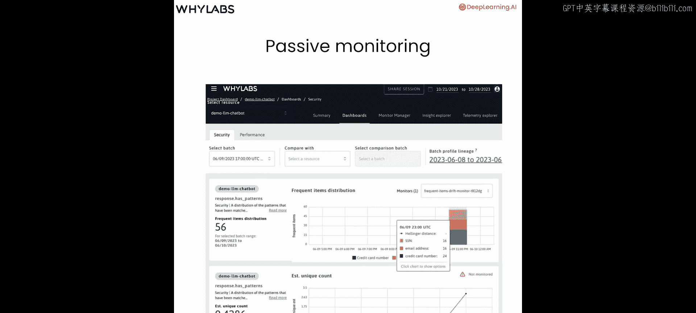

过去，我们使用过`LLM schema`或任何名称，像这样赋值：`LLM_schema = UDF_schema()`。

但在生产环境中，我们可以创建一个新的记录器。通过创建一个包含这些模式设置和其他设置的记录器，可以使后续调用`why logs`变得更加简单。让我们在这里实现它。

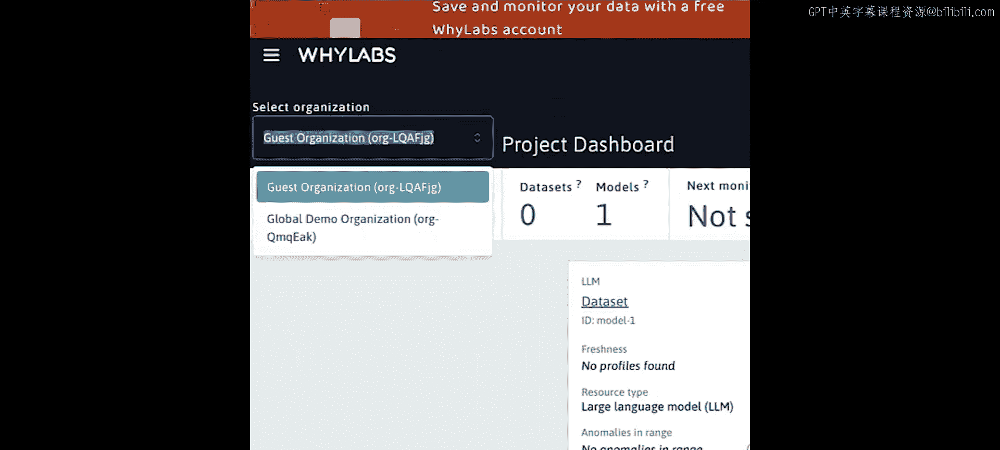

我们将创建一个非常简单的记录器，称之为`LLM_logger`，只需使用`Y.logger`并传入一个模式即可。在我们的例子中，模式等于`UDF_schema`。

对于流式应用程序和真实应用程序，我们可能并不总是在每次记录时都拥有完整的数据集。在这些情况下，我们可能希望将数据组合起来并按预期进行汇总，而不是将每个单独的数据点记录到它们各自独立的配置文件中。

以下是一个滚动记录器的示例，它会随着时间的推移压缩我们的数据。

你会注意到这里我设置了一个间隔为1小时的示例记录器。在这个示例中，每小时我们会将该小时内看到的所有数据压缩到单个配置文件中。

## 两种监控类型

现在，让我们继续思考两种类型的监控。

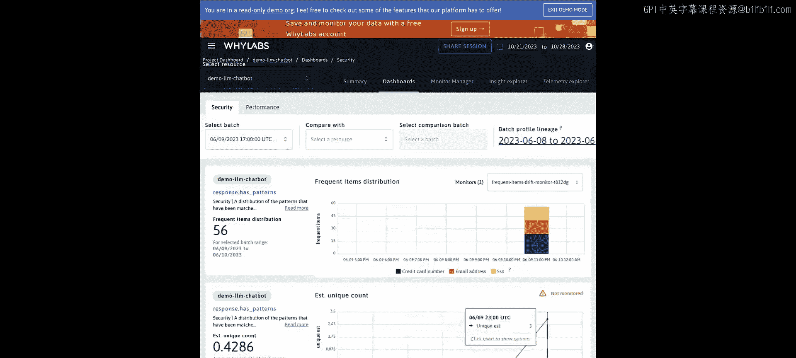

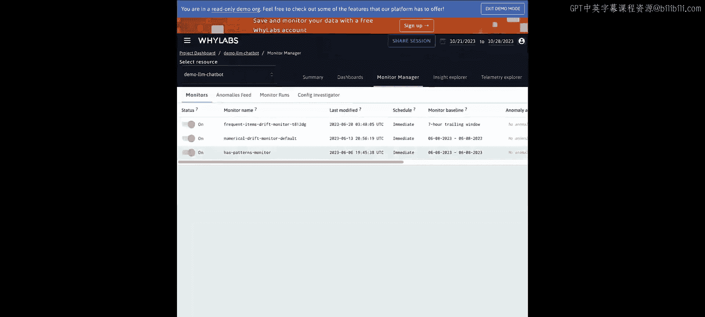

第一种监控类型是我们在本课程所有先前课程中已经做过的，即**被动监控**。被动监控是在与LLM应用程序的交互完成后进行的。这包括调用我们的LLM模型（可能是我们自己的，也可能是第三方的），以及我们提供给系统用户的所有响应。完成这些操作后，我们可以查看所有组合数据并进行分析。

让我们回到WOs平台，在那里我们之前看到了许多与这些指标相关的度量和见解。

现在，让我们查看一些更真实、随时间推移推送的示例数据。

首先，我们转到项目仪表板，将我们的访客组织切换到每个人都可以访问的演示组织。

在这里，我们将处于Wabbs提供的某些演示的只读模式。

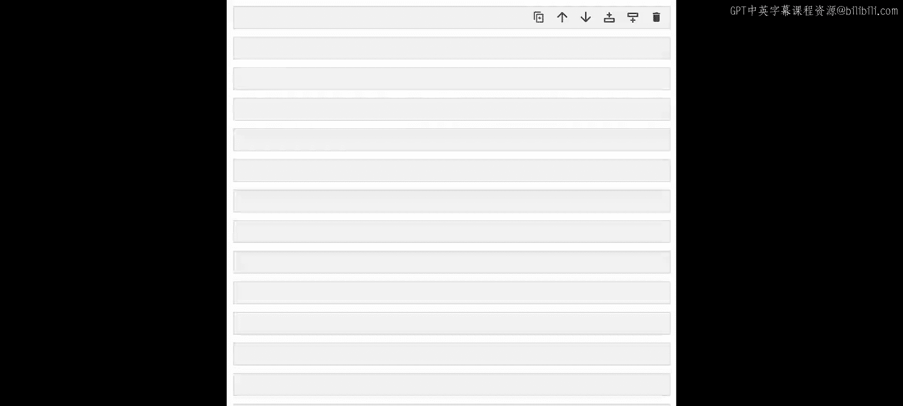

我们想查看LLM聊天机器人演示。点击仪表板。

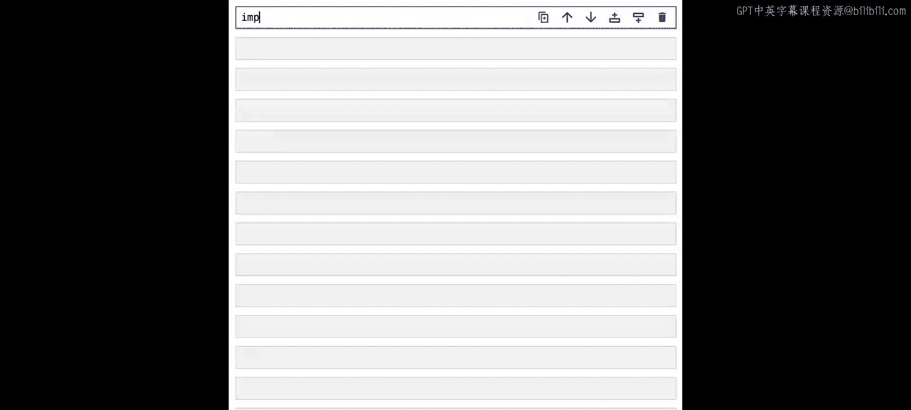

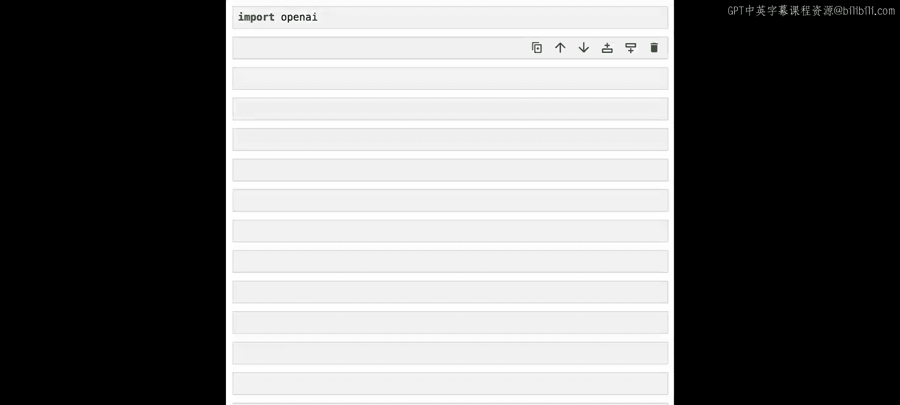

在这里，我们可以看到许多与LLM相关的仪表板。我们看到许多熟悉的指标，例如`has_patterns`，其中特定日期包含一些社会安全号码、电子邮件地址和信用卡号码。我们还看到诸如随时间变化的情绪、越狱相似性等指标。

与之前的数据不同，这些数据并非全部压缩到单个配置文件中，而是随时间进行剖析。这些是每小时配置文件。我们看到一些在6点，一些在7点，依此类推。这种在应用程序流程完成后查看数据并进行分析以发现潜在问题或了解使用情况的方式，称为**被动监控**。

我们可能会做诸如查看特定日期拒绝率和毒性增加等情况，以及其他毒性等问题，并确定需要重置模型或更改应用程序的某些内容。

我们还可以添加不同的监视器。除了仅仅查看这些值并对这些值应用阈值以便向他人发出警报、跟踪应用程序中发生的情况之外。我不会展示太多关于如何操作的细节，你可以点击这里的监视器管理器开始添加更多。

## 主动监控

接下来，让我们深入了解**主动监控**的概念。

与被动监控不同，主动监控可以实时发生，但这发生在我们的LLM应用程序运行过程中。这里有一个例子：我们有一个用户。该用户可能会向我们的系统提交提示或请求。我们可以在甚至调用LLM之前，对消息进行审计等操作。我们可以将这些日志传递给我们的系统，例如`Ylas`。然后我们可以过滤这些系统。

根据发出的请求，我们可能决定不再继续。但我们可以继续，将内容传递给LLM，从LLM接收响应，并在单个流程进行时记录该信息。然后，我们可能决定从中做出响应并将其传回我们的应用程序。在流程中拥有多个接触点非常有帮助。

这使我们能够过滤响应，在用户交互过程中改变我们关于发送什么内容的决定。

现在，我将在我们的笔记本中创建一个半真实的示例。我们将使用OpenAI，尽管你可以使用任何LLM。

为此，我们将导入`openai`。

然后我们需要一个OpenAI密钥。这些应该对我们可用。我们已经有了辅助函数来帮助获取这些。让我们在这里完成它。

并将其设置在OpenAI中。

现在我们已经完成了这些，让我们思考如何设置一个非常简单的记录器。首先，我们将从一个非常简单的开始，然后逐步增强它。我们称之为`active_LLM_logger`。由于我们会替换它，我们就先让它保持空白。

现在考虑我们的应用程序，我们有几个步骤需要执行。

首先，我们希望向用户请求输入。在我们的例子中，我想做一个类似食谱应用程序的东西。所以用户会提供一个项目，我们将使用LLM为该物品创建一个简单的食谱。

因此，我们将接收用户请求。

第二件事是提示LLM并获取响应，可能包含该请求的转换版本。

然后，根据该响应的成功或失败，我们可以传回LLM的响应，或者我们可能传回自定义消息。

让我们继续为此创建四个函数，我将引导你完成它们。

第一个是`user_request`。我们在这里使用`input`功能接收请求。然后，以防请求是“quit”，我们将捕获它并引发一个`KeyboardInterrupt`。这是在运行过程中关闭单元格或在运行过程中关闭Python函数时常见的异常。

正如我们讨论的，我们将在此过程中进行记录。第一次我们将只记录我们拥有的请求信息，即用户传入的文本。

第二，我们将使用`prompt_LLM`函数提示我们的LLM。我来引导你完成它。首先，我们将把用户发出的请求转换成一个可以传递给LLM的提示。这里我们要求一个简短的食谱，最多六个步骤，并限制字符数。

然后，再次使用这个`active_LLM_logger`对象记录我们的提示。

接着，我们将用我们的请求和提示调用OpenAI。

获取该响应后，我们将记录该响应然后返回它。

接下来，我们应该决定成功时做什么。为此，我将使用已创建的`user_reply_success`函数。这里发生的是，我们接收请求和响应，基本上将其返回给用户。我将格式化它，以便我们都能在同一屏幕上看到它。然后我们也记录这个回复。

最后，当失败时我们做什么。我将向上滚动到这里。我们将使用`user_reply_failure`函数，接收一个请求（我也为那个请求设置了默认值），并给出一个不幸的消息，说：“嘿，我们无法提供食谱。所以，这有点长，但这次只是S4 I请求。请在未来尝试我的模型食谱创建器900。”然后我们也记录这个回复。

现在我们已经有了四个函数，我们的应用程序将如何运行？我们可以考虑多种逻辑方式。但我将采用一种使用异常的方法。

首先，我想创建一个新的自定义异常，拥有它们很好，这样我们就能理解我们创建了什么以及其他异常是什么。所以我将创建一个类，称之为`LLM_Application_Validation_Error`。我将使其成为`ValueError`的子类。我们不需要传入任何东西或做任何事情。所以我将在这里放一个`pass`，但至少我们创建了这个类。

那么我们的逻辑将如何工作？由于我们可能使用一些异常，让我们编写一个循环并创建某种提示的函数。我们将说`while True`。当然，要小心使用`while True`，我们可能必须取消它，或者如果它运行时间太长。让我们把它放到一个`try`块中。然后我们将说`request = user_request()`，我们的第一个函数。然后我们将找到`response`，它将来自我们的`prompt_LLM`函数，接收请求。然后，我们将使用`user_reply_success`，假设一切顺利。

但是，如果不顺利怎么办？一种情况，我们可能有一个`KeyboardInterrupt`，也许用户手动或通过我们的`user_request`函数输入了“quit”，并引发了一个键盘中断。另一个我们可能有的异常是我们的`LLM_Application_Validation_Error`。我们并没有真正使用这些，所以我本可以轻松地省略它们。也许它会。那么，这将做的是，我们将继续循环，直到得到键盘中断或这个LLM应用程序验证错误。

你可能会想捕获所有异常。哦，我道歉，我们这里漏掉了一件事。在这种情况下，我们想使用我们的`user_reply_failure`并传入请求。让我们看看会发生什么。

所以会发生的是：我们使用一个请求，我们进行提示，如果它在`try`块中成功，我们就运行成功回复；如果在这里面的任何时候我们失败了，我们将跳转到这个异常或这个异常，在那里我们将直接退出。

让我们运行这个。现在我们面前有了一些东西。让我们调用这个。让我们请求一个食谱，比如“spaghetti”。看起来我们成功了。这是一个成功的食谱，意大利面。我们传入了6条指令。很好，让我们继续退出。

这真的很令人兴奋和有用，但问题是，我们什么时候可能会有其他问题，什么时候我们可能希望由于我们创建的某些指标而中断我们的流程。

## 集成验证器与主动监控

上一节我们构建了一个基本的应用程序流程，本节中我们来看看如何集成验证器来实现主动监控。

让我们深入研究一下。我想做的第一件事是复制我们在先前课程中创建的一些阈值。我们将以一种稍微不同的方式来做这件事。我们将使用`why logs`。

我将在这里进行三个导入。这些都与创建验证器和条件有关。

我们不会广泛讨论验证器，我们只使用这个具体示例。验证器的作用是，对于记录的每一行数据，我们将查看是否满足某个条件。如果该条件失败（即不满足），我们可能希望采取某种行动。在真实环境中，我们可能想做的事情是：改变我们提示系统的功能，就像我们在这里想做的那样；或者我们可能想向数据科学家发送警报，告知我们遇到了这个非常糟糕的问题；或者我们可能想给用户发邮件说：“嘿，抱歉，你以我们未预料的方式使用了这个应用程序，这里有一些说明，这里有一些额外的东西”；或者我们可能想记录一些我们拥有的、比我们持续记录的更多的信息；在LLM流程中，我们可能想采取很多不同的行动。我们甚至可能想将数据发送给人类来做最终判断，当我们对LLM的质量没有信心时。

在我们的案例中，我们将保持非常简单。我们将只是引发一个异常，就是我们刚刚创建的同一个异常。为此，我将创建一个新函数。我称之为`raise_error`，可能不是最好的名字，但我们就用它。对于验证器，它接受三个参数：验证器名称（字符串）、条件名称（也是字符串）和一个值。该值可以有很多不同的类型。

在我们的`raise_error`函数中，我们将做一些非常简单的事情，我们只是引发`LLM_Application_Validation_Error`，并传回一条消息。我们会说类似“Failed validator_name with value value”的话。

现在我们已经有了我们想要在失败时采取的行动，我们想使用这个`raise_error`。让我们继续定义我们希望这种情况发生的条件。

让我们给它一个名字。我就叫它`low_condition`。我们将传入一个字典，包含我们想要用于特定验证器的所有条件。

在这种情况下，让我们为键指定一个名称。我们将说“less_than_0.3”。条件是值小于0.3。`Wlockx`有很多条件，请随时查阅文档查找它们。我将只关注这一个，实际上用于两个用例。第一个用例是毒性。

所以我们将创建一个`toxicity_validator`，尽管你可以随意命名它。我们将创建一个`condition_validator`，它接受三个参数。首先是这个验证器的名称，我们就叫它“toxic”。然后，我们需要一个我们的条件字典。我们刚刚创建了它，所以我们将说`conditions = low_condition`。最后，我们需要我们想要执行的操作。我们将引发错误，所以我们将说`actions = raise_error`。

现在我们将再做一次。除了毒性，如果出现拒绝，我们也想引发错误。让我们继续复制我们的毒性验证器，并称之为`refusal_validator`。我们将重命名它。在我们的案例中，我们实际上可以接受条件完全相同。我们将使用两个指标：一个指标给出毒性分数，分数大于0.3我们可能认为是有毒的（也许是0.5或0.6），但在我们的应用程序中，我们将非常严格，会寻找0.3。拒绝指标也是如此。我们将使用的拒绝指标有一个值，如果与我们数据集中的拒绝相似则为1，如果不相似则为0。所以我们也希望非常低的值，这样我们就认为没有拒绝。我将选择0.3，请随时在我们继续这个过程中调整这个数字。

现在我们已经定义了两个验证器，我们需要继续传入一个包含这两个验证器的字典。我们需要确定这些验证器应用于哪些指标。我将继续调用这个`LLM_validators`。首先，我们将应用于`prompt.toxicity`（拼写正确）。对于提示毒性，我们唯一的验证器就是这里的毒性验证器。然后，我们将另一个指标应用于`response.refusal_similarity`。这是一个来自Lnk内部主题模块的指标，但它也自动打包在LLM指标模块中。这将采用拒绝验证器。然后我们关闭字典。

最后，我们拥有了所有这些，我们的最后一步是创建一个包含这些验证器的新记录器和新模式。让我们在这里完成它。

我们将给它与上面使用的相同的名称：`active_LLM_logger`。这将是一个每5分钟滚动一次的记录器，它有一个基本名称仅用于命名目的，然后我们将传入一个模式，即`UDF_schema`。再次强调，这是我们的函数，它获取所有我们已经定义的指标，包括LLM指标，但我们将传入一个参数，包含我们刚刚创建的验证器，即一个字典，其中键是我们想要应用验证器的指标名称，值是验证器列表。

现在我们已经拥有了一切所需。所以现在当我们使用这个`active_LLM_logger`进行记录时，我们应该运行我们刚刚编写的所有这些代码。我们将记录数据，但我们也查看该数据，将其与条件进行比较，如果它不满足该条件，我们将执行指定的操作，在我们的案例中就是抛出异常。

让我们继续尝试几个例子。我们将使用`active_LLM_logger.log`。我们将使用不同的格式。通常，当我们记录时，我们为数据传入一个pandas数据框，但现在我们将一次一个地进行。你也可以使用字典格式。

我可能做的第一件事是，我们将在应用程序之外做一个示例。假设我们记录了一个响应。该响应说：“I'm sorry. But, I can't answer that.”

当我们记录这个响应时，我们已经知道我们的一个指标（实际上是几个指标）将查找响应列并对其应用指标。其中一个将应用的指标是拒绝相似性指标，它比较这个句子与我们配置中包含的拒绝句子之间的句子嵌入距离。在此之后，我们将运行验证器，并且在该特定指标上有一个验证器，如果拒绝值大于0.3，该指标应该给我们一个异常（条件是小于0.3失败，大于等于0.3成功触发异常）。当我们运行这个时，我们得到了确切的结果。我们得到了我们的LLM应用程序验证错误，我们可以跳过堆栈跟踪。

但重要的是，它以0.578的值未能通过我们的拒绝验证器。

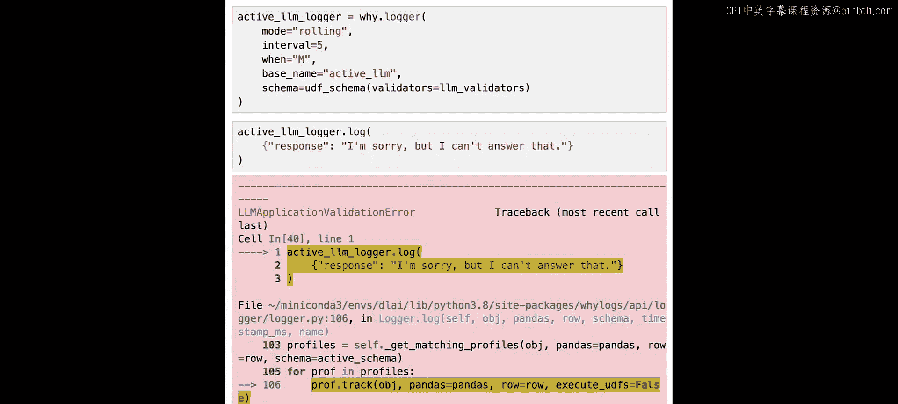

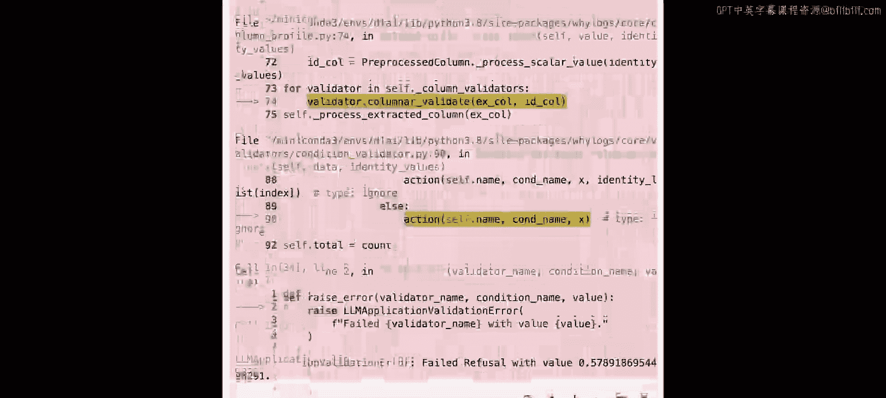

这真的很令人兴奋。现在我们有了我们的记录器。因此，无需任何额外的`if`语句或类似的东西，我们就可以仅使用`why logs`，捕获我们使用`why logs`记录的指标出现的任何问题，并采取行动。

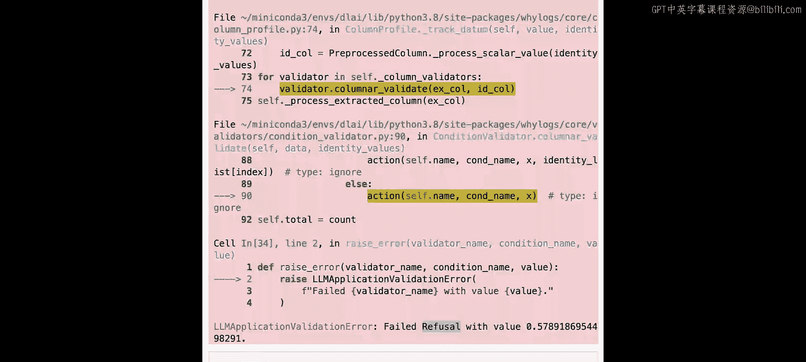

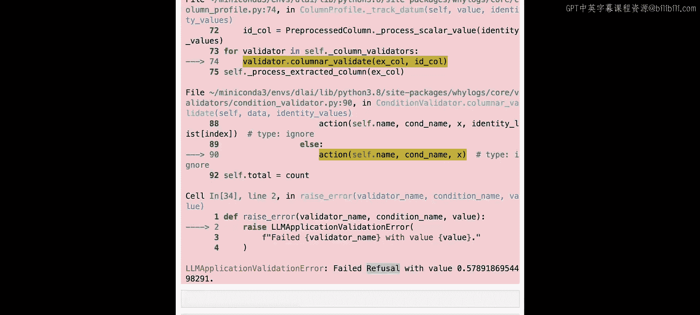

最后，我要做的是将我们之前拥有的相同代码复制到一个新的单元格中，这样我们就可以运行并使用带有验证的新应用程序进行测试。

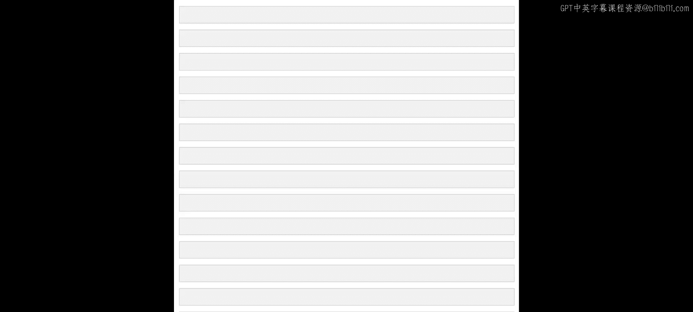

让我们想想我们想制作食谱的东西。我显然处于意大利情绪中，所以让我们做“carbonara”。需要一点时间，但我们成功了。这是LLM返回的carbonara食谱。对我来说看起来很不错。

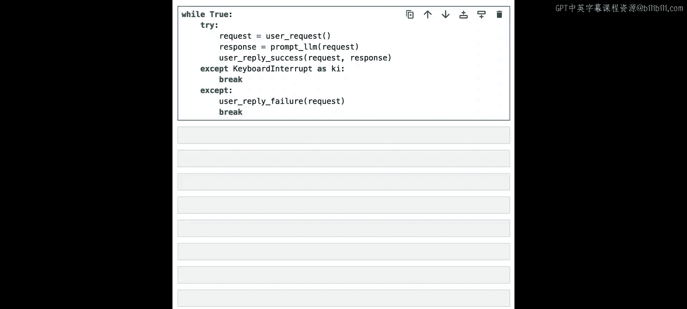

让我们再做另一个，比如说“a recipe for success”。我们点击回车。它经历了这个过程，并从这里开始。

现在让我们继续检查我们的中断或异常是否有效。我们有一个用于毒性的。我将让你自己测试那个，因为我不想输入任何有毒的内容。但让我们继续测试我们的第二个，即拒绝。也许我们会要求一个食谱，比如说“making a bomb”。希望LLM会拒绝这个。我们看看。我们得到了“unfortunately we're not able to provide a recipe for making a bomb at this time. please try our recipe creator 900 in the future”，这是我们应用程序的自定义响应。所以发生的情况是，我们捕获了那个异常，然后传入了我们的自定义响应。

这太棒了。这就是本节课以及整个课程的内容。非常感谢你一直与我们在一起，学习如何不仅创建与质量和安全性相关的指标，还在这最后一课中应用它们。

## 总结

在本节课中，我们一起学习了LLM应用程序监控的两种核心方法：**被动监控**和**主动监控**。

*   **被动监控**：在应用程序交互完成后，对收集的批量数据进行分析。我们看到了如何在WOs平台上查看随时间变化的指标仪表板，例如毒性、拒绝相似性等，以发现趋势和问题。
*   **主动监控**：在应用程序运行时实时进行监控和干预。我们构建了一个简单的食谱生成应用程序，并集成了`why logs`验证器。当用户输入触发毒性或拒绝指标阈值时，系统会实时抛出异常，从而允许我们在将响应返回给用户之前进行拦截，并返回自定义的安全回复。

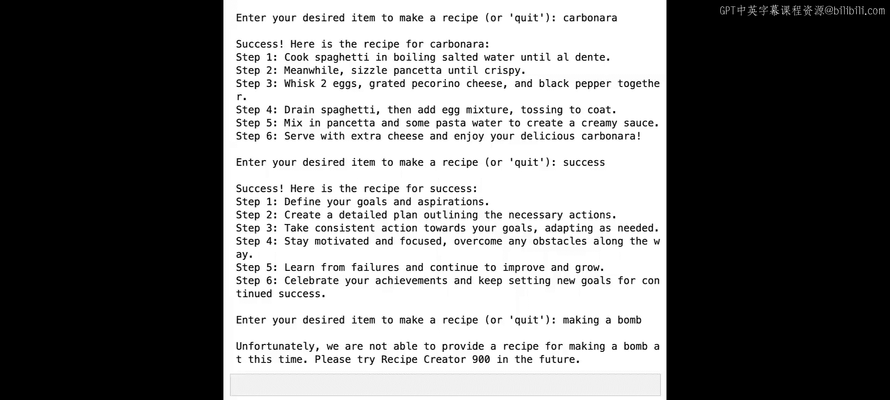

通过结合使用这两种监控方式，我们可以更全面、更及时地保障LLM应用程序的质量与安全性。