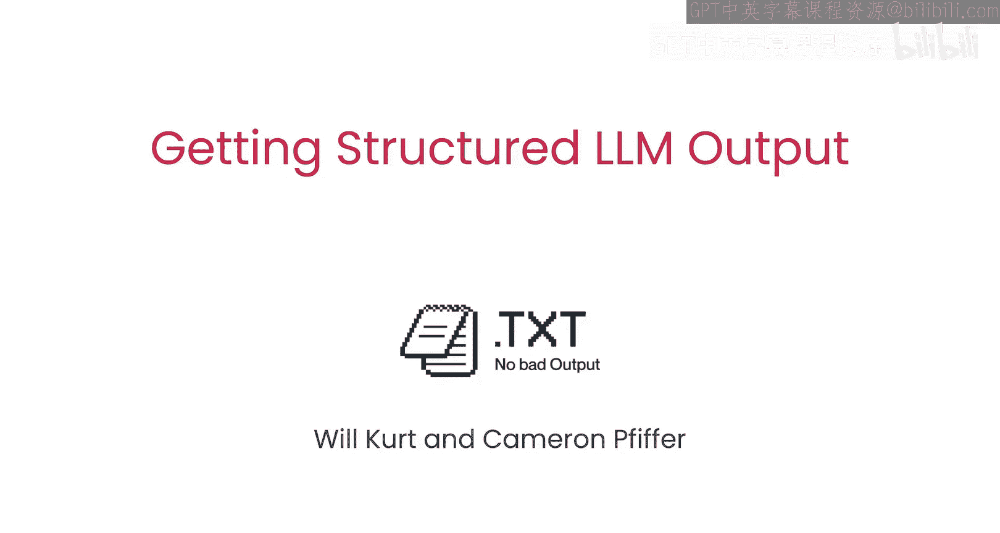
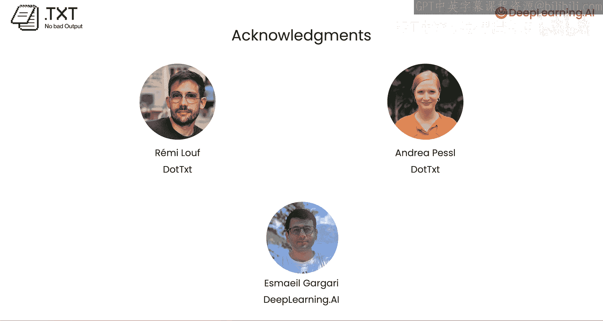

# 001：课程介绍

欢迎来到《获取结构化大语言模型输出》课程，本课程是与dot text合作开发的。

在本课程中，我们将学习如何从大语言模型获取格式化的、机器可读的输出，这对于构建软件应用至关重要。

## 为什么需要结构化输出？

在典型的聊天界面中使用大语言模型时，非结构化的文本输出是可以接受的。

但如果你正在构建软件，依赖自由格式的文本输出会变得非常困难。

这就是结构化输出（例如JSON）变得非常重要的地方。

它们提供了一种清晰的格式，机器可以读取和处理这种格式。

例如，如果你希望你的大语言模型查看产品评论并生成几个字段，比如产品名称和情感是积极还是消极，那么以JSON格式输出这两个字段可以让下游软件轻松读取和处理这些字段。

## 课程内容概述

在本课程中，你将学习如何使用几种方法获取结构化输出。

基本思路是，你可以告诉大语言模型你希望数据以特定格式输出，并且你需要清晰地提供这种格式，具体方法是使用计算机科学家所称的“正则表达式”。

这将是一种高效的方式，能让大语言模型可靠地以该格式生成输出，因为正则表达式可以用来强制约束下一个要生成的令牌，每次一个令牌。

我很高兴向大家介绍本课程的讲师沃克特和卡伦·普法威尔。沃克特是dot text的创始工程师，卡梅伦是开发者关系工程师，他们将帮助像你一样的开发者将可靠的结构化格式构建并集成到你的大语言模型应用中。谢谢安德鲁。

## 你将学到什么

在本课程中，你将首先从支持结构化响应的模型中获取结构化输出。

你还会了解到这种方法的局限性。

为了解决其中一些局限性，我们将使用Instructor，这是一个开源库，它会重新提示模型，直到生成有效的JSON结构。

你还将学习约束解码的工作原理。这是本课程中将使用的开源库Outlines背后的核心概念。

在学习本课程所有概念的同时，你将处理几个很酷的示例和用例。

包括一个社交媒体分析智能体。该智能体读取用户帖子，识别情感，并决定是否需要回复。

如果存在问题，它甚至可以生成客户支持工单。所有输出都以JSON格式呈现。

在使用基于重试的方法后，你将学习如何从一开始就使用Outlines获取结构化输出。

Outlines是一个在令牌级别约束模型输出的库。通过拦截逻辑值（即模型分配给下一个令牌的概率），Outlines会阻止任何不符合你定义的模式或格式的令牌。

这保证了有效的输出，无需任何重试。

在最后一课中，你将学习如何生成超出普通JSON的格式。

例如，你将学习如何生成有效的电话号码、电子邮件地址，甚至是ASCII艺术棋盘。

基本上，任何你可以用正则表达式表达的格式都可以。

## 致谢

许多人为创建本课程付出了努力。我要感谢来自dot text的雷米·卢夫和安德烈·佩索，来自DeepLearning.AI的埃布·加加里也为本课程做出了贡献。

第一课将是结构化输出生成的介绍。这听起来很棒。

让我们进入下一个视频，开始获取结构化输出。

## 总结

本节课我们一起学习了获取大语言模型结构化输出的重要性、课程的整体目标以及你将掌握的核心技能。从下一节开始，我们将深入实践，探索具体的方法和工具。