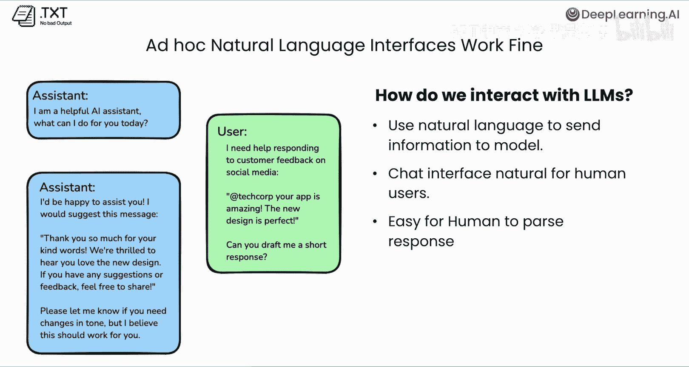
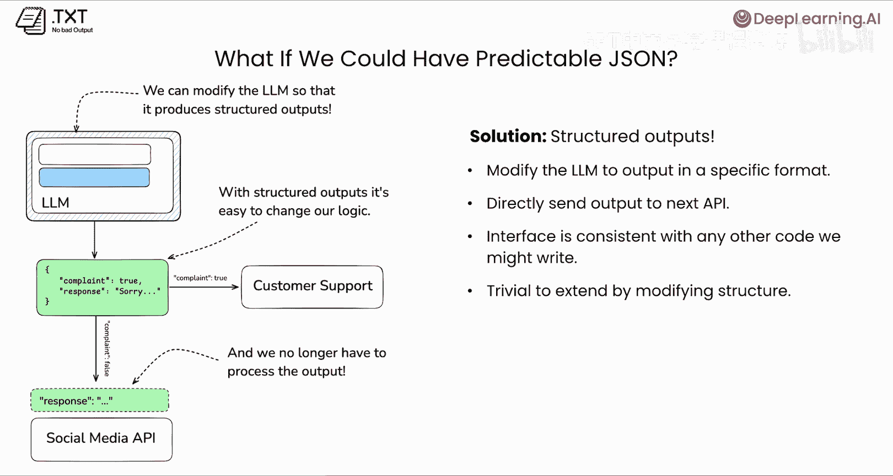
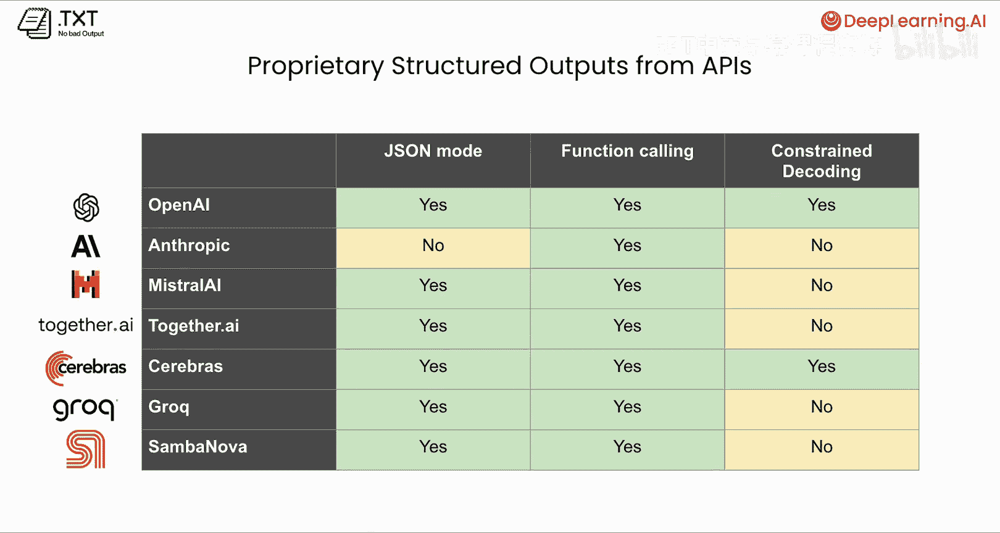
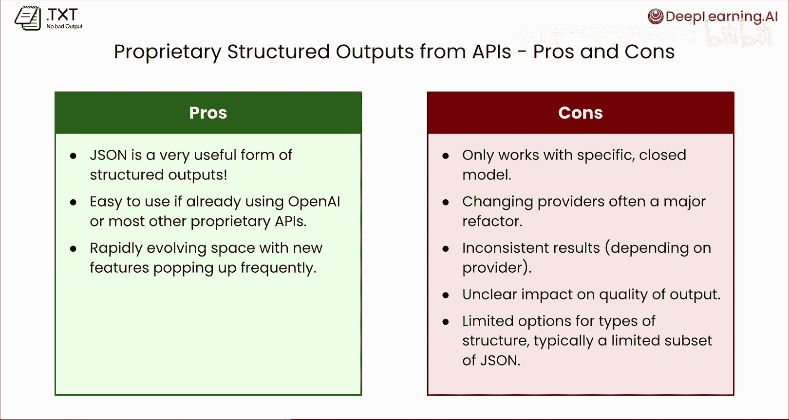
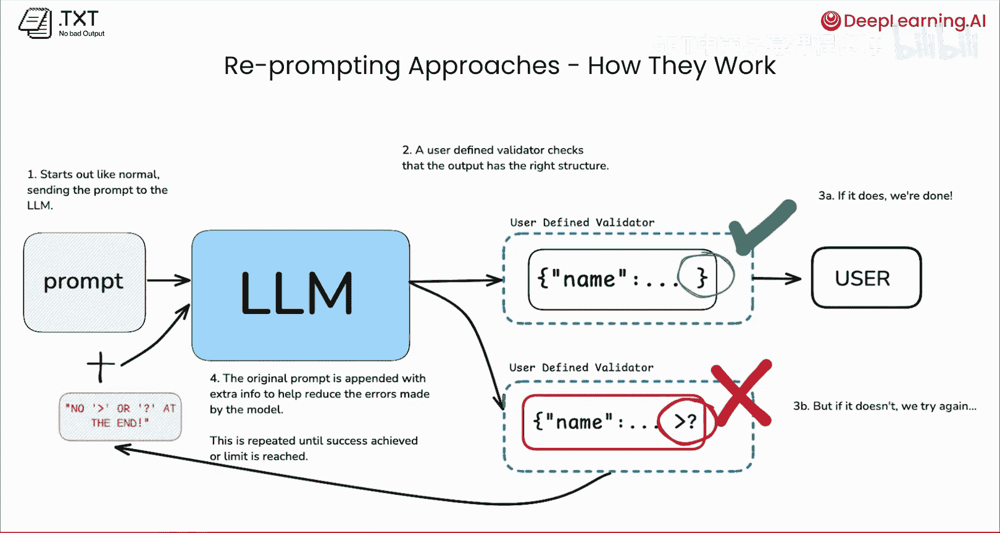
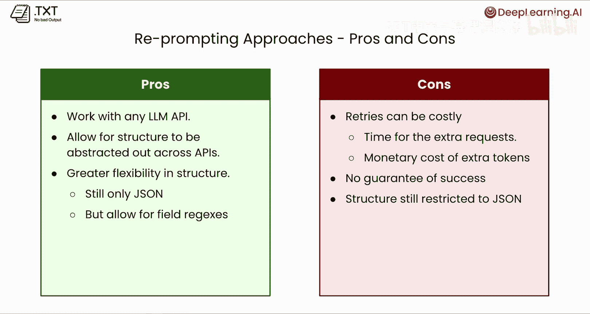
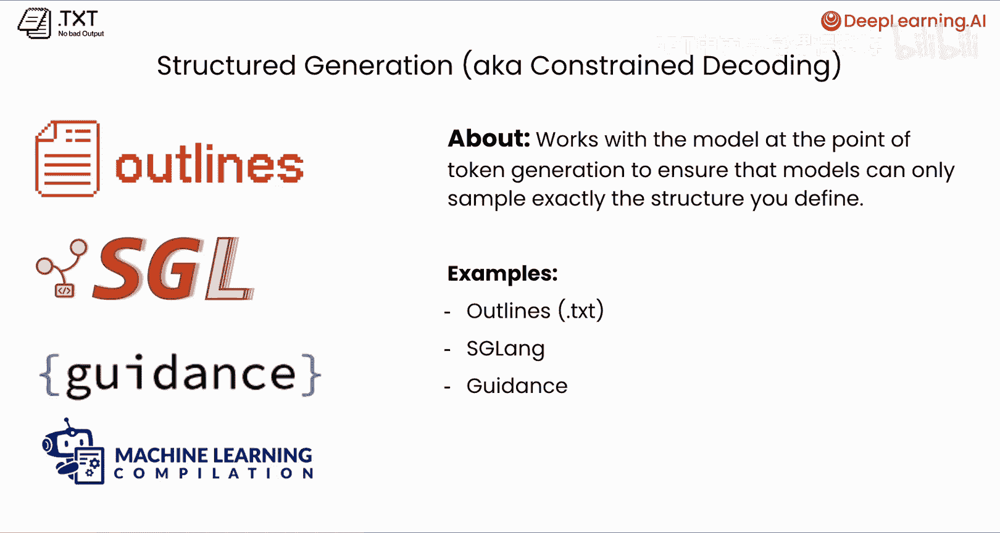
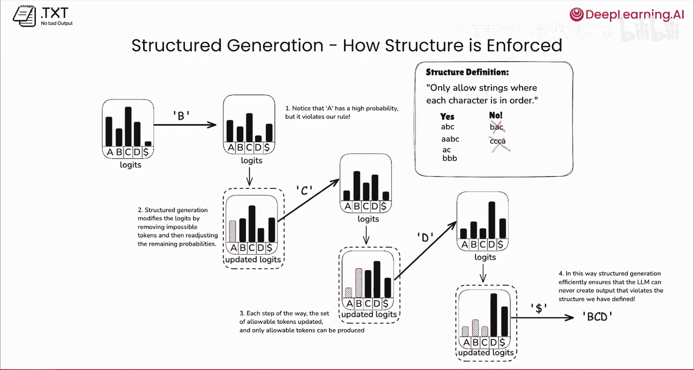
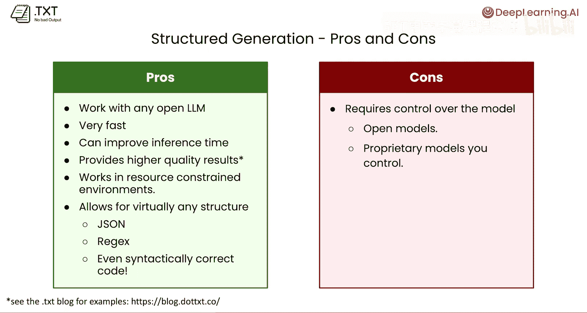
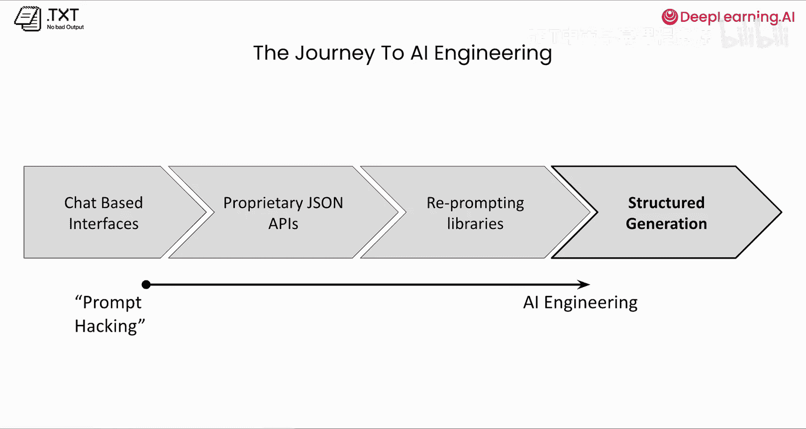

# 002：结构化输出生成简介 🧠

在本节课中，我们将学习什么是结构化输出、它们为何重要，以及生成结构化输出的不同方法。你将了解结构化输出如何让我们能够基于大语言模型进行可扩展的软件开发，并理解从“提示词工程”迈向真正“AI工程”的路径。

---

## 什么是结构化输出？

当我们使用大语言模型时，其输出通常是自由形式的文本，没有特定的结构。结构化输出意味着模型的输出遵循某种预定义的结构，例如 **JSON**。JSON 是一种非常常见的结构化输出格式，但并非唯一。

---



## 为什么需要结构化输出？

如果你长期使用大语言模型，可能非常熟悉常见的聊天界面。在这种格式下，模型像人类助手一样与我们互动。我们提出问题，模型给出回答。作为人类，我们很容易解析和理解这些回答。

然而，在编程环境中使用大语言模型时，情况就不同了。我们使用一种称为“指令接口”的类似界面，向模型发送请求并获取响应。虽然我们能在代码中与模型交互，但如何以编程方式解析模型返回的信息呢？作为人类这很容易，但程序需要一种可靠的方法来提取数据。

---

## 构建系统与可扩展性需求

为了更好地理解结构化输出的必要性及其如何帮助我们构建可扩展的软件，让我们设想构建一个由大语言模型驱动的社交媒体代理。这个代理将自动处理我们在社交媒体上收到的评论并生成回复。




一个简单的应用流程是：模型接收提示词和用户消息，生成回复，然后通过社交媒体 API 发布。但问题在于：我们如何处理这些原始的、非结构化的文本数据？



一种初级的解决方案是添加一个解析层，编写一些简单的规则来提取答案。不幸的是，这种方法非常耗时且容易出错。手动编写解析器很容易遗漏细节或遇到意料之外的输出格式，导致难以正确实现。更重要的是，它难以扩展。

例如，如果产品经理要求修改代理：当用户消息是投诉时，应将其转给客户支持，而不是自动回复。使用初级解析方法，我们需要同时解析“是否为投诉”和“回复内容”两个信息，代码会变得非常混乱。这显然不是构建可扩展软件的方法。

---

## 结构化输出的优势

如果模型的输出是结构化的、可预测的 JSON，实现上述功能就变得非常简单。我们可以定义一个包含 `complaint`（布尔值）和 `response`（字符串）字段的 JSON 结构。

```json
{
  "complaint": true,
  "response": "用户的具体投诉内容..."
}
```

程序可以像检查任何其他 JSON 对象一样检查 `complaint` 字段。如果为 `true`，则发送给客户支持；如果为 `false`，则将 `response` 字段的内容传递给社交媒体 API。通过 JSON 提取数据对 API 来说轻而易举。

---

## 如何获取结构化输出？





有多种方法可以获取结构化输出。

### 1. 使用专有API
最直接的方法是使用你已经在使用的主流模型提供商（如 OpenAI、Anthropic）的专有 API。每个提供商都提供了不同的结构化输出解决方案。

*   **基于逻辑的消息或约束解码**：这种方法会修改模型本身，使其只生成符合结构要求的令牌。
*   **函数调用或工具使用**：向模型提供一系列它可以调用的函数列表，其响应通常以 JSON 格式返回。
*   **JSON 模式**：对模型进行微调，使其在被提示时返回 JSON。
*   **其他“黑箱”方法**：由于专有 API 的内部机制不透明，可能还有其他我们不了解的方法。



**使用专有API的优缺点：**
*   **优点**：
    *   从非结构化文本到 JSON 是一个巨大的飞跃，有助于创建可靠的系统。
    *   如果你已经在使用某个主流提供商，集成起来相对容易。
    *   提供商持续改进其技术，输出质量在提升。
*   **缺点**：
    *   你的代码与特定模型提供商深度绑定，更换提供商可能意味着重大重构。
    *   结果可能不一致，某些提供商不一定总能返回预期的结构。
    *   可能对输出质量有不明影响（某些评估显示结构化输出可能损害特定任务的性能）。
    *   可用的结构类型有限，通常只支持 JSON 子集，难以强制执行复杂约束（如特定日期格式）。

### 2. 使用重提示库
为了解决专有API的局限性，出现了“重提示”库，如 **Instructor** 和 **LangChain**。它们被设计为可与任何主流大语言模型配合工作。

**工作原理**：
1.  向大语言模型发送常规请求（提示词）。
2.  同时提供一个“验证器”，描述我们期望的 JSON 结构。
3.  如果模型输出符合验证器，则直接返回数据。
4.  如果输出解析失败（例如，格式错误），重提示库会自动将失败原因作为额外信息添加到原始提示词中，然后重新尝试请求。



**重提示库的优缺点：**
*   **优点**：
    *   支持任何大语言模型 API，提高了代码的可复用性和可移植性。
    *   在结构定义上比大多数专有提供商更灵活，允许使用正则表达式等对字段施加约束（如验证电子邮件格式）。
*   **缺点**：
    *   重试可能带来额外的成本和延迟，影响用户体验。
    *   不保证绝对成功，如果多次重试后仍失败，库会报错。
    *   输出结构仍然主要局限于 JSON。

### 3. 结构化生成（约束解码）
结构化生成，也称为约束解码，是一种直接与模型交互以获得所需输出的方法。我们使用“结构化生成”这个术语，是因为我们实际上是在控制令牌的生成过程，以确保最终输出符合我们的结构。

支持此功能的库包括 **Outlines**、**SGLang**、**Microsoft Guidance** 和 **X-Grammar**。

**工作原理简述**：
大语言模型通过迭代预测下一个令牌来生成文本。每一步，模型都会输出一个“逻辑值”分布，表示每个可能令牌的概率。结构化生成会在每一步**修改这个逻辑值分布**，移除不符合我们预定结构规则的无效令牌，并重新归一化剩余有效令牌的概率，然后从中采样。这个过程持续进行，直到生成一个完全符合结构规则的字符串。

**结构化生成的优缺点：**
*   **优点**：
    *   适用于任何开源大语言模型（如 Hugging Face 上的模型）。
    *   速度极快，推理成本基本为零，甚至有研究显示可以利用结构来跳过某些令牌，从而加速推理。
    *   通常能提供更高质量的输出，在多项评估中表现优于非结构化生成。
    *   非常适合资源受限的环境（如小型设备），因为它轻量高效。
    *   能生成极其广泛的结构，不仅是 JSON，还包括正则表达式、语法正确的代码等。
*   **缺点**：
    *   需要直接访问模型的逻辑值，这意味着你必须使用开源模型，或者自行托管并控制推理过程的专有模型。

---



## 从提示词工程到AI工程

我们可以将上述方法视为从“提示词工程”迈向真正“AI工程”的旅程。

1.  **提示词工程**：仅使用基于聊天的界面，通过不断调整发送给模型的信息并手动解析结果来迭代，这不可扩展，也难称得上是真正的软件工程。
2.  **专有JSON API**：开启了新可能，我们可以开始编写真正的软件，获得可预测的响应，并将大语言模型代码集成到软件的其他部分。但代码与单一提供商深度绑定。
3.  **重提示库**：解决了供应商锁定的问题，允许我们创建可复用的软件库，兼容多种大语言模型提供商。这是构建可扩展大语言模型软件的一大步，但代码与模型之间仍存在隔阂，依赖于有限的重提示技巧。
4.  **结构化生成**：代表了真正的AI工程。我们直接与模型协作，精确获取所需结果。编写的代码易于理解、扩展和改进。



---

## 总结 🎯

在本节课中，我们一起学习了：
*   **结构化输出的基本概念**：即模型输出遵循预定义格式（如JSON）。
*   **其重要性**：它们是构建可扩展、可靠的大语言模型应用的关键，使程序能够可靠地解析和使用模型输出。
*   **三种主要实现方法**：
    1.  利用模型提供商的**专有API**（易用但可能被绑定）。
    2.  使用**重提示库**（如Instructor，提高可移植性和灵活性）。
    3.  采用**结构化生成/约束解码**（直接控制模型生成过程，高效、灵活且质量高，但需使用开源或自托管模型）。



这些技术共同使我们能够利用大语言模型创建真正强大和可维护的软件。在下一节课中，你将通过使用 OpenAI 的结构化输出 API 构建一个社交媒体代理，来亲眼看看这一切是如何运作的。敬请期待，下节课见！