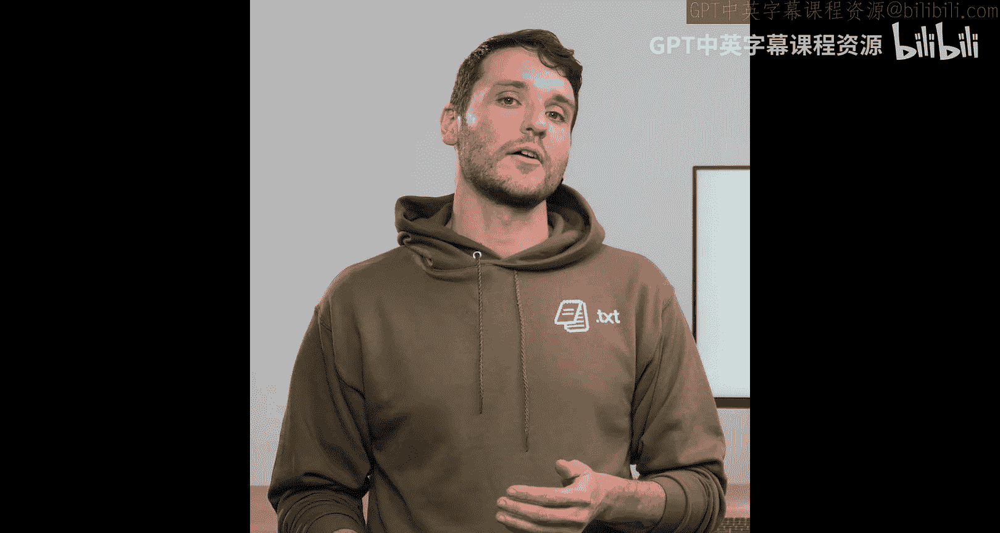
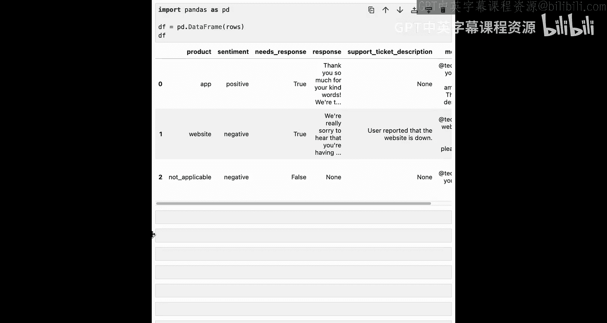

# 003：如何使用结构化输出


在本节课中，我们将学习如何使用OpenAI的结构化输出API构建一个简单的社交媒体管理助手。同时，我们还将学习使用Pydantic库来指定期望的输出结构的基础知识。



## 概述：什么是结构化输出与JSON Schema

结构化输出通常使用一种称为**JSON Schema**的标准来强制规定输出的结构。JSON Schema是一种描述JSON消息形状的标准。这些Schema提供了结构化输出所需的类型信息。

例如，以下是一个包含Dolly Parton姓名、年龄和邮箱的JSON消息：
```json
{
  "name": "Dolly Parton",
  "age": 79,
  "email": "dolly@parton.com"
}
```
我们可以看到，左边是键（如`name`、`age`、`email`），右边是它们的值。


让我们看一个描述“人”的JSON Schema示例。它同样是JSON格式，包含了所有键及其类型定义。例如，`"title": "name"`和`"type": "string"`。

## 为什么使用Pydantic

手动维护JSON Schema既困难又容易出错。对于任何非简单的结构，处理起来都非常麻烦。因此，AI工程师经常使用**Pydantic**来描述模型的输出结构。

Pydantic是一个开源的数据验证库，你可以灵活地定义应用程序中使用的数据结构。它功能丰富，建议查阅其文档以了解所有支持的功能。使用Pydantic可以使语言模型的输出变得可编程，我们马上就会看到这一点。

## 使用Pydantic定义结构

以下是如何在Pydantic中定义一个`User`类：
```python
from pydantic import BaseModel
from typing import Optional

class User(BaseModel):
    name: str
    age: int
    email: Optional[str] = None
```
继承`BaseModel`是使`User`成为Pydantic类的全部要求。接下来，使用类型注解来定义模型应生成的结构。例如，`name`可以是任何字符串，`age`可以是任何整数，`email`可以是空值或字符串。但请注意，OpenAI不允许你强制邮箱的格式（例如，必须是`test@co.com`的形式），而Instructor等工具可以做到。

## 构建社交媒体客户支持助手

假设我们有很多用户在推特上@我们，例如：“@techcorp，你们的应用太棒了，新设计完美！”我们将把这个输入到我们的客户支持助手中，然后输出一些结构化数据，告诉我们这是关于哪个产品、用户的情感、我们是否需要回复，以及如果出现问题需要创建什么支持工单。

让我们开始看代码。

首先进行一些准备工作。以下两行代码用于过滤掉学习过程中可能不想看到的警告：
```python
import warnings
warnings.filterwarnings('ignore')
```

以下是加载我们将要使用的OpenAI API密钥的方式：
```python
import os
from openai import OpenAI

# 假设你的API密钥已通过环境变量配置
client = OpenAI(api_key=os.environ.get("OPENAI_API_KEY"))
```

## 使用Pydantic和OpenAI生成对象

让我们看一个如何使用Pydantic定义结构并与OpenAI交互的例子。

我们将从粘贴之前在幻灯片中定义的`User`类开始。然后，使用OpenAI生成一个用户对象：
```python
completion = client.beta.chat.completions.parse(
    model="gpt-4o-mini",
    messages=[
        {"role": "system", "content": "You are a helpful assistant."},
        {"role": "user", "content": "Make up a user."}
    ],
    response_format=User
)

user = completion.choices[0].message.parsed
print(user)
```
运行后，OpenAI会返回一个用户对象，例如：`name='John Doe', age=30, email='john.doe@example.com'`。

## 定义社交媒体分析的结构

在使用结构化输出时，通常在编写其余代码之前，先定义你希望看到的结构。

在本例中，我们添加了一个`Mention`类：
```python
from pydantic import BaseModel
from typing import Optional, Literal

class Mention(BaseModel):
    product: Literal["app", "website", "not applicable"]
    sentiment: Literal["positive", "negative", "neutral"]
    needs_response: bool
    response: Optional[str] = None
    support_ticket: Optional[str] = None
```
`product`和`sentiment`使用了`Literal`类型，这意味着语言模型必须在给定的选项中选择。`needs_response`可以是`True`或`False`。`response`和`support_ticket`是可选字符串。

## 创建分析函数

接下来，我们创建一个`analyze_mention`函数来处理用户消息并生成`Mention`对象：
```python
def analyze_mention(post: str, personality: str = "friendly"):
    completion = client.beta.chat.completions.parse(
        model="gpt-4o-mini",
        messages=[
            {
                "role": "system",
                "content": f"""
                You are a social media manager with a {personality} personality.
                Analyze the user's mention.
                Provide the product mentioned, the sentiment, whether to respond,
                a custom response message, and an optional support ticket description.
                Do not respond to purely informational messages or bait.
                """
            },
            {"role": "user", "content": post}
        ],
        response_format=Mention
    )
    return completion.choices[0].message.parsed
```

## 使用分析函数

让我们提供一些示例数据并测试我们的函数：
```python
mentions = [
    "@techcorp your app is so amazing. the new design is perfect!",
    "@techcorp your website is down. please fix it!",
    "@techcorp you're so evil."
]

# 分析第一条提及（正面评价）
processed_mention = analyze_mention(mentions[0])
print(processed_mention)
```
输出会显示产品是`app`，情感是`positive`，`needs_response`为`True`，并包含一个回复文本，例如：“We're thrilled to hear that you love the new design!” 由于没有明显问题，`support_ticket`为`None`。

## 调整模型个性

你可以通过改变`personality`参数来调整模型的回复风格。例如，将其设置为`"rude"`：
```python
rude_response = analyze_mention(mentions[0], personality="rude")
print(rude_response.response)
```
输出可能是：“Thanks for the praise. We're glad you love the new design, but don't get too comfy, we're constantly improving.”

## 查看原始JSON输出

出于好奇，我们可以查看语言模型在解析成Pydantic对象之前生成的原始JSON内容：
```python
print(processed_mention.model_dump_json(indent=2))
```

## 扩展练习：添加更多字段

你可以尝试扩展这个结构。例如，创建一个包含更多字段的`UserPostWithExtras`类：
```python
from typing import List

class UserPostWithExtras(BaseModel):
    user_mood: Literal["awful", "bad", "evil"]
    product: Literal["app", "website", "not applicable"]
    internal_monologue: List[str]
    message: str
```
然后，你可以让模型生成这样的帖子，再将其输入回`analyze_mention`函数进行分析。

## 编程化处理输出

结构化输出的目的是将语言模型的响应转化为可编程的数据。以下是一个如何编程化处理输出的例子：
```python
rows = []
for user_message in mentions:
    # 调用LLM获取可编程的Mention对象
    processed = analyze_mention(user_message)

    # 基于分析结果编程
    if processed.needs_response:
        print(f"Responding to user: {user_message}")
        print(f"Sentiment: {processed.sentiment}")
        print(f"Our response: {processed.response}")

    if processed.support_ticket:
        print(f"Creating support ticket: {processed.support_ticket}")

    # 转换为字典并存储
    row_dict = processed.model_dump()
    row_dict["original_message"] = user_message
    rows.append(row_dict)

    print()  # 打印空行分隔
```

## 转换为DataFrame

使用结构化输出的一个优势是，你知道它遵循确切的格式，这意味着你可以轻松地将其转换为其他数据格式，例如Pandas DataFrame：
```python
import pandas as pd

df = pd.DataFrame(rows)
print(df)
```
DataFrame将包含`product`、`sentiment`、`needs_response`、`response`、`support_ticket`和`original_message`等列，便于进一步分析和处理。

## 总结

本节课中，我们一起学习了：
1.  如何使用Pydantic定义模型的输出结构。
2.  如何使用OpenAI的结构化输出API来获取格式化的响应。
3.  如何对语言模型的输出进行基本的编程化处理，例如条件判断和数据转换。

通过将非结构化的文本转换为结构化的数据，我们可以更可靠、更高效地将大语言模型集成到我们的应用程序和工作流中。



