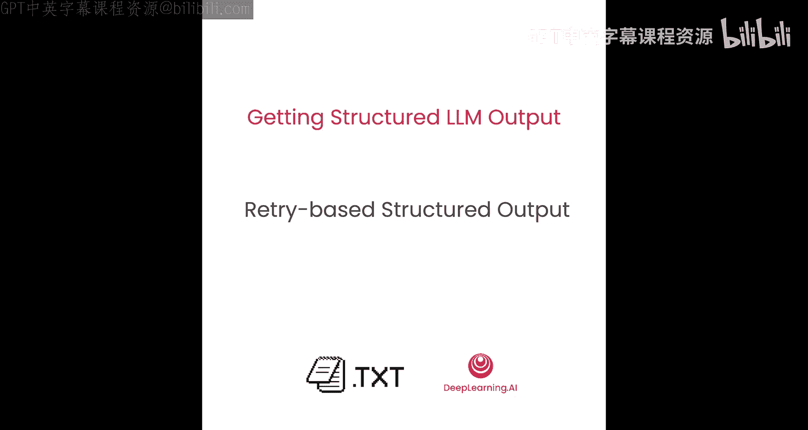
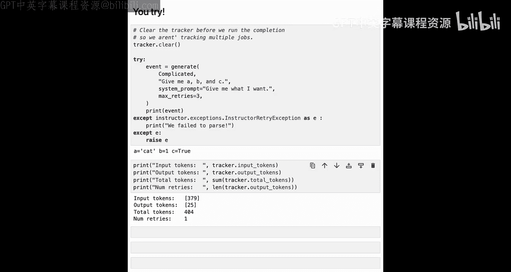

# 004：基于重试的结构化输出




在本节课中，你将学习如何使用开源库 `instructor`，从那些不支持正式结构化输出的模型提供商那里生成结构化输出。

## 概述

我们将首先介绍 `instructor` 库的基本原理和优缺点。然后，我们将通过代码演示如何使用 `instructor` 从 Together AI 获取结构化输出。最后，我们会探讨 `instructor` 的一些局限性，特别是关于重试机制和成本的问题。

## 认识 Instructor 🧠


`instructor` 是一个基于重新提示（reprompting）的开源结构化输出库。它的核心工作原理是：如果模型的输出不符合我们请求的格式，我们就尝试再次生成。

我们可以这样理解其流程：我们的提示词输入到语言模型中，模型产生某种形式的输出。然后，我们检查该输出是否是有效的语法。如果是，就将其返回给用户；如果不是，我们将输出和错误信息反馈给语言模型，并尝试再次获取输出，直到获得有效的输出为止。

## Instructor 的优缺点 ⚖️

上一节我们介绍了 `instructor` 的基本原理，本节中我们来看看它的主要优缺点。

以下是 `instructor` 的一些优点：
*   **简单易用**。
*   **支持广泛的提供商**，如 Anthropic、OpenAI、Together AI、Fireworks AI 等。
*   **跨提供商提供一致的 API**，有助于避免供应商锁定。
*   **支持 Pydantic 的所有功能**。

以下是 `instructor` 的一些缺点：
*   **无法完全强制执行结构**，因此解析失败的情况仍会发生。
*   **重试可能会意外增加成本和耗时**。每次解析失败，都需要将整个提示发送回模型。
*   **重试过程不够透明**。需要深入其内部机制才能理解具体发生了什么。
*   **仅适用于经过指令微调的模型**，这些模型需要支持函数调用、工具使用或 JSON 模式。而其他方法（如 `outlines`）可以使用任何模型，无论是否经过指令微调。

## 实践：使用 Instructor 获取结构化输出 💻

在本实验中，我们将演示 `instructor` 的简单用法，从 Together AI（一个不支持正式结构化生成的提供商）获取结构化输出。然后，我们将重点介绍 `instructor` 的一些局限性，以便你分析它是否适合你的应用。

### 设置环境与获取非结构化输出

让我们开始编写代码。首先获取我们的 Together API 密钥。如果你在 DeepLearning.AI 平台上，这个密钥将可用；如果你在自己的平台上工作，则需要使用自己的 API 密钥。

以下是连接到 Together AI 服务器的方法。我们将导入 `instructor` 和 `openai`。请注意，我们导入的是 `openai` 而不是其他 Together AI 的 SDK，原因是大多数推理提供商都使用 OpenAI 标准进行语言模型推理。这意味着你只需将基础 URL 更改为指向你的语言模型提供商，就可以使用 OpenAI SDK。

```python
import instructor
from openai import OpenAI
import os

# 设置 API 密钥和基础 URL
client = OpenAI(
    api_key=os.environ.get("TOGETHER_API_KEY"),
    base_url="https://api.together.xyz/v1",
)
```

要从 Together AI 生成非结构化文本，你可以使用标准的 OpenAI 工具 `chat.completions.create`。你需要提供 Together AI 服务的任何模型。这里我们将使用 Llama 3.1 的 80 亿参数指令微调模型。请注意，模型名称中的 “instruct” 与 `instructor` 库无关，它仅表示该模型已经过指令微调，具有类似聊天机器人的功能。

```python
# 生成非结构化输出
response = client.chat.completions.create(
    model="meta-llama/Meta-Llama-3.1-8B-Instruct-Turbo",
    messages=[{"role": "user", "content": "Hey there!"}]
)
print(response.choices[0].message.content)
```
运行上述代码，语言模型可能会回复：“嘿！你今天过得怎么样？我过得还不错，机器人。”

### 使用 Instructor 获取简单结构化输出

要使用 `instructor`，你只需用 `instructor` 的 `from_*` 方法包装你的客户端。例如，这里我们使用 `instructor.from_openai`，并传入我们的 Together 客户端。这将创建一个名为 `instructor_client` 的新客户端，它将使用 `instructor` 的工具来获取结构化输出。

```python
# 包装客户端以启用 instructor 功能
instructor_client = instructor.from_openai(client)
```

为了试用 `instructor`，让我们定义一个非常简单的结构。这里，我们将定义一个 `Greeting` 类，它只有一个字符串类型的字段 `hello`。

```python
from pydantic import BaseModel

class Greeting(BaseModel):
    hello: str
```

要使用这个结构，我们只需像之前一样调用 `instructor_client.chat.completions.create`。我们将传递相同的模型名称和消息，与之前的非结构化版本相比没有任何变化。我们唯一添加的是 `response_model=Greeting` 参数，这是我们期望接收的类。如果你使用 OpenAI 的结构化输出，请注意它们使用 `response_format` 作为关键字参数，而不是 `instructor` 的 `response_model`，请务必注意这一点。

```python
# 使用 instructor 获取结构化输出
structured_response = instructor_client.chat.completions.create(
    model="meta-llama/Meta-Llama-3.1-8B-Instruct-Turbo",
    messages=[{"role": "user", "content": "Hey there!"}],
    response_model=Greeting
)
print(structured_response)
```
运行此代码，我们将看到输出为 `Greeting` 对象，其 `hello` 字段中包含字符串。

### 构建日历事件提取器

让我们编写一个简单的日历事件提取器来测试 `instructor`。我们的目标是向模型提供一个事件的粗略描述，然后返回一个结构化的输出，包含事件名称、发生日期、参与者列表、事件地点以及一些额外的地址信息（如州代码和邮政编码）。

以下是事件数据模型的定义：

```python
from pydantic import BaseModel, Field
from datetime import date
import re

class Person(BaseModel):
    name: str

class CalendarEvent(BaseModel):
    name: str
    date: date  # 使用 Python 标准库的 date 类型
    participants: list[Person]
    address_number: int
    street_name: str
    city_name: str
    state_code: str = Field(pattern=r"^[A-Z]{2}$")  # 必须是两个大写字母
    zip_code: str = Field(pattern=r"^\d{5}$")  # 必须是五位数字
```

**核心概念解析**：
*   `date: date`：`instructor` 支持 Python 标准类型，比 OpenAI 的结构化输出工具更通用。
*   `participants: list[Person]`：使用 `Person` 类而不仅仅是字符串列表，便于未来扩展（如添加电子邮件字段）。
*   `Field(pattern=...)`：这是 Pydantic 的一个工具，用于指定字段值必须满足的正则表达式模式。例如，`state_code` 必须是两个大写字母（如 “OR” 代表俄勒冈州，“NY” 代表纽约州）。

接下来，我们写一个示例事件描述：

```python
event_description = """
Alice and Bob are going to science fair on Friday.
Science fair is hosted at the gymnasium of the Hazeldale Elementary school.
"""
```

然后，我们编写一个方便的 `generate` 函数来调用 `instructor` 客户端：

```python
def generate(response_model, user_prompt, system_prompt="You are a helpful assistant.", model="meta-llama/Meta-Llama-3.1-8B-Instruct-Turbo", max_retries=3):
    return instructor_client.chat.completions.create(
        model=model,
        messages=[
            {"role": "system", "content": system_prompt},
            {"role": "user", "content": user_prompt}
        ],
        response_model=response_model,
        max_retries=max_retries
    )
```

现在，让我们实际生成一个日历事件：

```python
system_prompt = "Make a calendar event. Respond in JSON with the event name, date, list of participants, and the address."
user_prompt = event_description

event = generate(CalendarEvent, user_prompt, system_prompt)
print(event)
```

查看我们返回的事件，可以看到它包含了事件名称、日期、参与者列表、地址信息等。值得注意的是，邮政编码被推断为 “97005”，尽管在提示词中并未指定。这是一个**通过提供结构从模型中提取额外信息**的例子。模型能够猜测出大致正确的邮政编码。如果你切换到 700 亿参数模型，它可能会更准确地推断出正确的邮政编码 “97007”。

你可以通过修改 `event_description` 来尝试让模型输出其他内容。

## 理解重试机制与成本 ⚠️

`instructor` 可能比其他形式的结构化输出使用更多的令牌。当输出验证失败时，`instructor` 会向模型提供反馈，请求新的输出，直到响应被正确解析为止。

`instructor` 本身并不容易跟踪重试次数和跨重试使用的令牌数。为了演示这一点，我们可以使用一些工具函数来跟踪重试和令牌使用情况。

```python
# 假设有工具函数 clear_tracker(), get_retries_used(), get_tokens_used()
clear_tracker()

event = generate(CalendarEvent, user_prompt, system_prompt)
print(f"Retries used: {get_retries_used()}")
print(f"Tokens used: {get_tokens_used()}")
```
对于简单的模式，`instructor` 可能一次就成功，无需重试。

然而，在模式复杂或提示不充分的情况下，模型输出可能需要多次重试，甚至可能永远无法生成正确的输出。为了看到这一点，让我们定义一个复杂的类，并尝试“破坏” `instructor` 以演示重试。

```python
class ComplicatedClass(BaseModel):
    a: str  # 必须是 "cat", "dog" 或 "hat"
    b: int
    c: bool

# 一个会引发问题的提示组合
bad_user_prompt = "Please write me a short essay about Dolly Parton."
bad_system_prompt = "Don‘t give me what I want."

try:
    result = generate(ComplicatedClass, bad_user_prompt, bad_system_prompt, max_retries=3)
except Exception as e:
    print(f"Failed to parse after retries: {e}")
    print(f"Total retries attempted: 3")
    # 检查令牌使用情况会显示消耗了数倍的令牌
```
在这个例子中，我们既没有向模型传达 `ComplicatedClass` 的结构，又在系统提示中故意要求它不合作。我们将 `instructor` 的最大重试次数限制为 3 次。结果很可能是解析失败，我们消耗了大约三倍的令牌，却没有得到正确的输出，还增加了等待时间。

你可以尝试修改用户提示和系统提示来修复这个问题，例如明确要求结构并给出合作的指令。

## 总结

在本节课中，我们一起学习了如何使用 `instructor` 库从任何模型提供商那里获取结构化输出。我们了解了它的工作流程、优点，以及需要重点考虑的限制，特别是重试机制可能带来的成本和可靠性问题。

在下一节课中，你将深入了解 `outlines` 库，看看结构化生成是如何能够快速、可靠地生成结构化输出而无需任何重试的。



