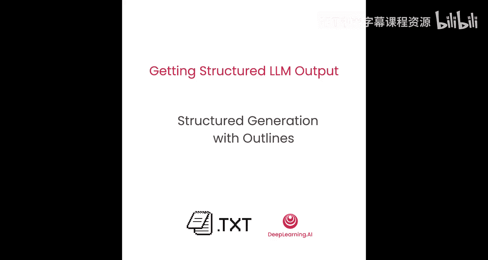
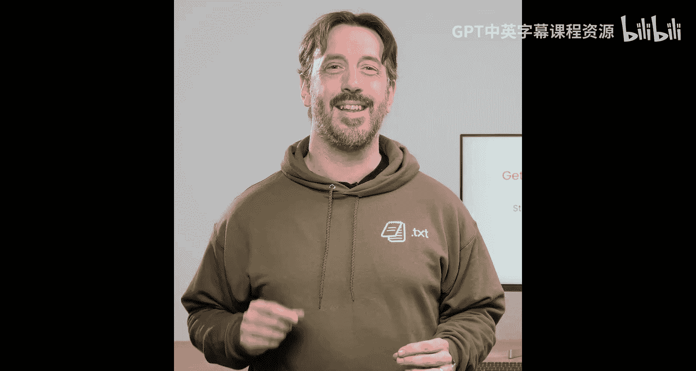
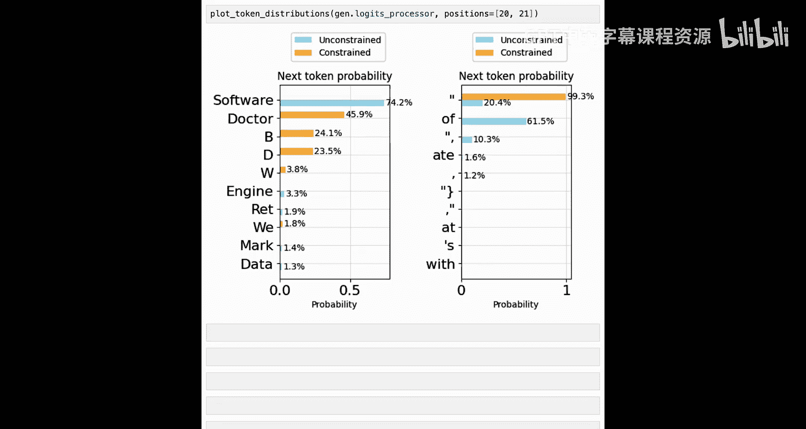

# 005：基于Logits的结构化生成原理与实践



## 概述

在本节课中，我们将深入探讨基于Logits的结构化生成技术的工作原理。你将学习如何通过操作语言模型的Logits来实现结构化输出，并通过代码示例直观地理解模型如何选择下一个token。

---

## 结构化生成的核心优势

上一节我们介绍了结构化生成的基本概念，本节中我们来看看其核心优势。



基于Logits的结构化生成是一种更高效、更灵活的输出结构化方法。它也被称为“约束解码”或“基于Logits的方法”。

以下是其主要优势：

*   **直接修改模型输出**：这意味着你总能获得定义好的结构。相比之下，使用专有模型的JSON模式或重新提示技术有时会失败，导致无法获得预期的结构。
*   **推理时间成本极低**：在推理过程中使用结构化生成的时间成本基本为零，非常轻量，你几乎感觉不到它的存在。
*   **支持更广泛的结构**：你不仅限于使用JSON，可以定义更多样化的输出格式。

然而，使用结构化生成有一个前提需要注意：因为我们需要操作Logits，所以必须能访问到模型的Logits层。这意味着你需要使用开源权重模型，或者你本身就是专有模型提供商。

---

## 语言模型如何生成文本

在深入原理之前，我们先快速回顾一下语言模型生成文本的基本流程。

1.  你向LLM提供一个提示，该提示被分解为一系列**tokens**。
2.  这些tokens被一次性输入到LLM中。
3.  LLM产生一组**Logits**，代表每个可能的下一个token的相对概率。
4.  根据这些概率，通过一个**采样器**选择一个token，并将其附加到提示后面。
5.  这个过程不断重复，直到遇到表示生成结束的特殊token（如`<EOS>`），或者达到预设的token数量上限。

---

## 结构化生成如何工作：一个实例

让我们通过一个具体任务，看看结构化生成如何通过修改Logits来工作。

假设我们使用一个视觉语言模型，并提供一张图片和文本提示：“请仅使用‘hot dog’或‘not hot dog’这两个标签来描述图片”。

模型初始的Logits分布可能包含多种可能的token，例如：`H`, `ham`, `hamburger`, `hot`, `hot dog`, `not`。即使我们要求模型只使用特定标签，它仍可能根据图片内容（比如一个汉堡）倾向于生成“hamburger”。

**采样器**负责从Logits中选择token。常见的采样策略有：
*   **贪婪采样**：总是选择概率最高的token。在上述例子中，可能会选择“hamburger”。
*   **多项式采样**：根据Logits的概率分布随机选择token。可能会选择“ham”。

但这都不是我们想要的结构（“hot dog”或“not hot dog”）。

结构化生成的做法是直接修改Logits。我们将不允许的token（如`ham`, `hamburger`）的Logits值大幅降低或置为无效。修改后，有效的token集合变为：`H`, `hot`, `hot dog`, `not`（`H`是“hot dog”的开头，所以有效）。

然后，采样器（贪婪或多项式）会在这个被约束过的概率分布中选择token，从而确保输出符合我们定义的结构。

---

## 代码实践：生成结构化JSON对象

现在，让我们通过代码看看这是如何实现的。

首先，我们导入必要的库并加载一个本地小模型。这里我们使用Hugging Face上的一个小型模型（`lm2-135M`），以便在演示中快速运行。

```python
import outlines
from outlines import models

model = models.transformers("lm2-135M")
```

接下来，我们使用Pydantic定义一个希望模型生成的数据结构。这里定义一个`Person`类，包含`name`（字符串）和`age`（整数）字段。

```python
from pydantic import BaseModel

class Person(BaseModel):
    name: str
    age: int
```

然后，我们创建一个**生成器函数**。在Outlines中，生成器是一个接受任何字符串提示并返回指定结构对象的函数。

```python
import outlines.generate as gen

generator = gen.json(model, Person, max_tokens=100)
```

为了让生成过程确定以便教学，我们设置采样方式为`greedy`（贪婪采样）。同时，使用`track_logits`工具函数来观察每一步的token概率。

```python
from outlines.generate.text import track_logits

track_logits()
```

在调用生成器之前，需要注意**提示模板**。大多数框架会自动添加对话所需的特殊token（如系统、用户标记），但Outlines为了给予用户更低层级的控制，不会自动处理。我们可以使用提供的`template`工具函数。

```python
from outlines import prompt

system_prompt = "You are a helpful assistant."
user_prompt = "Generate a random person."
formatted_prompt = prompt.template(model, user_prompt, system_prompt)
```

现在，我们可以生成一个随机人物了。

```python
person = generator(formatted_prompt)
print(person)
# 示例输出: Person(name='John', age=30)
```

我们成功获得了一个结构正确的`Person`对象。那么，模型是如何一步步生成符合JSON格式的文本的呢？让我们通过观察Logits来解密。

---

## 逐步解析生成过程

首先，我们知道目标JSON字符串的开头必须是：`{"name": "`。

**第一步：生成开头的花括号 `{`**
当我们查看第一步（position 0）的token概率时，会发现：
*   **约束后（橙色）**：`{` 的概率极高（例如90.8%），` {`（带空格的左花括号）也有一定概率。
*   **无约束（蓝色）**：模型原本倾向于生成自然语言，如“Here”, “I”, “Meet”等。

结构化生成在此处关闭了模型生成自然语言响应的倾向，强制其以JSON格式开始。

**第二步：生成字段名 `"name"`**
在生成了`{`之后，模型知道接下来应该是字段名。在对应的步骤（position 4），我们看到：
*   **约束后**：`"name"` 这个token的概率接近100%。
*   **无约束**：模型可能想生成 `"username"`, `"Person"`, `"user"` 等，但这些都被约束关闭了。

**第三步：生成字段值（如 `"John"`）**
在生成了 `"name": "` 之后，模型进入字符串值区域。此时，约束主要保证生成的是一个有效的字符串（被引号包围），而对字符串内容本身限制较少。因此，约束与无约束的Logits分布比较接近。模型根据训练数据，以高概率生成了 `"John"`。

**第四步：生成 `"age"` 字段及其整数值**
同理，模型在约束下生成 `"age": `，然后生成一个整数（如 `30`）。对于整数，约束确保生成的是数字字符。

**第五步：生成结束符 `}`**
在生成完所有字段后，模型知道必须用 `}` 结束JSON对象。在最后一步，`}` 的概率在约束下占主导地位，然后是表示生成结束的特殊token `<EOS>`。

通过全程跟踪Logits，你可以清晰地看到结构化生成如何像一位“引导员”，在每个决策点修正模型的输出方向，确保其走在符合我们定义格式的道路上。

---

## 动手实验：修改约束条件

为了加深理解，请尝试以下实验：

1.  修改`Person`类，增加一个`job`字段，并使用`Literal`限制其取值（例如，只能为 `"doctor"`, `"basketball player"`, `"welder"` 之一）。
    ```python
    from typing import Literal
    from pydantic import BaseModel

    class EmployedPerson(BaseModel):
        name: str
        age: int
        job: Literal["doctor", "basketball player", "welder"]
    ```
2.  使用新的类创建生成器，并生成一个`EmployedPerson`对象。
3.  观察在生成`job`字段时，Logits如何将不允许的选项（如 `"software engineer"`）的概率抑制，并提高允许选项的概率。

通过这个实验，你将直观感受到约束如何精确地控制模型在有限选项内的选择。

---

## 总结

本节课中，我们一起深入探索了基于Logits的结构化生成技术的内核。你学到了：
1.  结构化生成通过直接修改语言模型输出的**Logits**来确保格式正确。
2.  与API的JSON模式相比，这种方法**更可靠、高效且灵活**。
3.  我们通过代码示例，**逐步跟踪了Logits的变化**，亲眼见证了模型如何在约束下生成一个结构化的JSON对象。
4.  核心在于，约束在每个token生成步骤充当**过滤器**，屏蔽不符合格式要求的路径，引导模型走向有效输出。



在下一节课中，我们将把这项技术扩展到更多样的结构化输出场景，例如生成电话号码、电子邮件地址甚至井字棋棋盘状态。