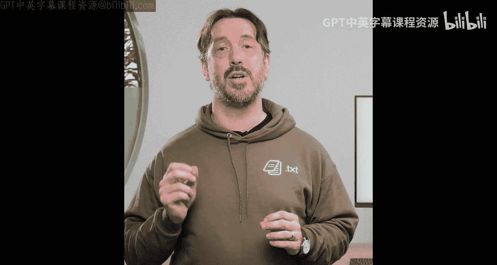
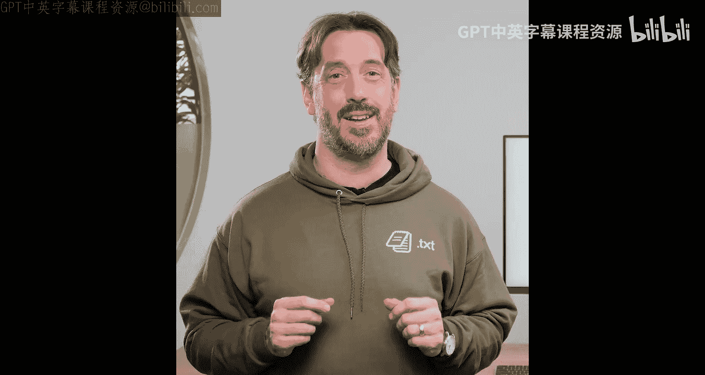
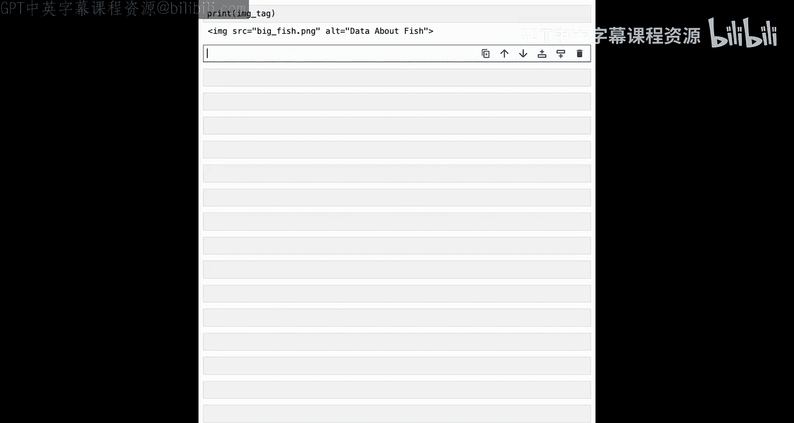
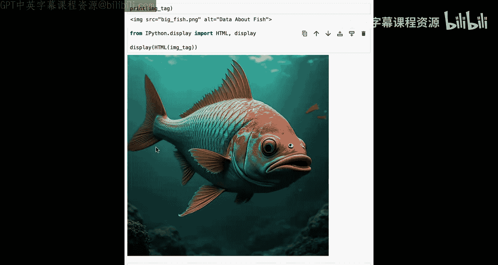
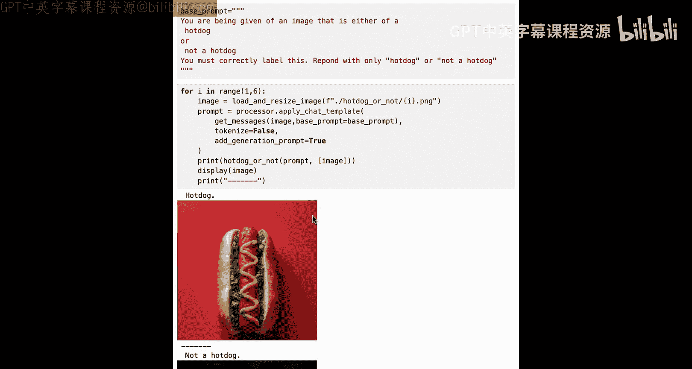
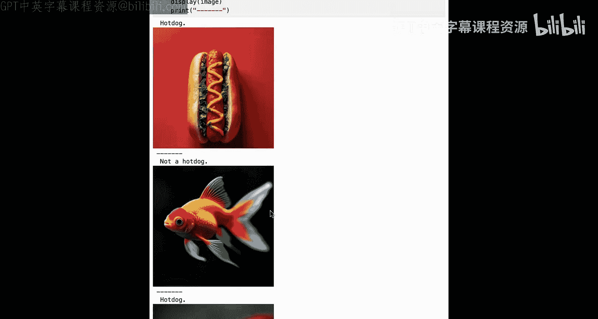
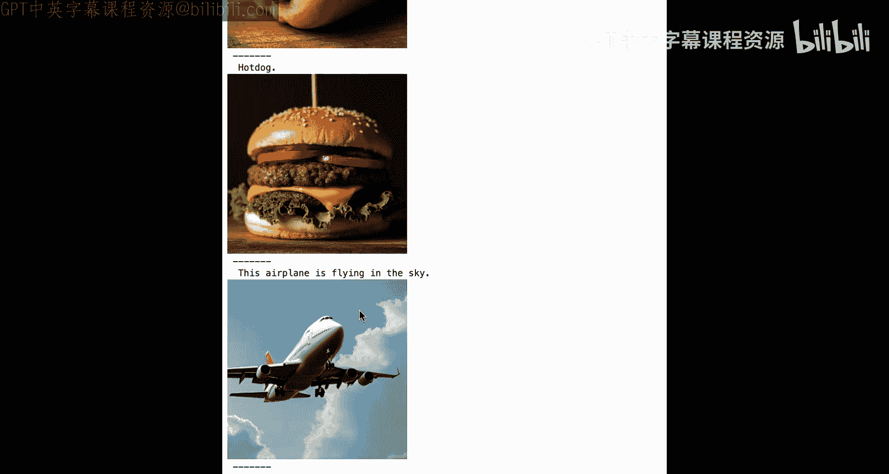

# 006：超越JSON的结构化生成 🚀


在本节课中，我们将学习`outlines`库如何高效地生成结构化输出，并探索其如何支持远不止JSON的多种结构。我们将理解正则表达式如何转换为有限状态机以实现高效计算，并最终探索JSON之外的各种结构化输出示例。

## 概述

上一节我们介绍了`outlines`如何通过修改逻辑来保证模型输出的结构。本节我们将深入探讨`outlines`如何精确地跟踪结构。`outlines`在底层使用正则表达式来建模我们想要的结构，这允许我们定义比JSON更广泛的结构范围。正则表达式与有限状态机之间存在有趣的关系，我们利用这种关系，在模型生成过程中轻松高效地处理结构。





## 正则表达式与有限状态机

首先，简要讨论正则表达式及其工作原理。您可能熟悉它们，但以防万一，我们快速回顾一下。

以下是一个非常简单的正则表达式，它描述了我们在第一课中讨论的示例：
```
A*B*C*$
```
这是一个必须按顺序出现的A、B、C序列。现在，可以有任意数量的A（包括0个）、任意数量的B、任意数量的C，然后是字符串的结尾。因此，有效的字符串包括空字符串（不违反约束）、ABC（按顺序）、AABCC（允许重复），当然，单独的C也是允许的，因为它前面的字符没有违反规则。

无效的字符串包括BAA、ABBCCB（只要有一次顺序不对，无论其他部分如何，都是无效的），以及CBA。

接下来，讨论正则表达式与有限状态机之间的关系。我们可以将刚刚描述的正则表达式转换为右侧所示的有限状态机。您可能认为这增加了问题的复杂性，但这个有限状态机实际上使程序能够轻松跟踪正则表达式。

让我们通过一个模式匹配示例来理解这个过程。给定代表我们之前描述的正则表达式的有限状态机，我们有一个字符串“AABC”，我们想看看它是否匹配。

我们从起始位置开始，观察到一个A，这使我们进入A状态。现在我们处于A状态，观察到另一个A，我们循环回到A状态，仍然保持在A状态。接下来，我们观察到一个B，这使我们从A状态移动到B状态。现在我们观察到一个C，并讨论匹配字符串的含义。当我们匹配一个字符串时，意味着我们成功地结束于图中用两个圆圈标记的目标状态，并且没有更多的字符串需要处理。因此，我们成功地匹配了这个字符串。

现在，让我们看一个匹配失败的例子。这个字符串根据我们的正则表达式是无效的。让我们看看有限状态机如何证明这一点。同样，我们从起始状态开始，观察到一个A，移动到A状态。接下来，我们观察到一个C，移动到C状态。到目前为止一切顺利，我们还没有违反正则表达式的任何规则。现在，我们有一个A。但是，您可以看到，从C状态出发的所有路径都没有A，而且我们不在结束状态，因此匹配失败。

## 结构化生成的应用

您可能会问，这个用于匹配正则表达式的有限状态机如何对生成结构有用？我们可以简单地反转这个过程。当我们在`outlines`中使用FSM时，幕后就是这样工作的：我们跟踪所处的状态，并查看从该状态出发的所有路径。

例如，我们处于起始状态，所有可能的路径都是允许的。右侧是我们的逻辑，可以看到结构不需要对这些逻辑进行任何更改，因为我们拥有的所有标记都是可接受的。但我们允许一个B，并移动到B状态。现在，您可以看到我们并非拥有所有路径。因此，尽管模型为所有选项生成了逻辑权重，但我们知道只有路径B、C和结束是允许的。我们在生成过程中继续这样做。

通过这种方式，我们能够将匹配过程反转为生成过程。这是一种非常强大的表示结构的方法。

## 超越JSON的结构

结构远不止JSON。简单的结构通常足以满足我们的大多数任务。

以下是几种常见的结构化输出示例：

*   **类别标签**：如果您正在构建一个零样本或单样本分类器，您可能希望将模型的输出限制在您拥有的类别标签内，不需要额外的JSON包装。
*   **电子邮件地址**：如果您从文档中解析电子邮件地址，如果LLM能够一致地输出电子邮件地址格式，那将非常有用。
*   **电话号码**：确保LLM的输出匹配电话号码格式的正则表达式非常有用。这一点很重要，因为人们可以用不同的方式书写电话号码，因此您可能希望在解析电话号码时应用一致的格式。
*   **常见文档类型**：我们已经讨论了很多关于JSON的内容，但当然，我们仍然可以生成JSON。我们也可以生成CSV文件或YAML。
*   **上下文无关文法**：对于观看本课程的形式语言爱好者，您可能会感到惊讶。通常，我们认为上下文无关文法比正则表达式更强大。然而，只要限制允许的递归深度，我们就可以将任何任意的上下文无关文法表示为正则表达式。有了上下文无关文法，我们就可以输出语法正确的编程语言，这是非常令人印象深刻的事情。基本上，您可以建模任何您能想象的文档类型。世界上有各种各样的结构，有了可用的上下文无关文法，您可以表示的内容几乎没有限制。

## 实践示例

现在，让我们看一些例子。我们将从添加这两行代码开始，以避免看到任何不必要的警告。

接下来，我们将添加我们将要使用的库。我们有一个实用程序模板，可以帮助我们轻松编写提示。我们还将使用`outlines`，并且在某些情况下使用`outlines`的贪婪采样，以确保我们始终确切知道模型将输出什么。

然后，我们将加载我们的语言模型。我们将使用Hugging Face的small LM2的1.35亿参数指令版本。即使在资源受限的硬件上，它也能运行得很好。因此，所有这些示例都将在具有约8GB RAM的CPU上实际运行，这是一个非常令人印象深刻的成就。

### 示例一：选择结构

我们将看到的第一个结构是“选择”。当我们想用有限数量的可能标签来标记某物时，就会使用选择。

在这种情况下，我们有一个简单的请求，我们希望将餐厅评论分类为正面或负面。这是任何时候我们使用LM进行单样本或零样本分类时非常常见的模式。因此，我们只希望输出一个类别标签。

值得指出的是，这可以用正则表达式解决。以下是代表这一点的正则表达式示例：
```
(positive|negative)
```
只有两个可能的字符串被允许：“positive”或“negative”。但这并不太糟糕，但对于更复杂的模型来说，编写正则表达式有点繁琐。因此，我们将实际使用称为“choice”的其他东西。

以下是使用`outlines.choice`创建生成器的代码，该生成器将只在“positive”和“negative”之间选择。在这段代码中，您可以看到，我们不需要传入完整的正则表达式，只需传入我们希望从模型中输出的值列表。在这种情况下，是“positive”和“negative”。您可以添加任意多个这样的值，这当然比运行正则表达式更容易。它还允许我们从另一个源获取标签并直接输入到模型中，这可能非常有用。

最后，我们将运行我们的新模型，看看我们得到了什么。结果是评论是正面的。当然，评论者说披萨很美味，我们得到了我们想要的结果。

### 示例二：电话号码正则表达式

在这个下一个例子中，我们将看一个用于此任务的电话号码正则表达式。我们想从提示中提取一个电话号码。现在，如果您看这个例子，我们实际上希望以与提供的格式不同的格式提取电话号码。我们希望区号周围有括号，一个空格，前三位本地号码，然后通过破折号分隔最后四位。

以下是提供的号码示例，它不匹配这个格式。这是一个非常、非常有用的应用程序，一个用于数据提取问题的非常简单的结构。

以下是我们将用于此的正则表达式。如您所见，它编码了我们刚刚描述的电话号码的所有属性。现在，我们所要做的就是获取我们的正则表达式，并使用`outlines.generate.regex`创建一个电话号码生成器。这将为我们提取电话号码，并且完全按照我们希望的格式。当我们运行这个时，我们可以看到它成功地提取了我们需要的号码，并应用了我们想要的格式。比较一下提示中我们拥有的不同格式。区号之间有一个破折号，没有括号，而我们的生成器成功地提取了正确的格式。

### 示例三：电子邮件地址



接下来，我们将对电子邮件地址做同样的事情。在这种情况下，我们肯定需要一个正则表达式，因为电子邮件地址可能非常复杂。现在，如果您了解如何验证电子邮件地址，这实际上不是完全完美的电子邮件地址，但它适用于我们的情况。对于这个例子，我们只是要求我们的模型为亚马逊的某人生成一个随机电子邮件地址。再次，我们只需使用`outlines`定义一个简单的正则表达式生成器并生成电子邮件地址。



### 示例四：HTML图像标签

接下来，我们将做一些更复杂的事情。我们将使用正则表达式根据我们提供的文件名生成HTML图像标签。由于我们正在处理一个更复杂的正则表达式，我想介绍一种处理结构化生成的技术，这可能非常有帮助。这里有一个我们希望从模型中得到的结构的例子。这是确保您定义的结构正确的非常有用的技术。由于这是一个不平凡的情况，我们真的想确保我们的正则表达式有效。

让我们看看我们将要使用的正则表达式。这是我们的图像标签正则表达式。这对我来说看起来不错，但我想在运行模型之前验证这实际上是否匹配我们的示例。我们将导入Python的正则表达式库`re`，并将在我们拥有的示例中搜索我们的图像标签。如您所见，它成功地找到了匹配项。这确实有力地证明我们为任务定义了正确的正则表达式，并节省了我们在实际运行LLM时查找错误的大量时间，因为我们可以相信我们的结构看起来不错。

现在是构建生成器的时候了。现在，我们使用生成器创建图像标签。我们给了它一个提示，说“为文件`big_fish.jpg`生成一个基本的HTML图像标签。确保包含alt标签。”让我们检查这个结果，看看我们是否喜欢我们得到的东西。好的，这是一个图像标签，源文件是`big_fish.jpg`，alt标签是“data about fish”。如果我们在创建博客文章，并希望确保我们的图像是可查找的，这可能很有用。我们不需要通过查看它来怀疑，我们实际上可以在页面上渲染HTML。正如我们所看到的，我们的图像标签有效，渲染了我们的大鱼图片。

### 示例五：井字棋棋盘

结构无处不在。我们通常认为结构严格是JSON或简单的正则表达式，以及像Markdown这样的东西。但在这个例子中，我们将生成一个井字棋棋盘。这是我们井字棋棋盘的正则表达式。它有点复杂，但这定义了一个ASCII井字棋棋盘的结构。让我们继续生成一个例子。我们将再次创建生成器，并生成井字棋棋盘。注意，在提示中，我向模型展示了我认为井字棋棋盘应该是什么样子的示例。即使我们保证能得到我们想要的结构，在提示中提供您希望得到的输出示例总是有帮助的。最后，我们可以打印出井字棋棋盘。正如您所看到的，我们有一个由LLM生成的正在进行的井字棋游戏。

### 示例六：CSV内容

我们已经详细讨论了JSON，但如果您是数据科学家或从事机器学习工作，您可能更熟悉CSV作为首选文件格式。在这个例子中，我们将直接从模型生成CSV内容，并将其输入到pandas数据框中。

以下是我们将用于生成此内容的正则表达式。您可以看到我们有三个列：`code`、`amount`和`cost`，它们代表库存物品的物品代码、我们拥有的该物品的数量以及每单位物品的成本。然后，我们指定了希望此CSV文件具有的一些属性。例如，我们可以看到`code`必须是一个三个字符的物品代码。然后，`amount`最多有两位数字。我们使用更多数字和一个小数点来表示`cost`，以确保我们始终有一个正确的美元值。

这是我们的简单CSV生成器，然后我们可以用它来创建CSV输出。注意，我们在这里只是简要描述了我们的CSV文件，我们将看到模型仅凭提示中的描述能做得有多好。与其打印出这个结果的字符串表示，我们实际上可以使用Python的`StringIO`将其直接传输到pandas。如您所见，它成功地创建了一个CSV文件，我们可以直接从LLM发送到pandas。如果您正在进行任何类型的数据处理，并且这将成为数据科学工作流的一部分，这将非常有用。

### 示例七：GSM8K问题的结构化实现

在下一部分，我们将讨论为GSM8K实现结构，这是一个常见的LM评估基准，使用小学问题来查看LM是否能正确回答它们。我们还将讨论使正则表达式更容易的方法。

以下是常见的GSM8K类型问题的示例：“Tom has three cucumbers. Jo gives two more. How many does Tom have?” 这是提示中提供给模型的内容。然后它接着进行推理步骤。这是模型对问题的思考：“Tom started with three cucumbers, then received two more, this means he has five cucumbers.” 最后，模型被要求回答：“So the answer is 5.” 注意，即使这是纯文本，这里仍然有一个非常清晰的结构。我们将用问题提示模型，并希望它遵循正确的推理，最重要的是，正确的答案。所有这些都是我们可以强制模型遵循的格式。

当然，为这个问题编写正则表达式将非常棘手。幸运的是，在`outlines`中，我们有一个领域特定语言，允许我们以一种易于理解的语言非常容易地表示正则表达式。我们可以看到我们通过从`outlines.types`导入`digits`并使用`dsl2regex`函数来使用它。

推理部分以短语“reasoning”开头，就像在这个例子中一样。然后我们将添加一个重复一到两次的句子。这意味着语句必须以“reasoning”开头，并且我们允许推理继续一到两句话，这些句子已经被预定义。因此，您不需要正则表达式。然后答案需要以“So the answer is: ”开头。然后我们需要有一个长度在一到四位数之间的数字。看，我们在这里使用`digits`并重复它一到四次。非常直接。最后，我们将把所有这些转换为正则表达式，看看它是什么样子。我当然很高兴我不必手动编写那个。

接下来，我们将通过传入这个新正则表达式来构建我们的正则表达式生成器，就像我们之前所做的那样。现在，我们准备测试我们的模型到底有多聪明。我们将给它这个问题：“Sally has five apples, then receives two more. How many does Sally have?” 现在，我们可以看看我们将用来向模型发送这个问题的提示。在提示中，我们解释了问题的结构。我们讨论了这将如何工作并提供了一个示例。然后我们只是将我们的问题放入模板中，保持与此提示的格式一致。因此，我们期望下一个自然步骤将是输出推理，然后是解决方案。最后，我们可以看到模型的表现如何。正如我们所看到的，模型正确地推理出Sally有五个苹果，她收到了两个更多，这意味着她有5+2=7个苹果。所以答案是7。所有这些都在一个我们可以轻松理解和解析的结构中。当然，我们本可以用JSON来做这件事，但尝试使用我们日常生活中发现的更自然的结构形式总是值得的。

### 最终挑战：热狗分类器

最后，我们将留给您一个非常有趣的项目。您将构建您自己的“热狗”与“非热狗”分类器。我们将从一些基本的样板代码开始。这将加载一个视觉模型，这是一个多模态模型，允许我们实际在提示中使用图像，因为您的任务是添加结构。我们将包括`outlines.text`方法的非常简单使用，它只是从模型返回非结构化结果，允许您完成其余的工作。

接下来，我们将查看我们的提示，这将有助于理解手头的任务。我们将指示我们的模型，它将获得一张热狗或非热狗的图像，并且必须正确标记，仅用“hot dog”或“not a hot dog”响应。注意，两者都是小写，并且是我们希望从模型中得到的唯一选项。为了帮助您入门，我们还包括了一些代码，这些代码将遍历文件中的图像并在它们上运行我们的模型，看看它的表现如何。

让我们看看这个非结构化模型的表现如何。现在，看看模型的表现如何。如您所见，它正确地将第一张图像标记为“hot dog.”，但它没有完全遵循我们的标记标准。我们希望它输出小写的“hot dog”，没有句点。现在，这可能看起来有点挑剔，但如果您正在为热狗或非热狗构建生产分类系统，您绝对希望这些标签是一致的。我们可以快速滚动查看其他结果，并发现我们在所有方面都有类似的问题。正确标记为“not a hot dog.”但没有遵守我们的准则。但当我们看到最后一张图像时，我们可以看到模型真的偏离了轨道。它只是将其描述为“This airplane is flying in the sky.”。虽然是对图像的正确描述，但这不是我们想要的。您的任务是运用我们在本课中学到的知识，并将其应用于此问题，看看是否能为所有这些输出获得一致的标签。

## 总结







在本节课中，我们学习了`outlines`如何真正由正则表达式驱动。我们用它来创建一系列不同的工程结构。最后，我们以一个非常有趣的练习结束，供您在家尝试。