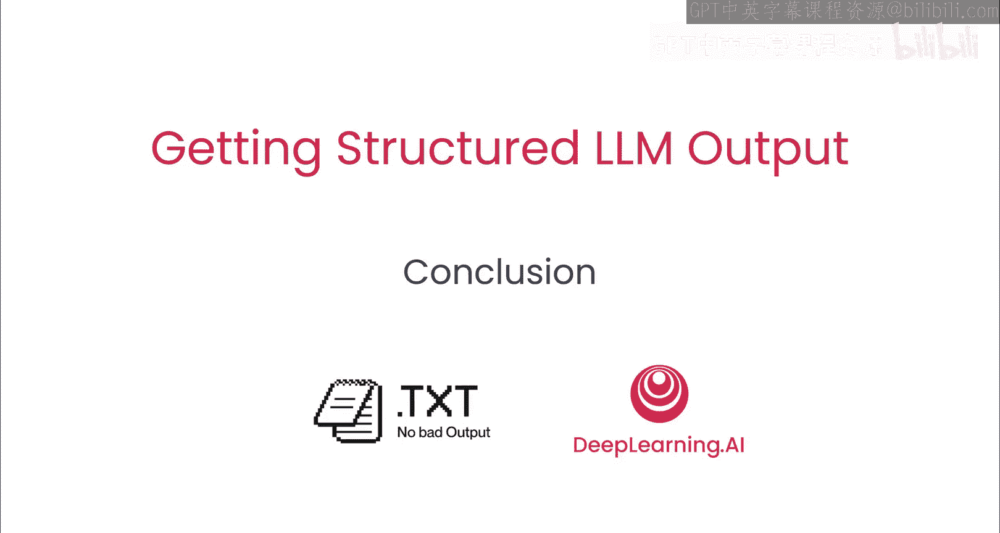

# 007：总结与展望 🎉

在本节课中，我们将对结构化输出课程的全部内容进行回顾与总结，并展望未来的应用方向。

## 课程回顾

上一节我们深入探讨了结构化生成的内部原理，现在让我们对整个课程的核心收获进行梳理。

在本课程中，你学习了如何利用大语言模型的结构化输出来编写可靠的软件。具体内容包括：

*   **使用OpenAI结构化输出**：你构建了一个社交媒体代理，实践了如何利用特定API获取格式化的模型响应。
*   **掌握重新提示方法**：你学会了如何通过精心设计的提示词，从任何推理服务提供商处获取结构化的输出，而不依赖于特定API。
*   **理解内部工作原理**：你“打开”了大语言模型的黑箱，窥见了Outline等工具执行结构化生成的内在机制。
*   **认识结构化生成的潜力**：你了解到结构化生成的能力远不止于产生JSON格式的数据，其应用场景更为广泛。

## 总结与展望

本节课中我们一起学习了构建可靠AI应用的关键——结构化输出技术。从具体的API调用到通用的提示工程方法，再到对底层原理的理解，你已掌握了确保大语言模型输出稳定、可预测、易于程序处理的一系列核心技能。

结构化输出是将大语言模型的强大能力与严谨的软件工程结合起来的桥梁。我们期待看到你将运用这些知识构建出怎样的创新应用。🚀