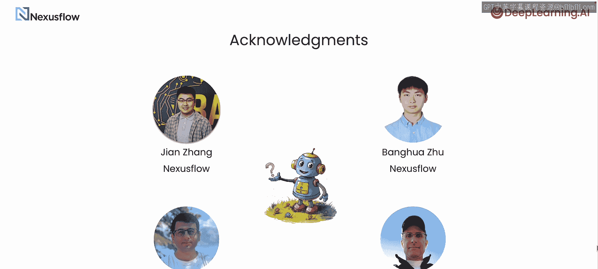

# 001：函数调用与结构化数据提取简介 🚀

在本节课中，我们将要学习大语言模型（LLMs）中一个核心且强大的功能：函数调用。这个功能是连接自然语言（非结构化数据）与计算机系统（依赖结构化数据）的关键桥梁。

## 概述

大语言模型通常在文本（一种非结构化数据）上进行训练。然而，我们的计算基础设施很大程度上建立在结构化数据之上，这些数据通过具有严格定义接口（如API）进行交互。函数调用正是为了弥合这一差距而设计的。

## 函数调用如何工作

上一节我们介绍了函数调用的必要性，本节中我们来看看它的具体工作原理。

向一个支持函数调用的大语言模型发送的提示词中，会包含可供模型使用的函数描述。这些描述包括：
*   说明函数功能的文本，以便模型知道何时应该使用该函数。
*   调用该函数所需的额外信息，例如函数名称及其参数的描述。

当模型判定某个查询最适合通过调用一个函数来解决时，它将从查询中生成所需的参数，并返回一个可用于调用该函数的字符串。

**核心概念**：模型本身并不直接调用函数，它只是返回一个可用于调用该函数的字符串。这些函数通常被称为“工具”，可用于扩展聊天机器人的能力或构建智能体。

以下是函数调用的应用示例：
*   一个研究型智能体，其工具可能包括网络搜索或维基百科查询。
*   但函数调用的应用远不止于聊天。例如，DeepLearning.ai 使用内部构建的简单AI智能体来分析学习者反馈，以持续改进课程。当然，我们的团队也会阅读您的反馈，并感谢您花时间提供。

为了收集统计数据，我们向模型提供一个提示词，其中包含一个名为 `record_learner_feedback` 的函数描述。该函数可以记录用户情感、评分，并将任何技术问题报告给相关团队。

我们用于此目的的模型实际上是一个专为函数调用微调的特殊模型：**NexusRaven-V2-13B**。

## 关于 NexusRaven-V2-13B 模型

NexusRaven-V2-13B 是一个开源模型，您可以从 Hugging Face 下载。您也可以使用我们网站上提供的托管版本。在本课程中，您将使用这个模型。

许多应用并不需要通用基础模型的全部能力。NexusRaven-V2-13B 仅有130亿参数，但在某些函数调用基准测试中，其输出可与 GPT-4 相媲美。像 NexusRaven-V2-13B 这样经过微调的小型模型，其体积小到足以在本地部署。这消除了可能阻碍您为应用程序添加自然语言界面的延迟和成本障碍。

## 课程内容预告

在掌握了函数调用的基本概念后，接下来我们将深入探索其多样化的应用。

以下是本课程将涵盖的主要内容：
1.  **深入理解函数调用**：我们将首先更深入地探讨函数调用是什么以及如何使用它。
2.  **构建提示词**：您将学习如何按照 Andrew 的描述，构建包含函数定义的提示词，然后利用LLM的响应来调用这些函数。
3.  **调用多个函数**：掌握基础后，我们将提升难度，学习如何定义和调用多个函数。
4.  **嵌套函数调用**：您将学习调用嵌套函数，即一个函数的参数本身也是函数。
5.  **处理开放API规范**：网络上的许多服务都使用 OpenAPI 描述来定义其API。您将学习如何将这些规范转换为可由您的LLM调用的函数。
6.  **实战应用**：课程最后，您将完成一个实际应用：处理客户服务对话记录，并构建SQL调用，将选定的数据存储到数据库中。

## 总结

本节课中我们一起学习了函数调用的核心概念及其作为连接非结构化自然语言与结构化系统接口的重要价值。我们了解了函数调用的基本流程，认识了专精于此的 NexusRaven-V2-13B 模型，并预览了本课程将带领大家从基础到实战，逐步掌握如何利用函数调用为各种应用添加强大的自然语言处理能力。让我们进入下一节视频，正式开始学习。